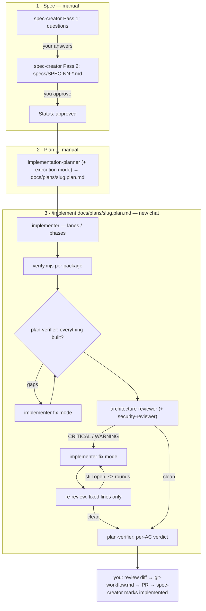

# Spec Driven Development — the agent pipeline

How a feature goes from an idea to a merged PR in this repo. Three stages, each started by
hand, each in its own chat: the spec and the plan need your decisions, the implementation
needs a clean context.

## 1. Spec — `spec-creator`, by hand

Dispatch `spec-creator` with the request, the design artboards or screenshots and any notes.
Pass 1 returns questions and proposals; answer them and re-dispatch for Pass 2. Review the
spec; when you approve it, re-dispatch with "user approved" so it sets `Status: approved`.

## 2. Plan — `implementation-planner`, by hand

Dispatch with the spec path **and the execution mode already chosen** (single-agent /
multi-agent) — then it finishes in one pass. Before executing, read the plan's
`Requirements traceability` and every `Done means`: that is what everything downstream is
judged against. Work is grouped into runs of one package and 3–5 items, because an agent's
cost is calls × context and one long run costs far more than several short ones.

## 3. Implement — `/implement <plan> [notes] [designs]`, in a new chat

The skill (`.claude/skills/implement/SKILL.md`) orchestrates the rest and never commits:

1. **Implement** — one `implementer` per lane (parallel) or phase (sequential).
2. **Integrate** — `node scripts/verify.mjs <pkg>` per touched package: the only full sweep
   before the end. Red → implementer fix mode.
3. **Verify #1** — `plan-verifier`, before any review: reviewing unfinished code wastes the
   review. Gaps → fix mode → re-check of the fixed items only.
4. **Review ⟲ fix** — `architecture-reviewer`, plus `security-reviewer` when routes, prompts,
   adapters or config changed. CRITICAL and WARNING are fixed by default, SUGGESTION is
   listed, anything that contradicts the plan goes to you. The implementer may mark a
   finding `disputed` with evidence — you decide. Re-review looks only at the lines the fix
   changed; at most 3 rounds, and a finding that reopens after a fix goes to you.
5. **Verify #2** — final full sweep and `plan-verifier`'s per-requirement table.
6. **Report** — what was done, what is open; the ledger in `.devdigest/cache/implement/`
   lets a new chat resume.

Then: review the diff, `docs/git-workflow.md`, commit, PR to your fork's `main`, re-dispatch
`spec-creator` with the per-requirement table to mark the spec `implemented`,
`/engineering-insights`.

## Models and what is switched off

| Agent | Model | Why |
|---|---|---|
| spec-creator, implementation-planner | opus | product and design judgement, run once per feature |
| implementer | sonnet | follows a plan; the bulk of the tokens |
| plan-verifier | sonnet | conformance against written `Done means`, with strict evidence rules |
| architecture-reviewer | sonnet | rule-checking against two skills, re-run every fix round |
| security-reviewer | opus | runs only when security-routed files change; a missed exploit costs more than the tokens |

`test-writer` is **off** in this pipeline for now, to save tokens: tests come from the
plan's work items. It is still there for a manual backfill, or for acceptance tests from the
spec's `Verify: unit | integration` ACs once the budget allows. `/code-review high` is an
optional extra pass for correctness bugs before the PR.

## Cheap verification — the rules every agent follows

- `node scripts/verify.mjs <pkg> [files...]` — typecheck + the tests for those files
  (`vitest related` for source files) + arch:check, colour off, one line per passing step and
  the output tail only on failure. One call instead of three.
- Once per work item, not after every edit: a tool call re-reads the whole context, so late
  in a run even an empty `pnpm typecheck` costs hundreds of thousands of tokens.
- The full suite (no files) runs at integration and once at the end.
- `--reporter=dot` does nothing useful off a TTY; `NO_COLOR=1` (which the script sets)
  halves the output.
