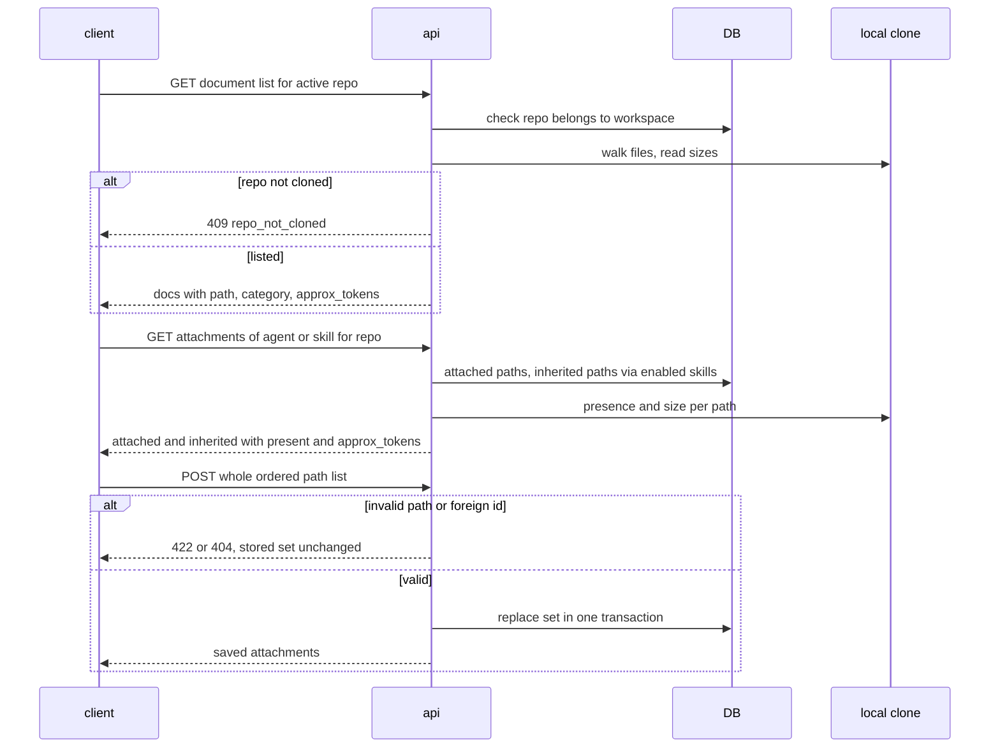
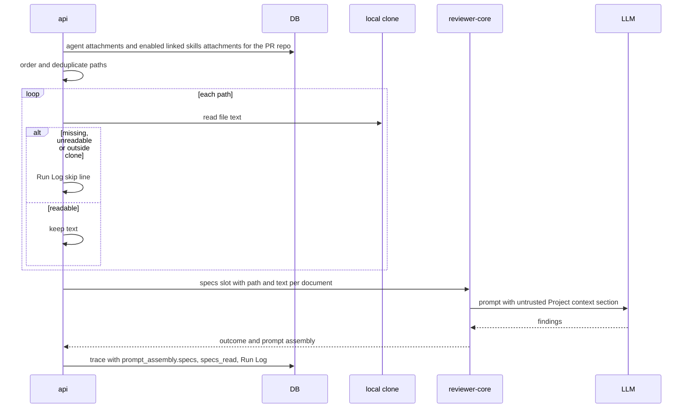

# Spec: Project Context
Spec ID: SPEC-01
Status: approved
Supersedes: none — reverses ONE decision of `client/specs/L02-skills.md` R3 (the skill editor's tab order, Preview first); the legacy spec is not edited, see Design review D-18.

## Problem and user

A developer who connects a repository to DevDigest usually already has the project's
requirements written down as markdown inside that repository — specifications, PRDs,
architecture notes, insights files. The reviewer agents never see them: the engine has a
`## Project context` prompt slot (`reviewer-core/src/prompt.ts:48-49`, `:136`) that nothing
feeds (`server/src/modules/reviews/run-executor.ts:338`, `:634` write `specs_read: []`), so an
agent reviewing a PR judges it without the rules the team agreed on and flags — or misses —
things the specs already settle.

Three users hit this:

- the **agent author** (Agents → Context), who wants a reviewer such as "Security Reviewer"
  to always read `specs/security-baseline.md`;
- the **skill author** (Skills → Context), who wants every agent carrying a skill to inherit
  the documents that skill depends on;
- the **person reading a run** (PR → Agent runs → trace), who needs to see which documents
  went into the prompt and read the exact text the model received.

Today none of them can find the repo's documents in the app, attach them, see what they cost
in tokens, or audit them in a run.

## Goals / Non-goals

**Goals**

- A repo-scoped **Project Context** page listing every markdown document of the repository's
  local clone, with a rendered, read-only preview.
- A **Context** tab on the agent editor and on the skill editor to attach the active
  repository's documents, in a chosen order, with a total token estimate.
- At run start, the attached documents' full text is read from the local clone and injected
  into the prompt as one untrusted `## Project context` section.
- The run trace shows the injected block in full and lists the injected paths.

**Non-goals** (each one is a decision; do not "restore" it)

- **Editing, New file, New folder, Upload** on the Project Context page. The clone is a
  read-only mirror: `sync()` runs `reset --hard origin/<branch>`
  (`server/src/adapters/git/simple-git.ts:84-86`), which wipes any local edit, and nothing in
  DevDigest pushes to GitHub (that would need a write-scoped token and a commit policy). An
  edit that silently disappears on the next sync is worse than no edit. (D-6)
- **COVERAGE ring** and **"Indexed: N files · M chunks"** footer — no defined metric, and
  chunks belong to retrieval, which this feature does not use. (D-7)
- **Any token or size budget** on injected documents — everything attached is injected in
  full; the user watches the estimate. (D-11)
- **Per-row token counts** on the Context tabs and **any token figure on the Project Context
  page** — only a single total on each tab. (D-12, P-2)
- **Per-document rows or badges in the run trace** — the trace shows the whole block and the
  path list. (D-13, P-7)
- **Folder tree** on the page — a flat list with a filter. (P-5)
- **A "used by" popover** naming the agents — a count only. (D-8)
- **Version bumps** of agents or skills when attachments change. (D-14)
- **Seeded attachments.** (D-19)
- **CI / GitHub-runner reviews, MCP tools, the Conformance report (N8), chunk/embedding
  retrieval (RAG)** do not consume Project Context in this spec. (D-20)
- **Following renames** — a renamed document is a missing one plus a new one. (D-15)
- **Reading documents from the PR head** — author-controlled text. (D-3)
- **Reading a base branch other than the clone's** — the clone has exactly one branch checked
  out (GitHub's default branch at clone time); PRs based on another branch get that checkout's
  text plus a Run Log line. (D-26, D-28)
- **Correcting `repos.default_branch`** — the stored value is never read from GitHub (D-28);
  this feature does not use it and does not change how it is written.
- **Syncing the clone before a run** — documents are read as of the last sync. (D-27)
- **Evals / Stats / CI tabs** on the agent editor and **Evals** on the skill editor — drawn in
  the screenshots, not part of this feature. (D-18)

## User stories

- **US-1** As a developer on a repository, I want to see every markdown document of the repo
  in one place and read it rendered, so that I know what project context exists.
- **US-2** As an agent author, I want to attach repository documents to an agent in a chosen
  order, so that every review that agent runs is grounded in them.
- **US-3** As a skill author, I want to attach repository documents to a skill, so that every
  agent carrying the skill inherits them.
- **US-4** As an agent or skill author, I want to see how many tokens the attached documents
  add to each prompt, so that I can keep prompt cost under control myself.
- **US-5** As someone reading a run, I want to see which documents were injected and read the
  full injected text, so that I can understand what the model was told.
- **US-6** As a workspace owner, I want document content treated as untrusted data and every
  read confined to my workspace, so that a file in a repo cannot steer the reviewer and no
  other workspace can see my attachments or documents.

## Acceptance criteria (EARS)

### Project Context page

**AC-1 [client]** The sidebar's WORKSPACE section shall contain a "Project Context" entry
linking to `/repos/:repoId/context` for the active repository.
Verify: unit — the navigation renders the entry with that href resolved for the active repo.

**AC-2 [server]** WHEN the document list of a repository is requested, the system shall return
every file of the repository's local clone whose name ends in `.md` or `.markdown`
(case-insensitive) and whose path has no segment named `node_modules`, `dist`, `.next`,
`vendor` or `.git`.
Verify: integration — a fixture clone holding included files and files under each excluded
directory returns exactly the included set.

**AC-3 [server]** The system shall order the document list ascending by repository-relative
path, compared by code point.
Verify: unit — a shuffled set of paths comes back in code-point order.

**AC-4 [server]** The system shall give each document the category `specs` when a directory
segment of its path is `specs`, otherwise `insights` when its file name is `INSIGHTS.md`
(case-insensitive) or a directory segment is `insights`, otherwise `docs`.
Verify: unit — `specs/a.md` → specs, `server/INSIGHTS.md` → insights, `insights/x.md` →
insights, `docs/a.md` → docs, `README.md` → docs, `server/specs/INSIGHTS.md` → specs.

**AC-5 [server]** IF a repository holds more than 500 documents, THEN the system shall return
the first 500 in AC-3 order together with the total count and `truncated: true`.
Verify: integration — a fixture with 501 documents returns 500 entries, `total: 501`,
`truncated: true`.

**AC-6 [client]** WHILE the document list is truncated, the page shall show the notice
"Showing 500 of N documents" with N the total count.
Verify: unit — a truncated response renders the notice with the total.

**AC-7 [server]** IF a file's path contains a control character (U+0000–U+001F or U+007F),
THEN the system shall leave that file out of the document list.
Verify: unit — a path containing a newline is not returned.

**AC-8 [server]** IF a file's real path resolves outside the repository clone, THEN the system
shall leave that file out of the document list.
Verify: integration — a committed symlink `docs/x.md` pointing outside the clone is not
returned.

**AC-9 [server]** The system shall build the document list from the local clone without any
request to GitHub.
Verify: integration — with the GitHub adapter stubbed to fail every call, the list request
succeeds.

**AC-10 [client]** The page shall show each listed document as one row carrying its
repository-relative path.
Verify: unit — two `README.md` files in different folders render as two distinguishable rows.

**AC-11 [client]** WHEN the user types in the page's filter box, the page shall show only the
documents whose path contains the typed text, case-insensitive.
Verify: unit — typing `API` leaves `specs/public-api.md` and hides `docs/deploy.md`.

**AC-12 [client]** WHEN the page loads a non-empty document list, the page shall select the
first listed document.
Verify: unit — after load the first row is marked selected and its preview is requested.

**AC-13 [client]** WHEN the user selects a document, the page shall render that document's
content as markdown in the Preview pane.
Verify: unit — a `# Title` line renders as a heading.

**AC-14 [server, client]** WHEN a document is selected, the page header shall show "Used by
N agents", where N is the number of distinct agents of the workspace that have this
repository's document attached directly or through an enabled skill linked to them,
regardless of the agent's own enabled state.
Verify: integration — one direct attachment plus one via an enabled linked skill plus one via
a disabled skill yields `used_by_agents: 2`; unit — the header renders the count.

**AC-15 [client]** The page header shall show an "Open on GitHub" link to
`https://github.com/<owner>/<name>/blob/<branch>/<path>`, with each path segment
percent-encoded, opening in a new tab with `rel="noopener noreferrer"`.
Verify: unit — the link's `href`, `target` and `rel` for `docs/a b.md`.

**AC-16 [client]** WHEN the user clicks Refresh, the page shall request the document list
again.
Verify: unit — a click issues a second list request and renders its result.

**AC-17 [client]** IF the repository has no documents, THEN the page shall show the empty
state "No markdown documents found in <owner>/<name>@<branch>" with a Refresh button.
Verify: unit — an empty response renders that text and the button.

**AC-18 [server]** IF the repository has no local clone, THEN the document list request shall
fail with status 409 and code `repo_not_cloned`.
Verify: integration — a repo row with no clone on disk returns 409 `repo_not_cloned`.

**AC-19 [client]** IF the document list request fails, THEN the page shall show the error
message with a Retry button.
Verify: unit — a 409 or 500 response renders the message; Retry issues a new request.

**AC-20 [client]** WHILE the document list request is in flight, the page shall show a loading
state in place of the list.
Verify: unit — a pending request renders the loading state.

**AC-21 [client]** The page shall offer no Edit, New file, New folder or Upload control.
Verify: unit — none of those controls is rendered.

### Context tabs (agent editor and skill editor)

**AC-22 [client]** The agent editor shall show its tabs in the order Config · Skills ·
Context, the last reachable as `?tab=context`.
Verify: unit — tab order, and `?tab=context` opens the Context tab.

**AC-23 [client]** The skill editor shall show its tabs in the order Config · Context ·
Preview · Stats · Versions, Context reachable as `?tab=context`.
Verify: unit — tab order, and `?tab=context` opens the Context tab.

**AC-24 [client]** WHEN a skill is opened without a `?tab` parameter, the skill editor shall
open the Config tab.
Verify: unit — `/skills/:id` with no parameter shows Config selected.

**AC-25 [client]** WHILE a repository is active, each Context tab shall list that repository's
documents with the attached ones first in attachment order, followed by the unattached ones
in AC-3 order.
Verify: unit — attachments `[b, a]` render as `b, a`, then the rest in path order.

**AC-26 [client]** IF no repository is active, THEN each Context tab shall show "Select a
repository to attach its documents" instead of a list.
Verify: unit — no active repo renders the message and no rows.

**AC-27 [client]** Each Context tab row shall show a checkbox, the file name, its folder, its
category badge and a Preview button.
Verify: unit — a row for `specs/public-api.md` shows `public-api.md`, `specs/`, `specs`.

**AC-28 [client]** WHEN the user ticks an unattached document, the Context tab shall append it
to the end of the attachment order.
Verify: unit — ticking `c` with `[a, b]` attached saves `[a, b, c]`.

**AC-29 [client]** WHEN the user unticks an attached document, the Context tab shall remove it
from the attachment set.
Verify: unit — unticking `a` with `[a, b]` saves `[b]`; this works on a row marked missing.

**AC-30 [client]** The Context tab shall let the user move an attached row by dragging its
handle or by pressing ↑ / ↓ while the handle has focus.
Verify: unit — a drag of `b` onto `a`, and ↑ on `b`'s handle, each save `[b, a]`.

**AC-31 [client]** WHEN the attachment set or its order changes, the Context tab shall send the
complete ordered list of paths for the active repository in one save request.
Verify: unit — one request per change, its body carrying `repo_id` and every attached path in
order.

**AC-32 [server]** WHEN a save request is received, the system shall replace the stored
attachment set of that agent or skill for that repository with exactly the sent ordered paths
in one transaction.
Verify: integration — saving `[b, a]` over `[a, c]` reads back `[b, a]`; a save that fails
validation leaves `[a, c]` untouched.

**AC-33 [client]** IF a save request fails, THEN the Context tab shall show an error and
display the last saved attachment set.
Verify: unit — a failing save renders the error and the previous order.

**AC-34 [client]** WHEN the user types in a Context tab's filter box, the tab shall show only
rows whose path contains the typed text, case-insensitive.
Verify: unit — filtering hides non-matching rows and keeps matching attached rows.

**AC-35 [server, client]** IF an attached document no longer exists in the local clone, THEN
the Context tab shall mark its row "missing".
Verify: integration — the attachments response reports `present: false` for a deleted file;
unit — such a row renders the "missing" badge.

**AC-36 [client]** WHEN the user clicks a row's Preview button, the Context tab shall open the
document's rendered content in a modal.
Verify: unit — the click opens a modal rendering the document's markdown.

**AC-37 [client]** The agent Context tab header shall show "{n} of {total} attached", with n
the agent's attached documents for the active repository and total the listed documents.
Verify: unit — 2 attached of 7 listed renders "2 of 7 attached".

**AC-38 [client]** The skill Context tab header shall show "{n} attached", with n the skill's
attached documents for the active repository.
Verify: unit — 1 attached renders "1 attached".

**AC-39 [client]** The skill Context tab shall show the note "Any agent using this skill
inherits these documents."
Verify: unit — the note is rendered.

**AC-40 [server, client]** The agent Context tab shall show every document the agent inherits
through an enabled linked skill, and does not attach directly, as a read-only row with a
"via <skill name>" badge.
Verify: integration — the attachments response lists inherited paths with the skill name and
omits those of a disabled skill; unit — inherited rows show the badge and no checkbox or drag
handle.

**AC-41 [server]** The system shall report each document's `approx_tokens` as the ceiling of
its content's character count divided by 4.
Verify: unit — a 10-character document reports 3.

**AC-42 [client]** The agent Context tab shall show "≈ N tokens", with N the sum of
`approx_tokens` over the distinct documents a run of this agent on the active repository would
inject (attached and inherited, missing ones excluded).
Verify: unit — attached 100 + inherited 50 + one path both attached and inherited counted once
+ a missing one renders the deduplicated sum.

**AC-43 [client]** The skill Context tab shall show "≈ N tokens", with N the sum of
`approx_tokens` over the skill's attached documents that are not missing.
Verify: unit — two present attachments of 40 and 60 render "≈ 100 tokens".

**AC-44 [client]** The agent Context tab shall show the note "Injected as an untrusted block
(## Project context) into every run."
Verify: unit — the note is rendered.

**AC-45 [client]** The skill Context tab shall show a "Serializes as" box containing the
`## Project context` heading followed, per attached document in order, by its `### <path>`
line and an elided `<untrusted …>…</untrusted>` placeholder for its body.
Verify: unit — attachments `[specs/public-api.md]` render that heading, that path line and the
placeholder.

### Injection at run time

**AC-46 [server]** WHEN a review run starts for an agent on a pull request, the system shall
take project-context attachments only from those whose repository is the pull request's
repository.
Verify: integration — an agent with attachments in repo A and repo B, run on a repo-B PR,
injects only repo B's paths.

**AC-47 [server]** The system shall order a run's documents as the agent's own attachments in
attachment order, followed, for each enabled skill linked to the agent in link order, by that
skill's attachments in attachment order.
Verify: unit — agent `[a]`, skill 1 `[b]`, skill 2 `[c]` yields `[a, b, c]`.

**AC-48 [server]** IF a path occurs more than once in a run's document order, THEN the system
shall inject it once, at its first position.
Verify: unit — agent `[a, b]`, skill `[b, c]` yields `[a, b, c]`.

**AC-49 [server]** IF a skill linked to the agent is disabled, THEN the system shall inject none
of that skill's attachments.
Verify: unit — a disabled skill's paths are absent from the run order.

**AC-50 [server]** WHEN a review run starts, the system shall read each document's text from
the local clone's current checkout (the working tree of the branch the clone has checked out),
whatever the pull request's base branch.
Verify: integration — a document changed in the clone between two runs is injected with its
new text in the second run; a PR whose base is `release/1.x` is injected the text of the
clone's checked-out branch.

**AC-51 [server]** WHEN a run reads project-context documents, the system shall record in the
run's Run Log the commit SHA of the clone checkout they were read from.
Verify: integration — the trace log contains a `project context:` line carrying the clone's
HEAD SHA.

**AC-52 [server, reviewer-core]** The system shall inject the run's documents as one
`## Project context` prompt section that contains, per document in run order, a
`### <path>` line followed by the document's full text.
Verify: unit — two documents produce one section with both path lines in order and both
bodies verbatim.

**AC-53 [server, reviewer-core]** The system shall enclose each injected document's text in an
`<untrusted source="…">` delimiter whose source label contains no part of the document's path
or content.
Verify: unit — a document at path `specs/x" onload=".md` yields a label free of that text.

**AC-54 [reviewer-core]** IF an injected document's text contains `</untrusted>`, THEN the
system shall escape it so that the delimiter cannot be closed early.
Verify: unit — the assembled section contains exactly one closing delimiter per document.

**AC-55 [server]** The system shall inject every readable attached document in full, without
any size or token limit.
Verify: integration — a 200 KB document appears byte-for-byte in `prompt_assembly.specs`.

**AC-56 [server]** IF an attached document does not exist in the clone at run start, THEN the
system shall record the Run Log line `project context: skipped <path> — missing` instead of
injecting it.
Verify: integration — a deleted attached file yields that line and is absent from the prompt.

**AC-57 [server]** IF an attached document contains a NUL byte or is not valid UTF-8, THEN the
system shall record the Run Log line `project context: skipped <path> — unreadable` instead of
injecting it.
Verify: integration — a binary `.md` yields that line and is absent from the prompt.

**AC-58 [server]** IF an attached document's real path resolves outside the clone, THEN the
system shall record the Run Log line `project context: skipped <path> — outside_clone` instead
of injecting it.
Verify: integration — a symlinked attachment pointing outside the clone yields that line.

**AC-59 [server]** IF the repository has no local clone at run start, THEN the system shall
record the Run Log line `project context: skipped — repository not cloned` and inject no
document.
Verify: integration — a run on a repo with no clone has that line and no project-context
section.

**AC-60 [server]** IF reading project-context documents fails for any reason, THEN the run
shall continue to completion without the affected documents.
Verify: integration — a run whose every attachment fails to read ends `done` with findings
persisted.

**AC-61 [server]** WHEN project-context resolution finishes, the system shall record the Run
Log line `project context: N document(s) attached, M skipped`.
Verify: integration — 3 attachments with 1 missing yield `2 document(s) attached, 1 skipped`.

**AC-62 [server]** The run trace's `specs_read` shall list the paths of the injected documents
in injection order.
Verify: integration — the persisted trace's `specs_read` equals the injected paths in order,
skipped ones excluded.

**AC-63 [server]** The run trace's `prompt_assembly.specs` shall hold the exact
project-context text sent in every model call of the run, in single-pass and map-reduce mode
alike.
Verify: integration — with a stub provider recording every call, `prompt_assembly.specs` is a
substring of the user message of each recorded call, for a single-pass run and for a
map-reduce run over two changed files.

**AC-64 [server, reviewer-core]** IF a run has no document to inject, THEN the prompt shall
contain no `## Project context` section.
Verify: unit — an empty document list yields a prompt without the heading and
`prompt_assembly.specs` null.

### Run trace

**AC-65 [client]** The trace's Prompt assembly section shall label the project-context block
"Project context — attached specs (untrusted)".
Verify: unit — a trace with `prompt_assembly.specs` renders that label.

**AC-66 [client]** WHEN the user expands the project-context block, the trace shall show the
full text of `prompt_assembly.specs`.
Verify: e2e — attach a document to an agent, run a review, open the trace, expand the block,
and the document's text is visible in full.

**AC-67 [client]** The trace's Configuration section shall list every path of `specs_read`
under "Specs read".
Verify: unit — `specs_read: [a, b]` renders both paths.

### Versioning, tenancy and validation

**AC-68 [server]** WHEN an agent's or a skill's attachment set is saved, the system shall
leave that agent's and that skill's `version` unchanged.
Verify: integration — the version before and after a save is equal and no version row is
written.

**AC-69 [server]** IF the repository, agent or skill named in a Project Context request does
not belong to the caller's workspace, THEN the system shall respond 404.
Verify: integration — each endpoint called with another workspace's repo, agent or skill id
returns 404 and reveals no attachment or document content.

**AC-70 [server]** IF a path in a save or read request is empty, absolute, contains a `..`
segment, a URL scheme or a control character, or does not end in `.md` / `.markdown`, THEN the
system shall reject the request with status 422 and code `invalid_path`.
Verify: unit — each listed shape is rejected; `specs/a.md` is accepted.

**AC-71 [server]** IF a save request carries more than 500 paths or the same path twice, THEN
the system shall reject it with status 422.
Verify: integration — 501 paths and a duplicated path are each rejected, stored set unchanged.

**AC-72 [server]** IF a document read request names a path that does not exist in the clone or
whose real path resolves outside the clone, THEN the system shall respond 404 with code
`doc_not_found`.
Verify: integration — a missing path and an out-of-clone symlink both return 404
`doc_not_found`.

**AC-73 [server]** IF a document read request names a file that contains a NUL byte or is not
valid UTF-8, THEN the system shall respond 422 with code `unreadable`.
Verify: integration — a binary `.md` returns 422 `unreadable`.

**AC-74 [server]** IF the pull request's base branch differs from the branch the local clone
has checked out, THEN the system shall record the Run Log line
`project context: base branch <base> differs from clone branch <branch> — documents read from <branch>`.
Verify: integration — a run on a PR with base `release/1.x` against a clone checked out on
`main` carries that line with both names; a PR based on `main` carries no such line; with the
clone checked out on `master` while `repos.default_branch` holds `main`, the line names
`master`.

**AC-75 [server]** The system shall read project-context documents from the clone as of its
last sync, without fetching or syncing the clone for that purpose.
Verify: integration — with the git adapter's fetch and sync instrumented, a run with
attachments performs no fetch or sync call for project context.

## Edge cases

- **EC-1** An attached document is deleted or renamed in the repository after it was attached.
  → AC-35, AC-56
- **EC-2** A document is binary or not valid UTF-8. → AC-57, AC-73
- **EC-3** A document is a symlink resolving outside the clone. → AC-8, AC-58, AC-72
- **EC-4** The same document is attached to the agent and to one of its skills. → AC-48, AC-42
- **EC-5** The same document is attached to two skills of the same agent. → AC-48
- **EC-6** A linked skill is disabled. → AC-49, AC-40
- **EC-7** An agent has attachments in repo A and reviews a PR in repo B. → AC-46
- **EC-8** The repository has no local clone. → AC-18, AC-59
- **EC-9** The repository holds more than 500 markdown files. → AC-5, AC-6
- **EC-10** The repository holds no markdown file. → AC-17
- **EC-11** The pull request's base branch is not the branch the local clone has checked out.
  → AC-50, AC-74
- **EC-12** The clone was last synced before its checked-out branch moved on upstream. → AC-75,
  AC-51
- **EC-13** An attached document is very large (hundreds of KB). → AC-55, Non-goal (no token
  budget)
- **EC-14** A document contains `</untrusted>` or instruction-like text. → AC-53, AC-54
- **EC-15** A file path contains a newline or another control character. → AC-7, AC-70
- **EC-16** A Context tab is opened with no active repository. → AC-26
- **EC-17** Two browser tabs save different attachment sets for the same agent and repository.
  → AC-32 (the later save replaces the set)
- **EC-18** Two files share a name in different folders (`README.md`). → AC-10, AC-27
- **EC-19** An attached document lies beyond the first 500 listed. → AC-35 (presence is
  checked per attachment, not against the truncated list), AC-25
- **EC-20** Saving the attachment set fails. → AC-33
- **EC-21** A skill carrying attachments is deleted. → AC-47 (only skills still linked
  contribute)
- **EC-22** An attached document is empty. → AC-55 (injected as is; contributes 0 to the
  estimate per AC-41)
- **EC-23** Reading the clone fails mid-run (I/O error). → AC-60
- **EC-24** A request names an agent, skill or repo of another workspace. → AC-69
- **EC-25** The agent itself is disabled but has the document attached. → AC-14 (still
  counted)
- **EC-26** The user wants to change a document from the page. → Non-goal (read-only page)
- **EC-27** The repository's real default branch is not `main`, while `repos.default_branch`
  still holds `main` (it is never read from GitHub); a later resync then resets the clone's
  working tree to `origin/main` when such a branch exists and fails otherwise
  (`server/src/modules/repo-intel/service.ts:160`,
  `server/src/adapters/git/simple-git.ts:84-86`). → AC-50, AC-74 (the stored value is not
  used), AC-51 (the commit SHA records exactly what was read), Non-goal (correcting
  `repos.default_branch`)
- **EC-28** The agent's review runs in map-reduce mode (one model call per changed file). The
  persisted `prompt_assembly` is the whole-diff assembly, whose `user` field no single call
  received (`reviewer-core/src/review/run.ts:107`, `:145-146`, `:177`); its `specs` field does
  not depend on the diff and is identical in every call. → AC-63

## Non-functional requirements

**NFR-1 [server]** WHEN the document list is requested for a clone holding 10,000 files of
which 500 are markdown, the system shall respond within 3 s.
Verify: integration — timed list request against such a fixture clone.

**NFR-2 [client]** Every new UI string of the page and the two Context tabs shall resolve from a
key under a `client/messages/en/` namespace.
Verify: unit — rendering each new view shows no raw dot-path key.

**NFR-3 [client]** Every control of the page and the Context tabs (filter, rows, checkboxes,
drag handles, Preview buttons, Refresh, Retry, Open on GitHub) shall be reachable and operable
by keyboard alone with a visible focus indicator (WCAG 2.2 AA 2.1.1, 2.4.7).
Verify: e2e — a keyboard-only pass attaches, reorders and previews a document.

**NFR-4 [client]** The document Preview shall render no raw HTML contained in a document.
Verify: unit — a document holding `<script>` and `` renders them as text
or not at all, and no script element or event handler reaches the DOM.

**NFR-5 [client]** The document Preview shall not load a remote image automatically.
Verify: unit — `` produces no `img` element with a remote `src`.

## Module interactions

Boundaries crossed: client ↔ api (new endpoints), api ↔ DB (attachments, agents, skills,
repos), api ↔ local clone (filesystem reads, no GitHub), api ↔ reviewer-core (the existing
`specs` slot), reviewer-core ↔ LLM (unchanged). No new LLM call, no GitHub call.

### Attaching documents (Context tab)

Failures: list failure → AC-18, AC-19; save failure → AC-33; foreign ids → AC-69; invalid
path → AC-70, AC-71.

### Injection at run start

Failures: every read failure is a skip, never a run failure → AC-56..AC-60; an unavailable LLM
is handled by the existing run failure path (unchanged by this spec).

### Existing scaffolding — what this feature reuses, replaces or leaves unused (D-29)

Unused scaffolding for this page already exists. No server route serves any of it today: the
`/repos/:id/*` routes are `poll`, `conventions`, `index-state`, `resync`, `refresh` and `pulls`
(`server/src/modules/{polling,conventions,repo-intel,repos,pulls}/routes.ts`). No client code
calls the two hooks, and no screen reads the `context` message namespace. Exactly one data
path per boundary is built; no parallel copy.

| Existing piece | Evidence | In this feature |
|---|---|---|
| Path `GET /repos/:id/context` (called by `useContextFiles`) | `client/src/lib/hooks/core.ts:122-129` | **reused** as the document-list endpoint below; its response type changes |
| `SpecFile` (`path`, `content?`, `size?`, `updated_at?`), typed as a bare `SpecFile[]` list | `server/src/vendor/shared/contracts/platform.ts:254-261` and the client copy | **replaced** by the list envelope and `ContextDoc` below. A bare array cannot carry `total`, `truncated` or `branch` (AC-5, AC-6, AC-15, AC-17) |
| `POST /repos/:id/context/reindex` (`useReindexContext`) and `IndexStatus` (`cloning / parsing / embedding`, `chunks_indexed`) | `client/src/lib/hooks/core.ts:131-137`; `platform.ts:263-269` | **not used**. Refresh re-requests the list (AC-16, D-23), and there is no indexing or chunk step (D-7, D-20) |
| `client/messages/en/context.json` | `title` "Project Context"; `empty.*`, `reindex`, `chunks`, `mode.edit`, `editor.*` | **reused** as the namespace for the page's strings (NFR-2). Its `empty` copy ("No spec files yet … under `.devdigest/specs/` … Every agent and the PR brief read them") contradicts AC-17, D-1 and D-20: **AC-17 wins**. The `reindex`, `chunks`, edit and editor strings belong to dropped elements (D-6, D-7, D-23) and are not shown |
| Sidebar key `context` for `/repos/:repoId/context` | `client/src/components/app-shell/helpers.ts:30`; `client/INSIGHTS.md:35` | **reused** by AC-1 |

### Contracts (new ones **proposed**; snake_case; both `vendor/shared` copies in lock-step)

**`GET /repos/:repoId/context`** — list the repository's documents (**proposed** response; the
path is the one `useContextFiles` already calls, see the table above).
- Response 200: `repo_id` uuid (req) · `branch` string (req, the branch the local clone has
  checked out, NOT `repos.default_branch` (D-28); used for the empty state and the GitHub link)
  · `total` int (req) · `truncated` boolean (req) · `docs` array (req) of `ContextDoc`
  (replaces `SpecFile`): `path` string (req, repository-relative, `/`-separated) · `name`
  string (req) · `folder` string (req, `""` at root) · `category`
  `"specs" | "docs" | "insights"` (req) · `approx_tokens` int (req).
- Errors: 404 repo not in workspace · 409 `repo_not_cloned`.

**`GET /repos/:repoId/context/doc?path=<path>`** — read one document.
- Response 200: `path` string (req) · `content` string (req) · `used_by_agents` int (req).
- Errors: 404 repo not in workspace · 422 `invalid_path` · 404 `doc_not_found` · 422
  `unreadable` · 409 `repo_not_cloned`.

**`GET /agents/:id/context-docs?repo_id=<uuid>`** — the agent's attachments for one repo.
- Response 200: `repo_id` uuid (req) · `attached` array (req, in order) of `path` string ·
  `present` boolean · `approx_tokens` int nullable (null when not present) · `inherited` array
  (req) of `path` string · `skill_id` uuid · `skill_name` string · `present` boolean ·
  `approx_tokens` int nullable.
- Errors: 404 agent or repo not in workspace · 422 missing `repo_id`.

**`POST /agents/:id/context-docs`** — replace the agent's attachment set for one repo (mirrors
`POST /agents/:id/skills`, which replaces the whole ordered skill set).
- Request: `repo_id` uuid (req) · `paths` string[] (req, ordered, unique, at most 500).
- Response 200: same shape as the GET.
- Errors: 404 agent or repo not in workspace · 422 `invalid_path` · 422 too many or duplicate
  paths.

**`GET /skills/:id/context-docs?repo_id=<uuid>`** and **`POST /skills/:id/context-docs`** —
same as the agent pair, without `inherited`.

**Run trace** — no contract change. The existing `PromptAssembly.specs`, `RunTrace.specs_read`
and `RunTrace.log` (`server/src/vendor/shared/contracts/trace.ts:44`, `:125`, `:137`) carry
the injected block, the injected paths and the skip lines. `token_counts` already counts every
non-empty slot (`server/src/modules/reviews/helpers.ts:241-250`). In map-reduce mode the
persisted assembly is the engine's whole-diff assembly, not any one per-file call
(`reviewer-core/src/review/run.ts:107`, `:145-146`, `:177`). Its `specs` field is built
without the diff and is the same text in every call, so AC-63 holds in both modes. Its `user`
field matching no single call is existing behaviour that this spec does not change (D-30,
EC-28).

**Engine** — the existing `PromptParts.specs` slot (`reviewer-core/src/prompt.ts:48-49`) is the
entry point; AC-52..AC-54 and AC-64 state what the section must look like.

## Inputs and provenance

| Input | Comes from | Produced by | Freshness | Trusted |
|---|---|---|---|---|
| Document list (paths) | Repository files in the local clone | Repo import / sync (`simple-git.ts:54-88`) | As of the clone's last sync | No |
| Document content | Repository files in the local clone | Repository contributors | As of the clone's last sync, read at run start or on preview | No |
| Attachment sets (repo, ordered paths) | User, via the Context tabs | DevDigest DB | Live | Validated user input |
| Linked skills, their order and enabled flag | DevDigest DB | User (agent Skills tab, skill toggle) | Live at run start | Yes |
| PR base branch | `pull_requests.base` (`server/src/db/schema/pulls.ts:19`) | GitHub, via PR sync | As of last PR poll | Compared and named in the Run Log (AC-74), never rendered into the prompt |
| Clone's checked-out branch and HEAD SHA | The local clone's git HEAD | `git clone` with no `--branch` at import, so GitHub's default branch at that time (`server/src/modules/repos/service.ts:55-57`, `server/src/adapters/git/simple-git.ts:65-68`); moved only by a resync (`simple-git.ts:77-88`) | As of the clone's last clone or sync | Yes, as a git ref name (named in the Run Log by AC-51 and AC-74; percent-encoded in the GitHub link by AC-15) |
| Repo owner, name | `repos` (`server/src/db/schema/repos.ts:12-14`) | Parsed from the repository URL at import | As of import | Yes (used in the GitHub link, encoded) |

`repos.default_branch` is not an input of this feature. Only the schema default `'main'` and
the seed write it (`server/src/db/schema/repos.ts:15`, `server/src/db/seed.ts:99`), never a
GitHub read, so it can disagree with the clone (D-28, EC-27).
| `approx_tokens`, `used_by_agents`, `present` | Computed by the API | API | Per request | Yes |

## Untrusted inputs

- **Document content in the prompt** — never instructions: each document's text sits inside an
  `<untrusted>` delimiter covered by the engine's injection guard (`reviewer-core/src/prompt.ts:16-28`)
  → AC-53; a literal closing delimiter is escaped → AC-54; the delimiter label never carries
  path or content → AC-53.
- **Document content in the UI** — rendered without raw HTML → NFR-4; no remote image loaded
  automatically → NFR-5.
- **File paths from the clone** — control characters excluded from the list → AC-7; paths
  rendered into the prompt only as a `### <path>` line under AC-52 after AC-7 filtering; paths
  in the GitHub link are percent-encoded → AC-15.
- **Symlinks** — anything resolving outside the clone is neither listed, read, previewed nor
  injected → AC-8, AC-58, AC-72.
- **Paths sent by the client** — validated at the boundary → AC-70, AC-71.
- **Tenancy** — every endpoint resolves the repo, agent or skill inside the caller's workspace
  first; attachment rows are only reachable through their owning agent or skill → AC-69; a run
  only draws attachments of its own repository → AC-46.
- **Size** — deliberately no limit on content (user decision D-11); the only bounds are 500
  listed documents (AC-5) and 500 paths per save (AC-71).

## Design review

Sources: `docs/design/extracted/screen_tour_context.jsx` (N6), `screen_trace.jsx`,
`screen_agents.jsx`, `screen_skills.jsx`, `data2.jsx`; user screenshots `1.png` (N6 page),
`2.png` (Agent → Context), `3.png` (Skill → Context), `4.png` (run trace).

| # | Finding / proposal | Evidence | Decision | Destination |
|---|---|---|---|---|
| D-1 | Which files are documents: the mock roots at `.devdigest/specs/`, the tabs show `specs/`, `docs/`, `insights/` | `screen_tour_context.jsx:111`; `2.png`, `3.png` | decided by user: every `.md`/`.markdown`, excluding `node_modules`, `dist`, `.next`, `vendor`, `.git`; category rule as proposed | accepted → AC-2, AC-4 |
| D-2 | Where the list comes from: `GitClient` has no listing (`server/INSIGHTS.md:22`); the server keeps a local clone (`repos.clone_path`, `server/src/db/schema/repos.ts:16`; `simple-git.ts:37`) | `simple-git.ts:37-145` | decided by user: the local clone, no GitHub request | accepted → AC-2, AC-9 |
| D-3 | Which ref a run reads: base, head or default branch | `server/src/modules/reviews/diff-loader.ts:20-24` uses `pull.base` | decided by user: the PR's base branch. The clone has exactly one branch checked out, GitHub's default branch at clone time (`server/src/modules/repos/service.ts:55-57` clones with no `--branch`; `simple-git.ts:65-68`), and `readFile` reads the working tree (`:135-145`), so a base other than that branch is settled by D-26. Wording corrected by D-28 | accepted → AC-50 |
| D-4 | When the text is read | — | decided by user: at run start, exact text kept in the trace | accepted → AC-50, AC-63 |
| D-5 | Agents and skills are workspace-wide, documents are per repo | `client/src/app/agents/[id]/page.tsx`, `client/src/app/skills/[id]/page.tsx`; `/context` is repo-scoped (`client/src/components/app-shell/helpers.ts:30`) | decided by user: attachment = (repo, path); tabs show the active repo; a run uses its PR's repo only | accepted → AC-25, AC-26, AC-46 |
| D-6 | Edit / New file / New folder / Upload toolbar | `screen_tour_context.jsx:113-114`, `:125` | decided by user: view-only (sync resets the working tree, nothing pushes); Preview + Refresh + Open on GitHub | declined → Non-goal; accepted → AC-15, AC-16, AC-21 |
| D-7 | COVERAGE ring and "Indexed: N files · M chunks" | `screen_tour_context.jsx:120`, `:128` | decided by user: dropped | declined → Non-goal |
| D-8 | "Used by N agents" — direct only, or via skills too | `screen_tour_context.jsx:127` | decided by user: count only, no popover; direct or via an enabled linked skill (one query: direct links union skill links joined through linked skills); agent enabled state ignored — spec-creator's pick, delegated by the user | accepted → AC-14; popover → Non-goal |
| D-9 | Merge of agent and skill documents, dedupe, disabled skill | `3.png` "Any agent using this skill inherits these documents" | decided by user: agent first, then skills in link order, first position wins, disabled skill contributes nothing; inherited rows read-only with "via <skill>" | accepted → AC-40, AC-47, AC-48, AC-49 |
| D-10 | Serialization differs: "## Project context" vs "## Project specifications" path list | `2.png` footer, `3.png` box, `reviewer-core/src/prompt.ts:136` | default accepted (simplest): one `## Project context` section, `### <path>` + body in untrusted delimiter; the skill box shows that form | accepted → AC-45, AC-52, AC-53 |
| D-11 | Token budget / size cap | intent precedent `MAX_DOC_CHARS=8000` (`server/src/modules/intent/constants.ts:10`) | decided by user: no limit | accepted → AC-55; declined budget → Non-goal |
| D-12 | Token count placement and estimator | `2.png` "≈ 317 tokens"; `client/src/lib/skills.ts:79-81`, `server/src/adapters/tokenizer/index.ts:21-23` use `ceil(chars/4)` | decided by user: one total per Context tab only; estimator `ceil(chars/4)` per document, content only (heading and delimiter overhead not counted) — the heuristic both packages already use | accepted → AC-41, AC-42, AC-43; per-row and page counts → Non-goal |
| D-13 | Trace: how to read the injected text; where skips are recorded | `4.png`; `client/src/app/repos/[repoId]/pulls/[number]/_components/RunTraceDrawer/_components/TraceBody/TraceBody.tsx:43-55`, `:91-93`; `client/messages/en/runs.json:50` labels the block "Project context (dynamic)" | decided by user: whole block expandable + "Specs read" filled; skips recorded in the Run Log (simplest place, persisted in `trace.log`) | accepted → AC-56..AC-63, AC-65..AC-67; per-doc trace rows → Non-goal |
| D-14 | Version bump on attachment change (contrast `server/specs/L02-skills.md` R13, `server/INSIGHTS.md:98`) | — | decided by user: no bump for agents or skills; the trace's stored text is the reproducibility record | accepted → AC-68 |
| D-15 | Attached document deleted / renamed / unreadable / binary at run time | — | decided by user: skip, record, run proceeds; tab marks "missing", detach allowed; renames not followed | accepted → AC-29, AC-35, AC-56..AC-60 |
| D-16 | Listing failure / repo not cloned | — | default accepted: error + Retry, attachments intact | accepted → AC-18, AC-19, AC-59 |
| D-17 | Large repos | `screen_tour_context.jsx:83-86` draws 6 files | default accepted: 500 cap + notice + filter | accepted → AC-5, AC-6, AC-11, AC-34 |
| D-18 | Tab order: skill editor ships Preview · Config · Stats · Versions with Preview first on purpose (`client/specs/L02-skills.md` R3; `SkillEditor/constants.ts:19-24`); `3.png` shows Config · Context · Preview · Evals · Stats · Versions | `client/INSIGHTS.md:34` | decided by user: as in `3.png`, reversing R3's Preview-first decision; landing tab follows the first tab and becomes Config (consequence of R3's "default = first tab" rule); Evals not built. Agent editor: Config · Skills · Context | accepted → AC-22, AC-23, AC-24; Evals/Stats/CI → Non-goal |
| D-19 | Seed (`server/INSIGHTS.md:49`) | — | default accepted: no seeded attachments | declined → Non-goal |
| D-20 | CI runner, MCP, Conformance (N8, `screen_conv_conf.jsx:123`), RAG chunks (`code_chunks.source`, `server/src/db/schema/context.ts:44`) | — | default accepted: out of scope | declined → Non-goal |
| D-21 | The extracted mock has no Context tabs (`screen_agents.jsx:171`, `screen_skills.jsx:270`) and no project-context trace block (`screen_trace.jsx:70-75`); the screenshots are newer | `2.png`, `3.png`, `4.png` | default accepted: screenshots are the source of truth | accepted → AC-22..AC-45, AC-65 |
| D-22 | Preview button target on Context tab rows not drawn | `2.png`, `3.png` | default accepted (simplest): rendered document in a modal | accepted → AC-36 |
| D-23 | Refresh semantics on the page | `screen_tour_context.jsx:114` "Re-index" | default accepted (simplest): re-request the list from the clone; no GitHub sync | accepted → AC-9, AC-16 |
| D-24 | Untrusted document text in the prompt | `server/INSIGHTS.md:43`, `server/specs/L02-skills.md` R6 (label never name-derived), `prompt.ts:30-34` | default accepted: untrusted delimiter, constant label | accepted → AC-53, AC-54 |
| D-25 | No active repo when a Context tab opens | — | default accepted | accepted → AC-26 |
| D-26 | PR base branch other than the clone's branch: the clone has exactly one branch checked out | `simple-git.ts:65-68`, `:84-86`, `:135-145` | decided by user: read the default-branch checkout and write a Run Log line naming both branches. "Default branch" here means the clone's checked-out branch, per D-28 | accepted → AC-50, AC-74; declined (reading the actual base) → Non-goal |
| D-27 | Clone freshness: the clone can lag the tip of its checked-out branch | `simple-git.ts:77-88` (sync only on resync) | decided by user: no sync before reading; read as of the last sync, commit SHA visible in the Run Log | accepted → AC-51, AC-75; declined (sync per run) → Non-goal |
| D-28 | `repos.default_branch` is never read from GitHub. Only the schema default `'main'` and the seed write it, so it is wrong for a repo whose real default is not `main`. The clone's checkout is set by `git clone` with no `--branch`, i.e. GitHub's real default at clone time, and moved only by a resync to `origin/<repos.default_branch>` | `server/src/db/schema/repos.ts:15`, `server/src/db/seed.ts:99`, `server/src/modules/repos/service.ts:55-57`, `simple-git.ts:65-68`, `:84-86`, `server/src/modules/repo-intel/service.ts:160`; retro `docs/retros/2026-10-02-spec-01-project-context.md` *Missed / lost* 1 | factual correction within D-26, no behaviour change: AC-50 reads the clone's current checkout, and AC-74 compares the PR base with the clone's checked-out branch, not `repos.default_branch`. The list contract's `branch` is the same checked-out branch. Correcting how `repos.default_branch` is written stays out of scope | accepted → AC-50, AC-74, EC-11, EC-27; not correcting the stored value → Non-goal |
| D-29 | Client and contract scaffolding for this page already exists: `useContextFiles` / `useReindexContext` call `GET /repos/:id/context` and `POST /repos/:id/context/reindex`, no route serves them, and `SpecFile`, `IndexStatus` and `client/messages/en/context.json` (`.devdigest/specs/` empty state) have no consumer | `client/src/lib/hooks/core.ts:122-137`, `server/src/vendor/shared/contracts/platform.ts:254-269` (and the client copy), `client/messages/en/context.json:11-14`; retro *Missed / lost* 2 | factual alignment, no behaviour change: reuse the list path and the `context` namespace, replace `SpecFile` with `ContextDoc` in an envelope, leave the reindex hook and `IndexStatus` unused; AC-17's empty-state copy wins over `context.json` | accepted → Module interactions (Existing scaffolding table), AC-1, AC-16, AC-17, NFR-2 |
| D-30 | In map-reduce mode the persisted `prompt_assembly` is the whole-diff assembly, which differs from every per-file call; AC-63's "text sent to the model" was only exact for single-pass | `reviewer-core/src/review/run.ts:107`, `:145-146`, `:177`; `reviewer-core/src/prompt.ts:103-106`, `:155` (`specs` is built without the diff); retro *Missed / lost* 3 | factual tightening, no behaviour change: AC-63 now requires `prompt_assembly.specs` to equal the block in every call, in both modes | accepted → AC-63, EC-28 |
| P-1 | Reuse the agent Skills-tab pattern: linked first, drag + ↑/↓, filter, "{n} of {total} attached", whole set saved (`client/specs/L02-skills.md` R7) | `2.png` drag handles | decided by user: accepted | accepted → AC-25, AC-28..AC-34, AC-37 |
| P-2 | Per-row token counts | — | decided by user: declined | declined → Non-goal |
| P-3 | Inherited rows on the agent tab | — | decided by user: accepted | accepted → AC-40, AC-42 |
| P-4 | "Open on GitHub" link | — | decided by user: accept if trivial — it is a URL built from fields already stored | accepted → AC-15 |
| P-5 | Folder tree on the page | — | decided by user: declined (flat list + filter) | declined → Non-goal |
| P-6 | Empty-state wording without "Add a spec file" (`screen_tour_context.jsx:105`) | — | decided by user: accepted | accepted → AC-17 |
| P-7 | Per-document rows in the trace | — | decided by user: declined | declined → Non-goal |
| P-8 | Safe Preview: no raw HTML, no auto-loaded remote images | Agentic AI / injection rules, `.claude/skills/security/SKILL.md:199-208` | not selected by the user; kept as a security requirement, flagged for the user to strike | accepted → NFR-4, NFR-5 |

## Traceability

| AC / NFR | From (US / EC / design review) | Packages | Verify |
|---|---|---|---|
| AC-1 | US-1, D-29 | client | unit |
| AC-2 | US-1, D-1, D-2 | server | integration |
| AC-3 | US-1 | server | unit |
| AC-4 | US-1, D-1 | server | unit |
| AC-5 | EC-9, D-17 | server | integration |
| AC-6 | EC-9, D-17 | client | unit |
| AC-7 | EC-15, US-6 | server | unit |
| AC-8 | EC-3, US-6 | server | integration |
| AC-9 | D-2, D-23 | server | integration |
| AC-10 | US-1, EC-18 | client | unit |
| AC-11 | US-1, D-17 | client | unit |
| AC-12 | US-1 | client | unit |
| AC-13 | US-1 | client | unit |
| AC-14 | US-1, D-8, EC-25 | server, client | integration |
| AC-15 | P-4, D-6 | client | unit |
| AC-16 | D-6, D-23, D-29 | client | unit |
| AC-17 | EC-10, P-6, D-29 | client | unit |
| AC-18 | EC-8, D-16 | server | integration |
| AC-19 | D-16 | client | unit |
| AC-20 | US-1 | client | unit |
| AC-21 | D-6, EC-26 | client | unit |
| AC-22 | US-2, D-18 | client | unit |
| AC-23 | US-3, D-18 | client | unit |
| AC-24 | D-18 | client | unit |
| AC-25 | US-2, US-3, D-5, P-1, EC-19 | client | unit |
| AC-26 | EC-16, D-25 | client | unit |
| AC-27 | US-2, US-3, EC-18 | client | unit |
| AC-28 | US-2, US-3, P-1 | client | unit |
| AC-29 | US-2, US-3, D-15 | client | unit |
| AC-30 | US-2, P-1 | client | unit |
| AC-31 | P-1 | client | unit |
| AC-32 | P-1, EC-17 | server | integration |
| AC-33 | EC-20 | client | unit |
| AC-34 | P-1, D-17 | client | unit |
| AC-35 | EC-1, EC-19, D-15 | server, client | integration |
| AC-36 | US-2, US-3, D-22 | client | unit |
| AC-37 | US-2, P-1 | client | unit |
| AC-38 | US-3 | client | unit |
| AC-39 | US-3, D-9 | client | unit |
| AC-40 | US-2, D-9, P-3, EC-6 | server, client | integration |
| AC-41 | US-4, D-12, EC-22 | server | unit |
| AC-42 | US-4, D-12, P-3, EC-4 | client | unit |
| AC-43 | US-4, D-12 | client | unit |
| AC-44 | US-2, US-6 | client | unit |
| AC-45 | US-3, D-10 | client | unit |
| AC-46 | US-2, D-5, EC-7 | server | integration |
| AC-47 | US-2, US-3, D-9, EC-21 | server | unit |
| AC-48 | D-9, EC-4, EC-5 | server | unit |
| AC-49 | D-9, EC-6 | server | unit |
| AC-50 | US-2, D-3, D-4, D-26, D-28, EC-11, EC-27 | server | integration |
| AC-51 | US-5, D-3, D-27, EC-12, EC-27 | server | integration |
| AC-52 | US-2, D-10 | server, reviewer-core | unit |
| AC-53 | US-6, D-10, D-24, EC-14 | server, reviewer-core | unit |
| AC-54 | US-6, D-24, EC-14 | reviewer-core | unit |
| AC-55 | D-11, EC-13, EC-22 | server | integration |
| AC-56 | EC-1, D-15 | server | integration |
| AC-57 | EC-2, D-15 | server | integration |
| AC-58 | EC-3, D-15 | server | integration |
| AC-59 | EC-8, D-16 | server | integration |
| AC-60 | EC-23, D-15 | server | integration |
| AC-61 | US-5, D-13 | server | integration |
| AC-62 | US-5, D-13 | server | integration |
| AC-63 | US-5, D-4, D-13, D-30, EC-28 | server | integration |
| AC-64 | US-2 | server, reviewer-core | unit |
| AC-65 | US-5, D-13, D-21 | client | unit |
| AC-66 | US-5, D-13 | client | e2e |
| AC-67 | US-5, D-13 | client | unit |
| AC-68 | D-14 | server | integration |
| AC-69 | US-6, EC-24 | server | integration |
| AC-70 | US-6, EC-15 | server | unit |
| AC-71 | US-6, D-17 | server | integration |
| AC-72 | US-6, EC-3 | server | integration |
| AC-73 | EC-2, D-15 | server | integration |
| AC-74 | EC-11, EC-27, D-26, D-28, US-5 | server | integration |
| AC-75 | EC-12, D-27 | server | integration |
| NFR-1 | US-1, D-17 | server | integration |
| NFR-2 | US-1, US-2, US-3, D-29 | client | unit |
| NFR-3 | US-2, P-1 | client | e2e |
| NFR-4 | US-6, P-8 | client | unit |
| NFR-5 | US-6, P-8 | client | unit |

## Open questions

None. Both earlier questions (non-default base branch, clone freshness) were decided by the
user — see D-26 and D-27.
