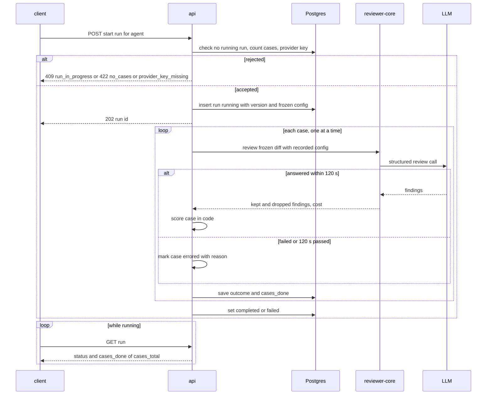
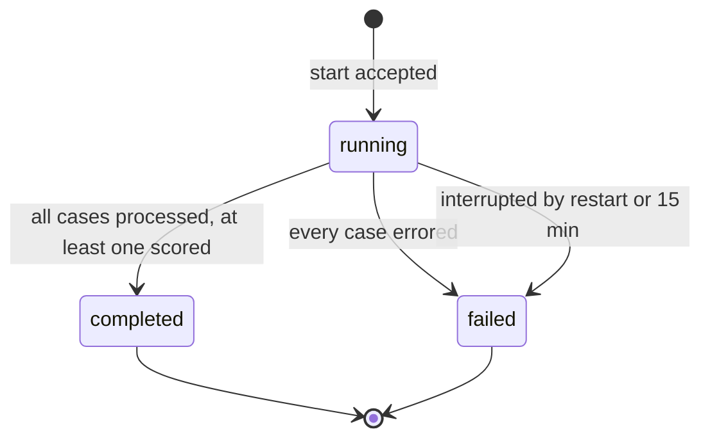
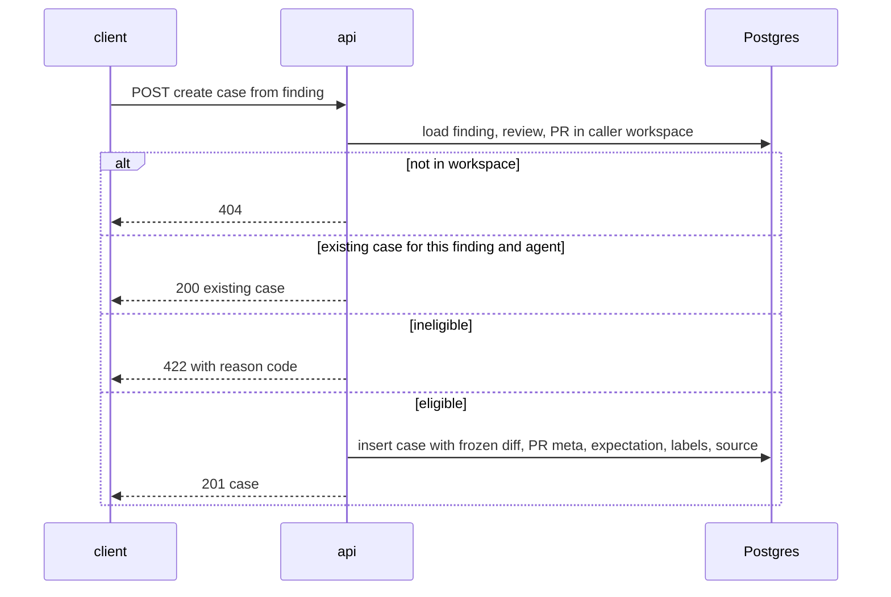

# Spec: Eval Pipeline — regression harness for review agents, built from triaged findings
Spec ID: SPEC-04
Status: approved
Supersedes: none
Superseded by: SPEC-05 (partially — manual case creation and diff editing for manual cases; Evals-tab trend chart)

## Problem and user

An agent author changes a review agent's system prompt, its model or a linked skill. Today they
have no way to tell whether the agent got better or broke, short of re-reviewing PRs by hand and
eyeballing the findings. The data that would answer it already exists: every **accepted**
finding is something the agent should find again, and every **dismissed** finding is something
it should not flag again. Nothing turns those decisions into a repeatable test.

The groundwork is in the tree and unused:

- The `eval_cases` / `eval_runs` tables (`server/src/db/schema/eval.ts:7-35`).
- The `EvalCase` / `EvalRun` contracts (`server/src/vendor/shared/contracts/knowledge.ts:186-221`).
- The `EvalCaseInput` / `EvalRunRecord` / `EvalDashboard` contracts
  (`server/src/vendor/shared/contracts/eval-ci.ts:19-89`).
- An unwired `eval` i18n namespace (`client/messages/en/eval.json`).
- A pre-wired `/eval` sidebar key (`client/src/components/app-shell/helpers.ts:39`).

The seed leaves the eval tables empty (`server/src/db/seed.ts:37`).

The users:

- **The agent author.** They want to change a prompt, model or skill, run one command, and see in
  numbers (recall, precision, citation accuracy) whether the change helped. They want to put two
  runs side by side with the prompt diff.
- **The reviewer who triages findings.** They want one click to turn an accepted or dismissed
  finding into a test case, without writing JSON.
- **The person paying for model calls.** A suite run costs one engine review per case. It must
  stay bounded when the model is slow or failing.
- **The workspace owner.** The PR text in a case is untrusted. It must not steer the model, and
  cases and runs must never cross workspaces.
- **The grader / a fresh checkout.** A clean `pnpm db:seed` must produce a working suite, and
  one command must verify the feature.

This is the L06 homework "Eval Pipeline for DevDigest". The homework names this file
`specs/eval-pipeline.md`. In this repo it is `specs/SPEC-04-eval-pipeline.md`, following the
naming in `specs/README.md`. The homework's acceptance items are traced explicitly as **HW-1…HW-5**:

- **HW-1:** the suite has at least 8 cases.
- **HW-2:** a case is created from a finding in one click, and both expectation kinds work.
- **HW-3:** changing the system prompt visibly moves recall or precision between two runs.
- **HW-4:** scoring makes zero LLM calls.
- **HW-5:** `pnpm verify:l06` is green.

## Goals / Non-goals

**Goals**

- **"Turn into eval case" on FindingCard.**
  - An accepted finding becomes a `must_find` case; a dismissed finding becomes a `must_not_flag`
    case.
  - The case freezes:
    - the finding file's whole patch;
    - the PR title and body;
    - the file + line-range expectation;
    - display labels (severity, category, title);
    - a link to its source.
- **A suite per agent.** The Agent Editor gets an **Evals** tab with:
  - latest-run metrics;
  - the case list (edit, delete);
  - the last 5 runs.
- **An edit-only Eval Case modal** (from the mock): Name, Notes and the Expected output JSON are
  editable. Diff and PR meta are read-only.
- **A whole-suite run in the background.**
  - It is pinned to the agent version and a frozen copy of the agent's effective config.
  - Cases run one at a time, each under a 120 s deadline.
  - A failing case is isolated.
- **Code-only scoring** — zero model calls:
  - per-case pass/fail;
  - recall, precision and citation accuracy;
  - `n/a` when a denominator is 0.
- **An Eval Dashboard in the sidebar.**
  - An overview of agents with their latest run.
  - A per-agent detail with:
    - metric cards (delta + sparkline);
    - a 0–100 % trend chart;
    - the last 20 runs, with checkboxes;
    - a regression banner;
    - **Compare**.
- **Compare two runs.** It shows:
  - old → new metric deltas over the cases common to both runs;
  - cost;
  - config changes;
  - a line diff of the two frozen system prompts;
  - per-case pass flips.
- **A seeded suite.** A clean checkout ships ≥ 8 cases for the Security Reviewer, plus two
  triaged findings without a case for the live one-click demo.
- **`pnpm verify:l06`** in `server/`.

**Non-goals** (each is a decision; do not "restore" it)

- **Creating a case from scratch** ("New eval case", `screen_agents.jsx:142`; Finding skeleton,
  `screen_cizruns.jsx:91`). The dataset is born from triaged findings (user decision, Q9).
- **Per-case runs**: the ▶ icon per row (`components2.jsx:55`), "Run case" and "Run on save"
  (`screen_cizruns.jsx:62-64`). A one-case run is not comparable with suite runs and would pollute
  history (user decision, P1).
- **The case editor's Files tab** (`screen_cizruns.jsx:76-80`). A case holds exactly one file's
  diff (Q9).
- **"Promote vN"** in the compare modal (screenshot `3-compare-runs-modal.webp`). The newer run
  normally already uses the agent's current config, and no agent restore route exists (Q17).
- **The "30 days" date-range button** (`screen_skills.jsx:290`). The dashboard shows the last 20
  runs instead (P3).
- **Cancelling a running eval run.** The 15-minute stale rule covers hangs (P5).
- **A dollar cost estimate before a run.** The button shows the exact case count only (P6).
- **A new e2e browser flow.** A real run needs an LLM. Component and integration tests plus a
  manual screencast cover it (P7).
- **Skill-owned evals** (`owner_kind: skill`; the `skill-evals` artboard, INDEX.md:49).
  `client/specs/L02-skills.md` R3 deliberately removed the skill Evals tab, as cited at
  `client/src/app/skills/[id]/_components/SkillEditor/constants.ts:10-13` (P8).
- **Replaying review enrichment.** An eval run does not replay project-context docs, callers
  digest, repo map, rank note, derived intent or memory. These need the clone, the index or an
  extra model call, so the inputs would no longer be fixed (Q3).
- **Pinning the OpenRouter upstream, seeding, or repeating cases to reduce variance.** Run-to-run
  variance is accepted (Q12).
- **An "expect zero findings anywhere" case kind** (mock `clean-refactor-no-flags`,
  `data2.jsx:30`). `must_not_flag` asserts only the dismissed finding's file and range (Q6).
- **Stats and CI tabs** of the Agent Editor (`screen_agents.jsx:171`). These belong to later
  lessons.
- **Learn / Reply to author** on FindingCard (screenshot `1-findingcard-turn-into-eval-case.webp`).
  They are not built and stay out of scope.
- **The agent selector dropdown** on the per-agent dashboard (screenshot
  `2-eval-dashboard-agent.webp`). It is not in the decided dashboard scope. Navigation is through
  "All agents".
- **A per-route rate limit on starting runs.** The "one running run per agent" rule bounds spend.
  Starting runs inherits only the global limit (`server/src/app.ts:95-97`).

## User stories

- **US-1** As a reviewer who triaged a finding, I want to turn it into an eval case in one click,
  so that my accept/dismiss decision becomes a regression test.
- **US-2** As an agent author, I want to see every case of an agent's suite with its last result,
  so that I know what the suite asserts and what currently fails.
- **US-3** As an agent author, I want to correct a case's name, notes and expectation, so that a
  mis-captured case does not distort the metrics.
- **US-4** As an agent author, I want to run the agent over its whole suite with fixed inputs, so
  that runs of different agent versions are comparable.
- **US-5** As an agent author, I want recall, precision and citation accuracy computed in code, so
  that the score itself is deterministic and free.
- **US-6** As an agent author, I want an Eval Dashboard with run history, trends and a regression
  banner, so that I notice when a change made the agent worse.
- **US-7** As an agent author, I want to compare two runs side by side with the system-prompt
  diff, so that I see which change moved which metric.
- **US-8** As the person paying for model calls, I want runs bounded and per-case failures
  isolated, so that a slow or failing model neither hangs a run nor wastes the rest of it.
- **US-9** As a workspace owner, I want eval data confined to my workspace and untrusted PR text
  kept as data, so that no other workspace and no PR author can read or steer it.
- **US-10** As a grader on a clean checkout, I want a seeded suite of at least 8 cases and one
  verify command, so that I can check the feature without building data by hand.

## Acceptance criteria (EARS)

### A. Turn a finding into an eval case

**AC-1 [client]** WHERE an expanded finding is accepted or dismissed and is eligible, the
FindingCard shall show a "Turn into eval case" ghost button with the `FlaskConical` icon after the
Dismiss button.
Verify: unit — component test finds the button after Dismiss, for an accepted and for a dismissed
finding.

**AC-2 [client]** WHERE a finding is neither accepted nor dismissed, the FindingCard shall not
render the "Turn into eval case" button.
Verify: unit — component test with an untriaged finding finds no such button.

**AC-3 [client]** WHERE a finding's review was not produced by an agent (reason
`not_agent_finding`), the FindingCard shall not render the "Turn into eval case" button.
Verify: unit — component test with that ineligibility reason finds no such button.

**AC-4 [client]** WHERE the agent that produced a triaged finding no longer exists (reason
`agent_missing`), the FindingCard shall render the button disabled, with the tooltip "Agent no
longer exists".
Verify: unit — the button is disabled and the tooltip text is present.

**AC-5 [client]** WHERE a finding already has an eval case, the FindingCard shall render the
action as "In eval suite". The action opens that case in its agent's Evals tab.
Verify: unit — label "In eval suite"; clicking navigates to `/agents/<id>?tab=evals` with the case
modal open.

**AC-6 [client]** WHEN the user clicks "Turn into eval case", the client shall send exactly one
create-case request for that finding.
Verify: unit — a double click issues one request (the button is pending after the first).

**AC-7 [client]** WHEN the create-case request succeeds, the FindingCard shall switch the action
to "In eval suite" without a page reload.
Verify: unit — after the mocked 201 the label changes.

**AC-8 [client]** IF the create-case request fails with a 422, THEN the client shall show one
toast with the human-readable message for the returned reason code. It must never show a raw code
or i18n key.
Verify: unit — each reason code maps to a message key under `client/messages/en/`, and exactly
one toast appears.

**AC-9 [server]** WHEN a create-case request names an accepted finding, the system shall create a
case of kind `must_find`.
Verify: integration — the created case has `expectation.kind = "must_find"`.

**AC-10 [server]** WHEN a create-case request names a dismissed finding, the system shall create a
case of kind `must_not_flag`.
Verify: integration — the created case has `expectation.kind = "must_not_flag"`.

**AC-11 [server]** The system shall set the new case's expectation `file`, `start_line` and
`end_line` equal to the source finding's.
Verify: integration — the expectation fields equal the finding row's.

**AC-12 [server]** The system shall assign a case created from a finding to the agent recorded on
that finding's review.
Verify: integration — the case's `agent_id` equals `reviews.agent_id` of the source review.

**AC-13 [server]** The system shall store as the case's input diff a parseable single-file unified
diff. It contains every hunk of the finding file's stored patch, with the original new-side line
numbers.
Verify: unit — parsing the stored diff yields one file whose hunks' new-side ranges equal those
of the source patch.

**AC-14 [server]** The system shall store the case's PR number, title and body as they were at
case creation.
Verify: integration — changing the PR row afterwards leaves `input_meta` unchanged.

**AC-15 [server]** The system shall store on the case the source finding's severity, category and
title as display labels, plus a source link (finding id, PR number, repository full name).
Verify: integration — the case response carries `labels` and `source` with those values.

**AC-16 [server]** The system shall name a new case with the kebab-case slug of the source
finding's title, truncated to 60 characters. When that slug is already a case name in the agent's
suite, the system appends `-2`, `-3`, … to it. The user can rename the case in the modal (AC-36).
Verify: unit — "Hardcoded Stripe secret key" → `hardcoded-stripe-secret-key`; a 100-character
title → a 60-character slug; integration — a second case from a finding with the same title in
the same suite is named `<slug>-2`, and a third `<slug>-3`.

**AC-17 [server]** WHEN a create-case request names a finding that already has a case for the
same agent, the system shall return the existing case with status 200 and create no second case.
Verify: integration — two requests produce one case row; the second response is 200 with the same
id.

**AC-18 [server]** IF a create-case request names a finding that is neither accepted nor
dismissed, THEN the system shall reject it with 422 `finding_not_triaged`.
Verify: integration — status and reason; no case row.

**AC-19 [server]** IF a create-case request names a finding whose review has no agent, THEN the
system shall reject it with 422 `not_agent_finding`.
Verify: integration — status and reason; no case row.

**AC-20 [server]** IF a create-case request names a finding whose review's agent no longer
exists, THEN the system shall reject it with 422 `agent_missing`.
Verify: integration — status and reason; no case row.

**AC-21 [server]** IF the finding's file has no stored patch, THEN the system shall reject the
create-case request with 422 `patch_missing`.
Verify: integration — a finding on a `pr_files` row with a NULL patch yields that reason.

**AC-22 [server]** IF the finding's line range intersects no new-side line of any hunk of its
file's patch, THEN the system shall reject the create-case request with 422
`range_outside_hunks`.
Verify: unit — a range entirely between hunks is rejected; a range touching one added line is
accepted.

**AC-23 [server]** IF the resulting case diff exceeds 200 KB, THEN the system shall reject the
create-case request with 422 `diff_too_large`.
Verify: integration — a 200 KB + 1 byte patch is rejected; no case row.

**AC-24 [server]** WHEN a finding is re-triaged (accept ↔ dismiss) after its case was created, the
system shall leave that case's expectation kind unchanged.
Verify: integration — dismiss an accepted finding that has a case; the case is still `must_find`.

**AC-25 [server]** The system shall report, for every finding in the PR reviews response, the id
of its eval case (or null) and its ineligibility reason (or null). The reason is one of
`not_triaged`, `not_agent_finding`, `agent_missing`.
Verify: integration — the reviews response carries both fields for triaged, untriaged, cased and
agent-less findings.

### B. The suite in the Agent Editor (Evals tab)

**AC-26 [client]** The Agent Editor shall show its tabs in the order Config · Skills · Context ·
Evals, with Evals selected by `?tab=evals`.
Verify: unit — the tab order assertion and the `?tab=evals` selection.

**AC-27 [client]** WHERE the agent has a completed run, the Evals tab shall show four metric
cards — RECALL, PRECISION, CITATION ACCURACY and CASES PASSED (`k/N`) — for the latest completed
run, each metric with its delta against the previous completed run.
Verify: unit — four cards with the latest values and deltas from a mocked response.

**AC-28 [client]** WHERE the agent has no completed run, the Evals tab shall show the text "No
runs yet" in place of the metric cards.
Verify: unit — with zero runs the text renders and no metric value does.

**AC-29 [client]** The Evals tab shall list every case of the agent's suite. Each row has:
- a status icon (pass `CheckCircle`, fail `XCircle`, errored `AlertTriangle`, never run `Dot`);
- the name;
- a result line;
- a kind badge (`must find` / `must not flag`);
- the severity · category chip;
- Edit and Delete icon buttons, and no Run icon.

Verify: unit — a row per case with those parts; no element labelled "Run" inside rows.

**AC-30 [client]** The Evals tab shall render a case's result line as one of:
- "expected a finding at `<file>:<start>–<end>`, got N" for `must_find`;
- "expected none at `<file>:<start>–<end>`, got N" for `must_not_flag`;
- "errored · `<reason>`";
- "never run".

N is the number of grounded findings matching the expectation in the latest run that contains the
case.
Verify: unit — each of the four variants renders from a mocked outcome.

**AC-31 [client]** The Evals tab header shall show the badge "k / N passing" for the latest
completed run, where N counts that run's scored (non-errored) cases.
Verify: unit — a run with 7 scored cases (5 passed) and 1 errored shows "5 / 7 passing".

**AC-32 [client]** WHERE the agent has no cases, the Evals tab shall show an EmptyState telling
the user to turn an accepted or dismissed finding into a case.
Verify: unit — the EmptyState text renders with an empty case list.

**AC-33 [client]** The Evals tab shall show a "Run history" section listing the agent's last 5
runs, newest first. Columns: ran at · version · recall · precision · citation · pass · cost ·
status. The section links "View full dashboard →" to the agent's dashboard detail.
Verify: unit — 7 mocked runs render 5 rows in order, and the link target is the agent's detail.

**AC-34 [client]** WHEN the user confirms deletion of a case in the ConfirmDialog, the client
shall remove that case from the list.
Verify: unit — clicking Delete opens the ConfirmDialog; confirming issues the delete and the row
disappears.

**AC-35 [server]** WHEN a case is edited or deleted, the system shall leave every stored run
outcome of that case unchanged.
Verify: integration — a run's stored outcome for the case is byte-identical before and after an
edit and a delete.

### C. The Eval Case modal (edit-only)

**AC-36 [client]** WHEN the user clicks a case row or its Edit icon, the client shall open a modal
with:
- width 920;
- title "Eval case · `<name>`";
- subtitle "`<agent name>` · simulate a PR and assert the expected output";
- a Name field;
- Notes;
- Input tabs Diff and PR meta;
- an Expected output JSON pane;
- a "Last run" line;
- Cancel and Save buttons.

Verify: unit — those parts render; there is no Files tab, Finding skeleton, Run case or Run on
save.

**AC-37 [client]** The case modal shall render the Diff tab and the PR meta tab read-only.
Verify: unit — no editable input exists in either tab.

**AC-38 [client]** The case modal shall colour diff lines with the mock's tokens: added lines
`--code-add`, removed lines `--code-del`, hunk headers `--accent-text` (`screen_cizruns.jsx:75`).
Verify: unit — line elements carry the token-based styles for each line type.

**AC-39 [client]** WHILE the Expected output text is not valid JSON or does not match the
expectation shape, the case modal shall show the "invalid JSON" badge and disable Save.
Verify: unit — malformed JSON and a missing `file` each show the badge; Save is disabled.

**AC-40 [client]** WHILE the Expected output text is a valid expectation, the case modal shall
show the "valid JSON" badge.
Verify: unit — a valid expectation shows the badge and Save is enabled.

**AC-41 [server]** IF a case update sets an expectation whose `file` differs from the case diff's
file, THEN the system shall reject it with 422 `file_mismatch`.
Verify: integration — status and reason; the stored case is unchanged.

**AC-42 [server]** IF a case update sets an expectation whose line range intersects no new-side
hunk line of the case diff, THEN the system shall reject it with 422 `range_outside_hunks`.
Verify: integration — status and reason; the stored case is unchanged.

**AC-43 [server]** IF a case update sets an empty name, THEN the system shall reject it with 422.
Verify: integration — status 422; the stored name is unchanged.

**AC-44 [client]** The case modal shall render the "Last run" line as one of:
- "Last run passed · `<result line>` · `<seconds>`s · `<cost>`";
- "Last run failed · …";
- "Last run errored · `<reason>`";
- "Never run".

Cost is formatted with `formatCost`.
Verify: unit — each variant renders from a mocked outcome; a null cost shows "—".

**AC-45 [client]** The case modal shall show the case's source as "PR #`<n>` · `<file>`:`<start>`–`<end>`"
when the source finding exists, and as "source removed" when it does not.
Verify: unit — both variants render from the `source.available` flag.

### D. Running the suite

**AC-46 [server]** WHEN a run is started for an agent that has at least one case, the system
shall record a run with status `running`, covering exactly the agent's cases at that moment. The
response is 202 with the run id, returned before any case's model call completes.
Verify: integration — with a never-settling stub LLM the request returns 202 and the run row is
`running` with `cases_total` equal to the case count.

**AC-47 [server]** The system shall record on each run the agent version and the effective config
as of the run's start: system prompt, model, provider, strategy, and the ordered names and
versions of the enabled linked skills.
Verify: integration — editing the agent after start leaves the run's recorded version and config
unchanged.

**AC-48 [server]** The system shall build each case's review input only from:
- the case diff;
- the case's frozen PR title and body;
- the run's recorded config.

No project-context docs, callers digest, repo map, rank note, derived intent or memory are
included.
Verify: unit — the prompt captured by a spy LLM contains none of those sections.

**AC-49 [server]** The system shall not include a case's expectation or labels, nor the source
finding's title, rationale or suggestion, in any model prompt of an eval run.
Verify: unit — a unique sentinel string placed in the case's labels and expectation is absent from
every prompt captured by a spy LLM.

**AC-50 [server]** The system shall execute the cases of a run one at a time.
Verify: unit — a spy LLM observes at most one call in flight during a 3-case run.

**AC-51 [server]** IF a run is started while another run of the same agent is `running`, THEN the
system shall reject the start with 409 `run_in_progress`.
Verify: integration — the second start is 409 and no second run row exists.

**AC-52 [server]** IF a run is started for an agent with zero cases, THEN the system shall reject
it with 422 `no_cases`.
Verify: integration — status and reason; no run row.

**AC-53 [server]** IF the agent's provider has no API key configured, THEN the system shall reject
the run start with 422 `provider_key_missing`.
Verify: integration — status and reason; no run row.

**AC-54 [server]** IF a case's model call fails, THEN the system shall mark that case `errored`
with the failure reason and continue with the next case.
Verify: unit — a stub failing on case 2 of 3 yields outcomes scored · errored · scored.

**AC-55 [server]** IF a case has not finished within 120 s, THEN the system shall mark that case
`errored` with reason `timeout` and continue with the next case.
Verify: unit — with fake timers and a never-settling stub, the case is `errored: timeout` and the
next case runs.

**AC-56 [server]** WHEN every case of a run has been processed and at least one was scored, the
system shall set the run's status to `completed`.
Verify: integration — a run with stubbed outcomes ends `completed` with `finished_at` set.

**AC-57 [server]** IF every case of a run errored, THEN the system shall set the run's status to
`failed` with reason `all_cases_errored`.
Verify: unit — an always-failing stub ends the run `failed` with that reason.

**AC-58 [server]** IF a run is still `running` 15 minutes after its start, or the server restarts
while it runs, THEN the system shall set the run's status to `failed` with reason `interrupted`.
Verify: integration — a run row older than 15 min, and a `running` row present at boot, both
become `failed: interrupted`.

**AC-59 [server]** WHILE a run is `running`, the system shall report its progress as
`cases_done` out of `cases_total`.
Verify: integration — between stubbed cases the run response shows `cases_done` increasing.

**AC-60 [server]** WHEN the client that started a run disconnects, the system shall continue the
run to its final status.
Verify: integration — start a run, never poll it, and the row reaches `completed`.

**AC-61 [client]** WHILE a run of the agent is `running`, the Evals tab and the agent's dashboard
detail shall show "Running k / N cases" and disable every run button for that agent.
Verify: unit — a mocked running run shows the text and disabled buttons; k advances as the polled
response changes.

**AC-62 [client]** The client shall label the run button "Run all evals (N cases)" in the Evals
tab and "Run eval (N cases)" on the dashboard detail, where N is the agent's current case count.
Verify: unit — the label carries the mocked count.

**AC-63 [client]** WHERE the agent has zero cases, the client shall disable the run buttons.
Verify: unit — with an empty suite both buttons are disabled.

**AC-64 [client]** IF a run start returns 409, 422 or 429, THEN the client shall show one toast
with the human-readable message for that response.
Verify: unit — each status yields exactly one toast with the mapped text.

### E. Scoring (code only)

**AC-65 [server]** The system shall count a finding as matching an expectation exactly when the
two have the same file and their line ranges overlap: inclusive bounds, no tolerance, severity,
category and title ignored.
Verify: unit — overlapping, touching (end = start), disjoint, different-file and
different-severity pairs.

**AC-66 [server]** The system shall match and count only findings that survived the grounding
gate.
Verify: unit — a dropped finding overlapping a `must_not_flag` range does not fail the case.

**AC-67 [server]** The system shall mark a `must_find` case passed exactly when at least one
grounded finding matches its expectation.
Verify: unit — 0 matches → fail, 1 or more → pass.

**AC-68 [server]** The system shall mark a `must_not_flag` case passed exactly when no grounded
finding matches its expectation.
Verify: unit — 0 matches → pass; 1 match → fail; a non-overlapping finding in the same file →
pass.

**AC-69 [server]** The system shall compute a run's recall as the number of passed `must_find`
cases divided by the number of scored `must_find` cases.
Verify: unit — 3 of 4 scored `must_find` cases passed → 0.75.

**AC-70 [server]** The system shall compute a run's precision as 1 − (grounded findings
overlapping any `must_not_flag` expectation) ÷ (all grounded findings across the run's scored
cases).
Verify: unit — 20 grounded findings, 3 of them on `must_not_flag` ranges → 0.85; findings matching
neither kind stay in the denominator.

**AC-71 [server]** The system shall compute a run's citation accuracy as findings kept by the
grounding gate ÷ (kept + dropped), summed over the run's scored cases.
Verify: unit — kept 9, dropped 1 → 0.9.

**AC-72 [server]** IF a metric's denominator is 0, THEN the system shall report that metric as
null.
Verify: unit — no `must_find` cases → recall null; no grounded findings → precision null; no
findings at all → citation null.

**AC-73 [server]** The system shall exclude errored cases from every metric's numerator and
denominator and from the passed and scored counts.
Verify: unit — adding an errored case to a run leaves all metrics and the "k / N" counts
unchanged.

**AC-74 [server]** The system shall compute every score, pass/fail and metric without any model
call.
Verify: unit — scoring runs with an LLM provider that throws on any call; scoring completes and
the provider records zero calls.

**AC-75 [server]** The system shall report a run's cost as the sum of per-case costs. The sum is
null if any scored case reported no cost.
Verify: unit — costs 0.01 + 0.02 → 0.03; one scored case with null cost → null.

**AC-76 [server]** The system shall report a run's duration as the wall-clock time from its start
to its final status.
Verify: integration — `duration_ms` equals `finished_at − started_at`.

**AC-77 [client]** The client shall display a null metric as "n/a" and a null cost as "—", and
every non-null metric as a whole percentage (`screen_skills.jsx:298`).
Verify: unit — null recall renders "n/a", null cost "—", and 0.8249 renders "82%".

### F. Eval Dashboard

**AC-78 [client]** The sidebar's SKILLS LAB section shall contain an "Eval Dashboard" item with
the `Gauge` icon linking to `/eval`, active on every `/eval` path (`chrome.jsx:13`).
Verify: unit — the nav renders the item, and `activeKeyFor("/eval/…")` returns `eval`.

**AC-79 [client, server]** The `/eval` overview shall list one row per agent of the workspace,
including agents with no cases. Each row shows:
- agent name, model chip and case count;
- the latest run's version, recall, precision, citation, pass k/N, cost and ran-at.

An agent with no cases shows "0 cases · never run" with a link to its Evals tab.
Verify: integration — the overview response holds every workspace agent, including one with zero
cases; unit — the table renders those fields, and the zero-case row shows "0 cases · never run"
linking to `/agents/<id>?tab=evals`.

**AC-80 [client]** WHEN the user clicks an overview row, the client shall open that agent's
dashboard detail at a URL that reloads to the same view.
Verify: unit — the row navigates to the agent's detail URL, and rendering that URL shows the same
agent.

**AC-81 [client]** The dashboard detail shall show:
- an "All agents" back link;
- the agent name with a model chip;
- the subtitle "Regression harness · R runs on the N-case set";
- a "Configure eval cases →" link to the agent's Evals tab;
- the run button.

Verify: unit — those parts render; the link targets `/agents/<id>?tab=evals`.

**AC-82 [client]** The dashboard detail shall show RECALL, PRECISION and CITATION ACCURACY metric
cards for the latest completed run. Each card has its delta against the previous completed run
and a sparkline over up to the last 20 completed runs.
Verify: unit — the cards show the mocked values, deltas and trend arrays.

**AC-83 [client]** The dashboard detail shall draw the Recall, Precision and Citation trend lines
on a 0–100 % axis.
Verify: unit — the chart receives a 0–1 domain, so a 0.30 precision renders inside the plot.

**AC-84 [client]** The dashboard detail shall list the agent's last 20 runs, newest first, with
columns ☐ · Ran at · Version · Recall · Precision · Citation · Pass · Cost. The metric columns are
drawn as mini bars with the value (`screen_skills.jsx:314-323`).
Verify: unit — 25 mocked runs render 20 rows in order with those columns.

**AC-85 [server]** The system shall raise a regression alert for an agent when a metric (recall,
precision or citation accuracy) of the latest completed run is at least 0.02 below the previous
completed run's. Null metrics are skipped; no alert is raised with fewer than two completed runs.
Verify: unit — drop 0.02 → alert; drop 0.019 → none; one run → none; a null metric → not
considered.

**AC-86 [client]** WHERE a regression alert exists, the dashboard detail shall show a warning
banner (`--warn` / `--warn-bg`, `AlertTriangle`; `screen_skills.jsx:293-295`). It names each
dropped metric with its drop in whole points and the two versions, and lists the cases that went
from pass to fail.
Verify: unit — the text "Precision dropped 6 pts on v8 vs v7" and the failing case names render
from a mocked alert.

**AC-87 [client]** WHILE exactly two completed runs are selected, the dashboard detail shall
enable the Compare button and show "2 selected".
Verify: unit — 0, 1 and 2 selections; Compare is enabled only at 2.

**AC-88 [client]** WHILE two runs are selected, the dashboard detail shall disable every other
run's checkbox.
Verify: unit — a third checkbox is disabled after two are checked.

**AC-89 [client]** The dashboard detail shall disable the checkbox of every run whose status is
not `completed`.
Verify: unit — running and failed rows have disabled checkboxes.

### G. Compare two runs

**AC-90 [server]** WHEN two completed runs of the same agent are compared, the system shall treat
the run that started earlier as "old", whatever the request order.
Verify: unit — swapping the two ids yields the same old/new assignment.

**AC-91 [server]** The system shall compute the compared recall, precision and citation accuracy
of both runs over the cases common to both runs only. It also lists the cases present in only one
run.
Verify: integration — runs over case sets {1,2,3} and {2,3,4} are compared on {2,3}, with 1 listed
only-in-old and 4 only-in-new.

**AC-92 [server]** The system shall return a line diff (added / removed / context lines) of the
two runs' recorded system prompts.
Verify: unit — prompts differing by one inserted line produce exactly one `added` line.

**AC-93 [server]** The system shall list each recorded config field (model, provider, strategy,
skills) whose value differs between the two runs, as old → new.
Verify: unit — a model change yields one `model` entry; identical configs yield none.

**AC-94 [server]** The system shall list every common case whose pass result differs between the
two runs, marked "now passing" or "now failing".
Verify: unit — a case fail → pass and another pass → fail are listed with their directions.

**AC-95 [server]** IF the two compared runs belong to different agents, THEN the system shall
reject the compare with 422 `different_agents`.
Verify: integration — status and reason.

**AC-96 [server]** IF either compared run is not `completed`, THEN the system shall reject the
compare with 409 `run_not_completed`.
Verify: integration — comparing a running run gives that status and reason.

**AC-97 [server]** IF the two compare ids are the same run, THEN the system shall reject the
compare with 422 `same_run`.
Verify: integration — status and reason.

**AC-98 [client]** WHEN the user clicks Compare, the client shall open a modal titled "Compare
runs · v`<old>` → v`<new>`". It holds four cards:
- RECALL, PRECISION and CITATION, each as old % → new % with ▲/▼ and the delta in whole points;
- COST, as old $ → new $ with ▲/▼ and the delta in $.

Verify: unit — the title and four cards render from a mocked compare response (screenshot
`3-compare-runs-modal.webp`).

**AC-99 [client]** The compare modal shall show a "SYSTEM PROMPT DIFF" section with the legend
v`<old>` (old) / v`<new>` (new), added lines on `--code-add` and removed lines on `--code-del`.
Verify: unit — added and removed lines carry the token styles.

**AC-100 [client]** WHERE the two recorded system prompts are identical, the compare modal shall
show "No changes" in the prompt diff section.
Verify: unit — an all-context diff renders "No changes".

**AC-101 [client]** The compare modal shall list the config changes as "`<field>`: old → new"
rows, the per-case flips, and the only-in-one-run cases.
Verify: unit — each list renders from the mocked response.

**AC-102 [client]** The compare modal shall offer Close as its only footer action.
Verify: unit — no "Promote" button renders.

### H. Tenancy and lifecycle

**AC-103 [server]** IF any eval request names a finding, case, run or agent outside the caller's
workspace, THEN the system shall answer 404 and read or change nothing. This covers create-case,
case get/update/delete, run start/get/list, compare, overview and detail.
Verify: integration — per endpoint, the owning workspace succeeds and a second workspace gets 404
with the row unchanged.

**AC-104 [server]** WHEN an agent is deleted, the system shall delete that agent's eval cases and
runs.
Verify: integration — after `DELETE /agents/:id` no case or run with that agent id remains.

**AC-105 [server]** WHEN a case's source finding, its review, its PR or its repository is deleted,
the system shall keep the case runnable and report its source as unavailable.
Verify: integration — after `DELETE /reviews/:id` the case still runs and `source.available` is
false.

### I. Seed

**AC-106 [server]** The seed shall create a demo PR in the seeded repository with real unified-diff
patches and one Security Reviewer review holding at least 10 findings. Each finding lies inside a
new-side hunk line of its file's patch.
Verify: integration — after `pnpm db:seed` on an empty DB, the review has ≥ 10 findings and each
passes the hunk-intersection check.

**AC-107 [server]** The seed shall create at least 8 eval cases for the Security Reviewer, each
created from one of the seeded triaged findings and linked to it. At least 3 are `must_not_flag`
and at least 1 is `must_find`.
Verify: integration — the case count, kind counts and source links after seeding.

**AC-108 [server]** The seed shall leave at least 2 triaged findings of that review without an
eval case.
Verify: integration — at least 2 accepted or dismissed findings have a null eval case id.

**AC-109 [server]** WHEN the seed runs on a database that already holds the seeded eval data, the
seed shall create no duplicate PR, finding or case.
Verify: integration — running the seed twice leaves all counts unchanged.

### J. Verification command and the homework experiment

**AC-110 [server]** WHEN `cd server && pnpm verify:l06` runs on a clean checkout with Docker
available, the command shall exit 0 after running:
- the eval scoring unit tests;
- the eval executor unit tests;
- the eval contract tests;
- the DB-backed eval integration tests.

Verify: manual — run the command and read the exit code and the listed test files. The check is
the command itself, run before submission.

**AC-111 [server]** WHERE Docker is not available, `pnpm verify:l06` shall exit 0 and print the
number of skipped integration tests.
Verify: manual — run the command with Docker stopped; the output shows the skip count, not just
"passed".

**AC-112 [server]** WHEN two runs of the same agent use system prompts for which the stubbed model
returns different findings, the system shall report a non-zero recall or precision delta between
them.
Verify: integration — a stub LLM keyed on the system prompt returns a matching finding for prompt
A and a `must_not_flag`-overlapping finding for prompt B; the compare deltas are non-zero.

**AC-113 [server, client]** WHEN the user runs the seeded suite with the Security Reviewer's
seeded prompt, then again after changing the prompt to flag every changed line, the compare view
shall show a lower precision for the second run.
Verify: manual — a live model is non-deterministic and cannot be asserted in CI. Deliverables are
a screenshot of the compare modal and a screencast.

## Edge cases

- **EC-1** Untriaged finding → AC-2, AC-18
- **EC-2** The same finding is clicked twice, or two tabs click at once → AC-6, AC-17
- **EC-3** A finding is re-triaged after its case exists → AC-24
- **EC-4** The review's agent was deleted (`reviews.agent_id` has no FK, so it dangles) → AC-4,
  AC-20
- **EC-5** The finding's review has no agent (for example, a future built-in detector finding,
  `eval-ci.ts:263-275`) → AC-3, AC-19
- **EC-6** The file's stored patch is NULL. A long-lived dev DB can have this for PR #482
  (server/INSIGHTS.md:34) → AC-21
- **EC-7** The finding's range sits between hunks or on a removed-only line → AC-22
- **EC-8** A huge file patch → AC-23
- **EC-9** A finding id from another workspace → AC-103
- **EC-10** The PR is reopened after case creation and `pr_files` is rewritten from live GitHub
  (server/INSIGHTS.md:59) → AC-13, AC-14
- **EC-11** The source finding, review, PR or repo is deleted → AC-105, AC-45
- **EC-12** The agent is deleted while it has cases and runs → AC-104
- **EC-13** The agent is edited (prompt, model, skills) while a run is in progress → AC-47
- **EC-14** A case is added or deleted while a run is in progress → AC-46, AC-35
- **EC-15** Run started with zero cases → AC-52, AC-63
- **EC-16** A second run is started while one is running → AC-51, AC-61
- **EC-17** No API key for the agent's provider → AC-53
- **EC-18** One case's model call fails or returns invalid output → AC-54
- **EC-19** One case hangs. OpenRouter ignores the per-request timeout (server/INSIGHTS.md:81) →
  AC-55
- **EC-20** Every case errors → AC-57
- **EC-21** Server restart or a run stuck for more than 15 min → AC-58
- **EC-22** The user navigates away or closes the tab during a run → AC-60
- **EC-23** A metric with a 0 denominator (no `must_find` cases, no grounded findings) → AC-72,
  AC-77
- **EC-24** A grounded-gate-dropped finding overlaps a `must_not_flag` range → AC-66
- **EC-25** A finding in the same file but outside the `must_not_flag` range → AC-68
- **EC-26** A `must_find` and a `must_not_flag` case with overlapping ranges in the same file, each
  scored independently → AC-67, AC-68
- **EC-27** A scored case with no cost reported → AC-75, AC-77
- **EC-28** Only one completed run (no delta, no alert, no comparison) → AC-85, AC-87
- **EC-29** More than 20 runs → AC-84
- **EC-30** A broken prompt drives precision below 60 % (the shared chart defaults to `yMin` 0.6) →
  AC-83
- **EC-31** Compare: the two runs have different case sets → AC-91
- **EC-32** Compare: the same agent version, so the prompt is identical → AC-100
- **EC-33** Compare: a third run is selected, or a running or failed run → AC-88, AC-89, AC-96
- **EC-34** Compare: runs of different agents, the same run twice, or another workspace's run →
  AC-95, AC-97, AC-103
- **EC-35** The expectation is edited to another file or to a range outside the hunks → AC-41,
  AC-42
- **EC-36** Malformed JSON in the Expected output pane → AC-39
- **EC-37** The case name is cleared → AC-43
- **EC-38** The PR body or diff contains instructions aimed at the model, or a literal
  `</untrusted>` → NFR-5
- **EC-39** The diff, PR title or labels contain HTML or script → NFR-4
- **EC-40** A fixture with a realistic Stripe key → NFR-1
- **EC-41** The agent strategy is `map-reduce` or `auto` → AC-47
- **EC-42** A linked skill is disabled, or imported from an untrusted source → AC-47, NFR-5
- **EC-43** Docker is unavailable for `verify:l06` → AC-111
- **EC-44** Re-running the seed → AC-109
- **EC-45** Agents with no cases on the overview → AC-79
- **EC-46** Live model variance makes two runs of the same prompt differ → Non-goal (pinning),
  AC-113

## Non-functional requirements

**NFR-1 [server]** No seed or test fixture of this feature shall contain a Stripe-shaped literal
of `sk_live_` followed by 20 or more alphanumerics. Fixtures use the `sk_live_xxx` placeholder
(server/INSIGHTS.md:103; `server/src/db/seed-pulls.ts:30`).
Verify: unit — a test scans the seed and eval fixture sources for `sk_live_[0-9A-Za-z]{20,}` and
finds none.

**NFR-2 [client]** Every new UI string of this feature shall come from a key under
`client/messages/en/` (the `eval` namespace, or the PR-review namespace for FindingCard).
Verify: unit — component tests assert the rendered English text, which a missing key would
replace with the raw key.

**NFR-3 [client]** Every new interactive control shall be reachable and operable by keyboard
(WCAG 2.2 AA, 2.1.1 Keyboard). The controls are the FindingCard action, the case row actions, the
run checkboxes, Compare and the modal buttons. Pressing Escape in the case or compare modal closes
it.
Verify: unit — tabbing reaches each control, Space toggles a checkbox, and Escape closes each
modal.

**NFR-4 [client]** The client shall render untrusted text as text, never as HTML. This covers:
- case diff, PR title and body;
- case labels and names;
- the result of the model's findings;
- prompt-diff lines.

Verify: unit — a `` string in each field renders literally and creates no element.

**NFR-5 [server]** In an eval run, the case diff and PR body shall reach the model only inside the
engine's untrusted delimiters, with imported or community skills wrapped exactly as in a review
run (`reviewer-core/src/prompt.ts:36-43,152-188`; `server/src/modules/reviews/helpers.ts:124-129`).
Verify: unit — the spy-captured prompt shows the diff within `<untrusted source="diff">`. An
injected `</untrusted>` in the diff is escaped. An imported skill body is wrapped.

**NFR-6 [server]** An eval run shall make at most one engine review per scored or errored case.
It makes no other model call (no intent derivation, no scoring call).
Verify: unit — for an N-case run a counting stub sees only the engine's own calls for N reviews,
and the intent feature model is never requested.

**NFR-7 [client]** New eval UI shall be composed from `@devdigest/ui` primitives and the mock's
CSS tokens (`docs/design/extracted/styles.css`), with no hard-coded colour values.
Verify: manual — the reviewer compares each screen with the artboards and screenshots, and a grep
of the new client files finds no hex or `rgb(` literals outside the token file. There is no
automated visual check for this.

## Module interactions

### Boundaries

| Boundary | Who calls whom | Data | Sync / async | Failure behaviour |
|---|---|---|---|---|
| client → api: create case | FindingCard → API | finding id | sync | 404 / 422 reason → toast (AC-8, AC-17…AC-23, AC-103) |
| client → api: cases and runs | Evals tab, dashboard, modals → API | agent id, case id, run id | sync; run start returns 202 | 409 / 422 / 429 → toast (AC-64); polling while running (AC-61) |
| api → reviewer-core | API (eval run) → engine | frozen case diff, PR title/body, recorded config | in-process, one case at a time | engine error → case `errored` (AC-54) |
| reviewer-core → LLM | engine → provider | assembled prompt | network | failure → AC-54; no answer in 120 s → AC-55 |
| api → DB | API → Postgres | cases, runs, outcomes | sync | a restart mid-run → AC-58 |

### Running a suite



### Run status



### Creating a case from a finding



### Contracts (all **proposed** unless noted)

The existing `EvalCase`, `EvalRun`, `EvalRunRecord`, `EvalCaseInput` and `EvalDashboard`
(`knowledge.ts:186-221`, `eval-ci.ts:19-89`) are shaped one row per case and run. They carry no
expectation kind, agent version, run status or compare data. They do not fit as-is. The planner
decides whether to extend or replace them; the wire fields below are what the client relies on.
All names are snake_case on the wire.

```text
EvalExpectation (proposed)
  kind        "must_find" | "must_not_flag"   required
  file        string                           required
  start_line  int >= 1                         required
  end_line    int >= start_line                required

EvalCase (proposed)
  id, agent_id                 string          required
  name                         string, min 1   required
  notes                        string | null
  input_diff                   string          required   single-file unified diff, <= 200 KB
  input_meta                   { pr_number: int, title: string, body: string | null }
  expectation                  EvalExpectation required
  labels                       { severity: string, category: string, title: string }
  source                       { finding_id: string | null, pr_number: int, repo: string, available: boolean }
  created_at                   string (ISO)
  last_outcome                 EvalCaseOutcome | null   from the latest run containing the case

EvalCaseOutcome (proposed)
  case_id, case_name           string
  status                       "scored" | "errored"
  pass                         boolean | null   null when errored
  error_reason                 string | null    e.g. "timeout", "llm_error", "invalid_output"
  findings_matched             int              grounded findings matching the expectation
  findings_total               int              grounded findings in the case
  grounding_kept, grounding_total  int
  duration_ms                  int
  cost_usd                     number | null
  actual                       [{ file, start_line, end_line, severity, category, title }]  grounded findings

EvalSuiteRun (proposed)
  id, agent_id                 string
  agent_version                int
  status                       "running" | "completed" | "failed"
  error_reason                 "all_cases_errored" | "interrupted" | null
  started_at                   string (ISO);  finished_at string | null
  cases_total, cases_done, cases_passed, cases_scored, cases_errored   int
  recall, precision, citation_accuracy   number 0..1 | null
  cost_usd                     number | null;  duration_ms int | null
  config                       { system_prompt, model, provider, strategy, skills: [{ name, version }] }
  outcomes                     EvalCaseOutcome[]   only on GET run by id

EvalCompare (proposed)
  old, new                     EvalSuiteRun (without outcomes)
  common_case_ids              string[]
  only_in_old, only_in_new     [{ case_id, name }]
  metrics                      { old: {recall, precision, citation_accuracy}, new: {…} }  over common cases, nullable
  deltas                       { recall, precision, citation_accuracy, cost_usd }  nullable
  config_changes               [{ field: "model"|"provider"|"strategy"|"skills", old: string, new: string }]
  prompt_diff                  [{ kind: "context"|"added"|"removed", text: string }]
  flips                        [{ case_id, name, direction: "now_passing"|"now_failing" }]

EvalAlert (proposed)
  drops                        [{ metric, old_value, new_value, old_version, new_version }]
  now_failing                  [{ case_id, name }]
```

```text
Endpoints (proposed)
  POST   /findings/:id/eval-case        -> 201 EvalCase | 200 EvalCase (existing)
         errors 404; 422 finding_not_triaged | not_agent_finding | agent_missing |
                patch_missing | range_outside_hunks | diff_too_large
  GET    /agents/:id/eval/cases         -> EvalCase[]
  GET    /eval/cases/:id                -> EvalCase                      errors 404
  PATCH  /eval/cases/:id   { name?, notes?, expectation? } -> EvalCase
         errors 404; 422 validation | file_mismatch | range_outside_hunks
  DELETE /eval/cases/:id                -> 204                            errors 404
  POST   /agents/:id/eval/runs          -> 202 { run_id, status: "running", cases_total }
         errors 404; 409 run_in_progress; 422 no_cases | provider_key_missing; 429
  GET    /agents/:id/eval/runs          -> EvalSuiteRun[]  newest first, at most 20
  GET    /eval/runs/:id                 -> EvalSuiteRun with outcomes    errors 404
  GET    /eval/compare?a=&b=            -> EvalCompare
         errors 404; 409 run_not_completed; 422 different_agents | same_run
  GET    /eval/overview                 -> [{ agent_id, agent_name, model, cases_total, latest_run: EvalSuiteRun | null }]
  GET    /agents/:id/eval/dashboard     -> { agent, cases_total, runs: EvalSuiteRun[] (<= 20),
                                            trend: [{ started_at, recall, precision, citation_accuracy }],
                                            alert: EvalAlert | null }

Changed (proposed): the PR reviews response (FindingRecord, review-api.ts:15-19) gains per finding
  eval_case_id            string | null
  eval_ineligible_reason  "not_triaged" | "not_agent_finding" | "agent_missing" | null
```

## Inputs and provenance

| Input | Comes from | Produced by | Freshness | Trusted |
|---|---|---|---|---|
| Finding file, range, triage state | `findings` row (`server/src/db/schema/reviews.ts:38-56`) | engine output, triaged by the user | read at case creation | range: validated against the hunks (AC-22); text: no |
| Finding title, severity, category | `findings` row | LLM output | frozen at creation as labels | no — display only, never prompted (AC-49) |
| Owning agent | `reviews.agent_id` | review run | read at creation | yes (internal id), may dangle (AC-20) |
| Case diff | `pr_files.patch` of the finding's file | GitHub | frozen at creation (AC-13) | no |
| PR number, title, body | `pull_requests` row | GitHub | frozen at creation (AC-14) | no |
| Expectation edits, name, notes | the user in the case modal | user | on save | user input, validated (AC-39…AC-43) |
| Agent config (prompt, model, provider, strategy, skills) | `agents`, linked skills | the agent author | recorded at run start (AC-47) | prompt, model, provider, strategy: yes; imported or community skill bodies: no (NFR-5) |
| Model findings per case | LLM via reviewer-core | LLM | per run | no — grounded, then scored in code (AC-66) |
| Grounding kept / dropped | `ReviewOutcome` | reviewer-core grounding gate | per case | yes (code) |
| Cost and tokens | `ReviewOutcome.costUsd` | provider usage | per case | yes, may be null (AC-75) |
| Provider API key | local secrets | user settings | read at run start | secret, never sent to the client (AC-53) |

## Untrusted inputs

- **Case diff and PR title/body (GitHub).**
  - They reach the model only inside the engine's untrusted delimiters. The body is truncated by
    the engine, and a closing delimiter is escaped → NFR-5.
  - They are size-limited at creation → AC-23.
  - They are rendered as text → NFR-4.
  - They are confined to the caller's workspace → AC-103.
- **Finding title, rationale, suggestion and labels (LLM output).**
  - Never placed in an eval prompt → AC-49.
  - Rendered as text → NFR-4.
- **Model findings during a run (LLM output).**
  - Only findings that pass the grounding gate are scored → AC-66.
  - Scoring is pure code → AC-74.
  - Rendered as text → NFR-4.
- **User-edited expectation JSON.**
  - Validated in the client → AC-39.
  - Validated at the server boundary → AC-41, AC-42, AC-43.
- **Imported or community skills linked to the agent.** Wrapped as in reviews → NFR-5.
- **Ids in requests** (finding, case, run, agent).
  - Every read and write is scoped to the caller's workspace → AC-103.
  - `findings`, `agent_versions` and today's `eval_runs` have no `workspace_id` of their own
    (server/INSIGHTS.md:45, :52; `server/src/db/schema/eval.ts:22-35`). Tenancy is resolved
    through the owning review/PR or agent.

## Design review

| # | Finding or proposal | Evidence | Decision |
|---|---|---|---|
| DR-1 | The mock's Evals tab has no metrics or run history; the brief asks for history | `screen_agents.jsx:135-144`; screenshot `4-agent-evals-tab.webp` shows four metric cards | accepted (P2) → AC-27, AC-28, AC-31, AC-33 |
| DR-2 | Undrawn states: no cases, never run, one run, running, errored, all errored, missing key | `data2.jsx:31` draws only `never` | accepted → AC-28, AC-30, AC-32, AC-53, AC-57, AC-61 |
| DR-3 | A metric with a 0 denominator | — | accepted (Q6) → AC-72, AC-77 |
| DR-4 | The trend chart clips values below 60 % | `client/src/vendor/ui/charts/LineChart.tsx` default `yMin=0.6` | accepted (P4) → AC-83 |
| DR-5 | The row text "expected 1 finding, got 1" does not fit `must_not_flag` | `data2.jsx:27-30` | accepted → AC-29, AC-30 |
| DR-6 | The mock diff contains a realistic Stripe key | `screen_cizruns.jsx:58`; screenshot `5-eval-case-modal.webp` | accepted → NFR-1 |
| DR-7 | The stored patch is hunk-only and needs a single-file unified diff | `server/src/db/seed-pulls.ts:26-53` | accepted (Q4) → AC-13 |
| DR-8 | "Turn into eval case" action on FindingCard (screenshot only) | `FindingCard.tsx:91-112`; screenshot `1-findingcard-turn-into-eval-case.webp` | accepted → AC-1…AC-8 |
| DR-9 | Learn / Reply to author buttons in the screenshot | screenshot `1-findingcard-turn-into-eval-case.webp` | declined → Non-goal |
| DR-10 | Tab order: mock Config/Skills/Evals/Stats/CI vs shipped Config/Skills/Context | `screen_agents.jsx:171`; `AgentEditor/constants.ts:11-15`; SPEC-01 | accepted Config · Skills · Context · Evals → AC-26; Stats and CI → Non-goal |
| DR-11 | The dashboard in the mock is skill-owned | `screen_skills.jsx:287` | accepted as agent-owned → AC-81 |
| DR-12 | Overview plus per-agent detail (screenshot) | screenshot `2-eval-dashboard-agent.webp` | accepted (Q14 b) → AC-79…AC-84; overview lists every workspace agent, zero-case agents as "0 cases · never run" (user decision on OQ-2) → AC-79 |
| DR-13 | Agent selector dropdown on the detail | screenshot `2-eval-dashboard-agent.webp` | not in the decided scope → Non-goal |
| DR-14 | "30 days" button | `screen_skills.jsx:290` | declined (P3) → Non-goal; last 20 runs → AC-84 |
| DR-15 | Regression banner rule | `screen_skills.jsx:293-295` | accepted (Q15, 2 pts) → AC-85, AC-86 |
| DR-16 | Checkboxes and Compare in Recent runs (screenshot only) | `screen_skills.jsx:314-323` (none drawn); screenshot `2-eval-dashboard-agent.webp` | accepted (Q16) → AC-87…AC-89 |
| DR-17 | Compare modal (screenshot only) | screenshot `3-compare-runs-modal.webp` | accepted (Q16) → AC-90…AC-101 |
| DR-18 | "Promote vN" | screenshot `3-compare-runs-modal.webp` | declined (Q17) → Non-goal; AC-102 |
| DR-19 | Case editor scope: New eval case, Files tab, Finding skeleton, Run case, Run on save | `screen_cizruns.jsx:56-96`; screenshot `5-eval-case-modal.webp` | accepted edit-only (Q9) → AC-36…AC-45; the rest declined → Non-goal |
| DR-20 | Per-row ▶ run icon | `components2.jsx:55` | declined (P1) → Non-goal; AC-29 |
| DR-21 | Sidebar entry | `chrome.jsx:13`; `nav.ts` has none; `helpers.ts:39` pre-maps `/eval` | accepted → AC-78 |
| DR-22 | MiniBar is absent from `@devdigest/ui` | `screen_skills.jsx:319` | accepted (compose from tokens) → AC-84, NFR-7 |
| DR-23 | The finding's agent is not on FindingRecord | `review-api.ts:15-37`; `FindingCard.tsx:26-42` | accepted (server resolves it) → AC-12, AC-25 |
| DR-24 | Replay enrichment vs frozen inputs | `run-executor.ts:234-266` (researcher) | accepted frozen-only (Q3) → AC-48; enrichment → Non-goal |
| DR-25 | Run pins version and frozen config | `agent_versions` is cascaded on agent delete (researcher) | accepted (Q2) → AC-47 |
| DR-26 | Background run, bounded per case | server/INSIGHTS.md:11, :20, :81 | accepted (Q10, Q11) → AC-46, AC-50, AC-55, AC-58 |
| DR-27 | Non-determinism of OpenRouter | server/INSIGHTS.md:33; researcher (openrouter.ai/docs/api-reference/parameters) | accepted variance (Q12) → AC-112, AC-113; pinning → Non-goal |
| DR-28 | Source deletion and agent deletion | delete paths `reviews/routes.ts:150`, `repos/routes.ts:43`, `agents/routes.ts:133` (researcher) | accepted (Q20) → AC-104, AC-105 |
| DR-29 | Run cost shown before running | — | declined (P6, count only) → Non-goal; AC-62 |
| DR-30 | Cancel a running run | `reviewer-core/src/review/run.ts:169` (researcher) | declined (P5) → Non-goal |
| DR-31 | New e2e flow | — | declined (P7) → Non-goal |
| DR-32 | Skill evals | `client/specs/L02-skills.md` R3 | declined (P8) → Non-goal |
| DR-33 | Default case name | screenshot `5-eval-case-modal.webp` (`stripe-key-leak`) | accepted: kebab-case slug of the finding title, 60 chars, `-2`/`-3` on collision (user decision on OQ-1) → AC-16 |
| DR-34 | `verify:l06` location | no root package.json; prior art `upstream/fix/numbered-diff-line-citations:server/package.json:14` (researcher) | accepted (Q18 a) → AC-110, AC-111 |
| DR-35 | Expectation `kind` is editable in the Expected output JSON and validated, and re-triage never changes it | screenshot `5-eval-case-modal.webp` (JSON pane) | accepted (explicit user confirmation) → AC-24, AC-39, AC-41, AC-42 |
| DR-36 | Pass 2 assumptions: detector findings treated as `not_agent_finding`; the fourth Evals-tab card is CASES PASSED; the banner compares each run's own metrics; run cost sums every reported case cost (null if a scored case lacks one); no agent selector; no per-route run rate limit; per-finding `eval_case_id` / `eval_ineligible_reason`; URL-addressable dashboard detail | `eval-ci.ts:263-275`; screenshots `2-eval-dashboard-agent.webp`, `4-agent-evals-tab.webp` | accepted (user) → AC-3, AC-19, AC-25, AC-27, AC-75, AC-80, AC-85; Non-goals |

## Traceability

| AC / NFR | From (US / EC / design review / HW) | Packages | Verify |
|---|---|---|---|
| AC-1 | US-1, HW-2, DR-8 | client | unit |
| AC-2 | US-1, EC-1 | client | unit |
| AC-3 | US-1, EC-5 | client | unit |
| AC-4 | US-1, EC-4 | client | unit |
| AC-5 | US-1, EC-2 | client | unit |
| AC-6 | US-1, EC-2 | client | unit |
| AC-7 | US-1, HW-2 | client | unit |
| AC-8 | US-1, DR-8 | client | unit |
| AC-9 | US-1, HW-2 | server | integration |
| AC-10 | US-1, HW-2 | server | integration |
| AC-11 | US-1, HW-2 | server | integration |
| AC-12 | US-1, DR-23 | server | integration |
| AC-13 | US-4, DR-7, EC-10 | server | unit |
| AC-14 | US-4, EC-10 | server | integration |
| AC-15 | US-2, EC-11 | server | integration |
| AC-16 | US-1, DR-33 | server | unit, integration |
| AC-17 | US-1, EC-2 | server | integration |
| AC-18 | US-1, EC-1 | server | integration |
| AC-19 | US-1, EC-5 | server | integration |
| AC-20 | US-1, EC-4 | server | integration |
| AC-21 | US-1, EC-6 | server | integration |
| AC-22 | US-1, EC-7 | server | unit |
| AC-23 | US-9, EC-8 | server | integration |
| AC-24 | US-1, EC-3 | server | integration |
| AC-25 | US-1, DR-23 | server | integration |
| AC-26 | US-2, DR-10 | client | unit |
| AC-27 | US-2, DR-1 | client | unit |
| AC-28 | US-2, DR-2 | client | unit |
| AC-29 | US-2, DR-5, DR-20 | client | unit |
| AC-30 | US-2, DR-5 | client | unit |
| AC-31 | US-2, DR-1 | client | unit |
| AC-32 | US-2, DR-2 | client | unit |
| AC-33 | US-6, DR-1 | client | unit |
| AC-34 | US-3 | client | unit |
| AC-35 | US-6, EC-14 | server | integration |
| AC-36 | US-3, DR-19 | client | unit |
| AC-37 | US-3, DR-19 | client | unit |
| AC-38 | US-3, DR-19 | client | unit |
| AC-39 | US-3, EC-36 | client | unit |
| AC-40 | US-3, DR-19 | client | unit |
| AC-41 | US-3, EC-35 | server | integration |
| AC-42 | US-3, EC-35 | server | integration |
| AC-43 | US-3, EC-37 | server | integration |
| AC-44 | US-2, DR-19 | client | unit |
| AC-45 | US-2, EC-11 | client | unit |
| AC-46 | US-4, DR-26, EC-14 | server | integration |
| AC-47 | US-4, DR-25, EC-13, EC-41, EC-42 | server | integration |
| AC-48 | US-4, DR-24 | server | unit |
| AC-49 | US-9, US-5 | server | unit |
| AC-50 | US-8, DR-26 | server | unit |
| AC-51 | US-8, EC-16 | server | integration |
| AC-52 | US-4, EC-15 | server | integration |
| AC-53 | US-8, EC-17, DR-2 | server | integration |
| AC-54 | US-8, EC-18 | server | unit |
| AC-55 | US-8, EC-19 | server | unit |
| AC-56 | US-4 | server | integration |
| AC-57 | US-8, EC-20 | server | unit |
| AC-58 | US-8, EC-21 | server | integration |
| AC-59 | US-4, DR-26 | server | integration |
| AC-60 | US-4, EC-22 | server | integration |
| AC-61 | US-4, EC-16, DR-2 | client | unit |
| AC-62 | US-4, DR-29 | client | unit |
| AC-63 | US-4, EC-15 | client | unit |
| AC-64 | US-8, EC-16, EC-17 | client | unit |
| AC-65 | US-5, HW-2 | server | unit |
| AC-66 | US-5, EC-24 | server | unit |
| AC-67 | US-5, HW-2, EC-26 | server | unit |
| AC-68 | US-5, HW-2, EC-25, EC-26 | server | unit |
| AC-69 | US-5, HW-3 | server | unit |
| AC-70 | US-5, HW-3 | server | unit |
| AC-71 | US-5 | server | unit |
| AC-72 | US-5, EC-23, DR-3 | server | unit |
| AC-73 | US-5, EC-18 | server | unit |
| AC-74 | US-5, HW-4 | server | unit |
| AC-75 | US-8, EC-27 | server | unit |
| AC-76 | US-6 | server | integration |
| AC-77 | US-6, EC-23, EC-27, DR-3 | client | unit |
| AC-78 | US-6, DR-21 | client | unit |
| AC-79 | US-6, DR-12, EC-45 | client, server | integration, unit |
| AC-80 | US-6, DR-12 | client | unit |
| AC-81 | US-6, DR-11, DR-12 | client | unit |
| AC-82 | US-6, DR-12 | client | unit |
| AC-83 | US-6, DR-4, EC-30 | client | unit |
| AC-84 | US-6, DR-14, DR-22, EC-29 | client | unit |
| AC-85 | US-6, DR-15, EC-28 | server | unit |
| AC-86 | US-6, DR-15 | client | unit |
| AC-87 | US-7, DR-16, EC-28 | client | unit |
| AC-88 | US-7, DR-16, EC-33 | client | unit |
| AC-89 | US-7, DR-16, EC-33 | client | unit |
| AC-90 | US-7, DR-17 | server | unit |
| AC-91 | US-7, EC-31 | server | integration |
| AC-92 | US-7, HW-3, DR-17 | server | unit |
| AC-93 | US-7, DR-17 | server | unit |
| AC-94 | US-7, DR-17 | server | unit |
| AC-95 | US-7, EC-34 | server | integration |
| AC-96 | US-7, EC-33 | server | integration |
| AC-97 | US-7, EC-34 | server | integration |
| AC-98 | US-7, HW-3, DR-17 | client | unit |
| AC-99 | US-7, DR-17 | client | unit |
| AC-100 | US-7, EC-32 | client | unit |
| AC-101 | US-7, DR-17 | client | unit |
| AC-102 | US-7, DR-18 | client | unit |
| AC-103 | US-9, EC-9, EC-34 | server | integration |
| AC-104 | US-9, EC-12, DR-28 | server | integration |
| AC-105 | US-2, EC-11, DR-28 | server | integration |
| AC-106 | US-10, HW-1 | server | integration |
| AC-107 | US-10, HW-1, HW-2 | server | integration |
| AC-108 | US-10, HW-2 | server | integration |
| AC-109 | US-10, EC-44 | server | integration |
| AC-110 | US-10, HW-5, DR-34 | server | manual |
| AC-111 | US-10, HW-5, EC-43 | server | manual |
| AC-112 | US-7, HW-3, DR-27 | server | integration |
| AC-113 | US-7, HW-3, DR-27, EC-46 | server, client | manual |
| NFR-1 | US-10, DR-6, EC-40 | server | unit |
| NFR-2 | US-2, US-6 | client | unit |
| NFR-3 | US-6, US-7 | client | unit |
| NFR-4 | US-9, EC-39 | client | unit |
| NFR-5 | US-9, EC-38, EC-42 | server | unit |
| NFR-6 | US-8, DR-24 | server | unit |
| NFR-7 | US-6, DR-22 | client | manual |

## Open questions

None. OQ-1 (default case name) and OQ-2 (overview membership) were answered by the user and are
resolved in AC-16 and AC-79 (Design review DR-33, DR-12). No question was deferred.
