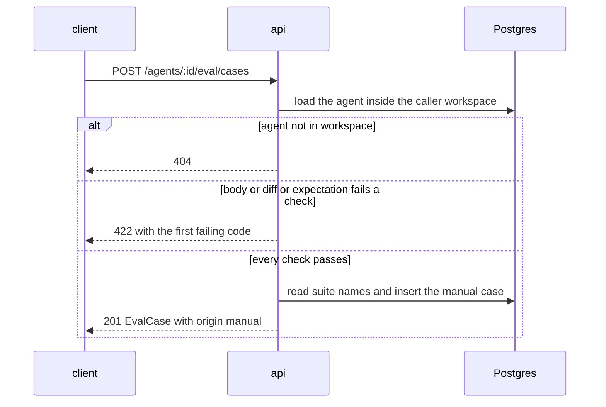
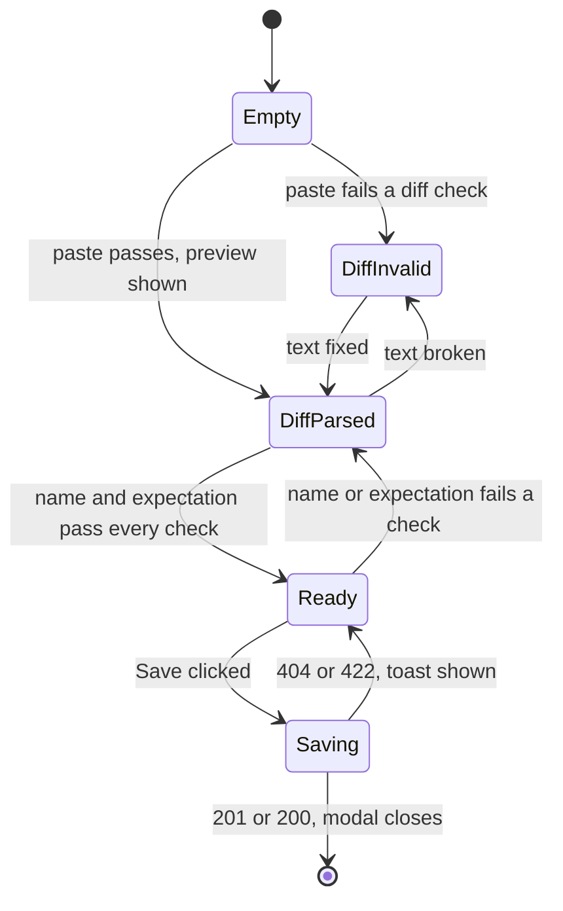

# Spec: Eval Case Editor (manual cases) and the Evals-tab metric trend
Spec ID: SPEC-05
Status: approved
Supersedes: SPEC-04 (partially) — the Non-goal "Creating a case from scratch" and the Finding skeleton (`SPEC-04-eval-pipeline.md` L96-97, AC-36), the read-only Diff and PR meta for cases created by hand (Goals L66-67, AC-37, DR-19), and the Evals-tab EmptyState copy (AC-32). Every other SPEC-04 decision stands, including the read-only input of finding-born cases, whole-suite runs only and the "last 20 runs" window.
Superseded by: SPEC-07 (partially — the Non-goal "Run case, Run on save, and per-case runs" (decision 8) and the AC-3 "Run case button" clause; Run on save stays out)

## Problem and user

SPEC-04 built the eval pipeline. Its dataset has exactly one source: "Turn into eval case" on a
finding the agent already produced and a reviewer triaged (`SPEC-04-eval-pipeline.md` L96-97).
That gap costs the agent author two things:

- **No cases for bugs the agent never saw.** Examples are another team's incident, or an edge case a
  colleague raised in a code review. The author cannot test for these until the agent happens to
  flag them, and an agent that never flags them never gets a case. The suite only measures
  hindsight, never foresight.
- **No view of dynamics.** The Evals tab shows the latest run against the previous one: four
  metric cards with a delta (`EvalMetrics.tsx:40-77`) and a five-row run history
  (`RunHistory.tsx:21-76`). A precision that slips two points per prompt version over six versions
  is invisible as a series of small deltas. The dashboard detail has a trend chart, but it has no
  tooltip, so a point cannot be tied to a prompt version or its cost (`LineChart.tsx:43-71`).

The users:

- **The agent author.** They want to paste a diff fragment, state what the agent must find (or must
  not flag) in it, and have the case run with the suite. They also want to watch recall,
  precision and citation accuracy move across versions without leaving the agent.
- **The workspace owner.** A pasted diff and PR text can come from anywhere. They must not steer
  the model or cross workspaces.

This is the L06 extra homework. Its two items are traced as:

- **HW-A (Case Editor):** a form to create and edit a case by hand: paste a diff (with a DiffView
  preview), set the expectation kind, the file and the line range. Manual cases live in the same
  suite and run through the same route.
- **HW-B (Trend charts):** a recall / precision / citation_accuracy chart over the agent's runs on
  the Evals tab. A point is a run, and the tooltip shows the prompt version and the cost.

## Goals / Non-goals

**Goals**

- **"New eval case"** in the Evals tab header (`screen_agents.jsx:142`) opens the existing case
  modal in **create mode**:
  - a Diff tab with a paste area and a live, line-numbered preview;
  - a PR meta tab with an optional title and body;
  - the Expected output JSON pane with its valid/invalid badge and the mock's "Finding skeleton";
  - live file and line-range checks.
- **A create endpoint**, `POST /agents/:id/eval/cases`. It is workspace-scoped, makes no model
  call, and re-checks everything the client checks.
- **Manual cases are first-class suite members.**
  - They carry `origin: "manual"`, no source and no labels.
  - The row shows a "manual" badge.
  - They are run and scored exactly like finding-born cases.
- **Manual cases stay editable.** The diff and PR meta of a manual case can be edited, with the
  same preview and checks. Finding-born cases keep SPEC-04's frozen input; the server enforces it
  with `diff_frozen`.
- **A "Metric trend" card on the Evals tab** with these properties:
  - three lines, one point per completed run among the last 20, chronological;
  - a 0–1 axis, gaps for null metrics;
  - a tooltip with the date, the agent version, the cost and the three metrics.
- **A tooltip on the shared line chart** as an optional capability, which the dashboard trend
  uses too.

**Non-goals** (each is a decision; do not "restore" it)

- **Run case, Run on save, and per-case runs** (`screen_cizruns.jsx:62-64`). Runs stay
  whole-suite through `POST /agents/:id/eval/runs` (SPEC-04 P1, kept; decision 8).
- **The Files tab and multi-file cases** (`screen_cizruns.jsx:76-80`). A case holds one file's
  diff (SPEC-04 Q9, kept; decision 2).
- **The "Linked issue" field** of the mock's PR meta tab (`screen_cizruns.jsx:84`). Nothing reads
  it; decided by orchestrator (DR-14).
- **A PR number on manual cases.** A manual case has no PR (decision 6).
- **Skill-owned eval cases** (the `skill-evals` artboard in `screen_skills.jsx`). It is a visual
  reference only. `client/specs/L02-skills.md` R3 removed the skill Evals tab (decision 8; SPEC-04
  P8).
- **Form fields for the expectation**: a kind dropdown, a file picker, or picking lines by
  clicking in the preview. The JSON pane plus "Finding skeleton" is the editor (decision 3). The
  diff viewer has no line-selection capability (`DiffViewer.tsx:16-35`).
- **Editing the diff or PR meta of a finding-born case.** It stays a frozen copy of the PR
  (decision 7).
- **Thresholds, alerts or a CI gate on the trend** ("dynamics first, thresholds later";
  decision 18). SPEC-04's 2-point regression banner (AC-85, AC-86) is unchanged.
- **A trend over more than the last 20 runs**, a date-range control or zoom (SPEC-04 P3, kept;
  decision 12).
- **Any change to the dashboard trend other than the tooltip.** It keeps no dots and keeps
  omitting runs with a null metric (`EvalAgentDetail/helpers.ts:43-51`; decision 17).
- **A discard confirmation** when cancelling a modal with unsaved input. This matches the
  shipped edit modal (`EvalCaseModal.tsx:89-91`); decided by orchestrator (DR-17).
- **A URL-addressable create mode.** A reload while creating loses the draft. Edit mode keeps
  `?case=<id>` (`EvalsTab.tsx:40-47`); decided by orchestrator (DR-18).
- **Seeding a manual case.** The SPEC-04 seed is unchanged; decided by orchestrator (DR-24).
- **Secret scanning of pasted diffs.** The pasted text is the author's own test input; decided by
  orchestrator (DR-25).
- **A per-route rate limit on case creation.** Creation makes no model call, so it inherits the
  global limit (`server/src/app.ts:95-97`); decided by orchestrator (DR-26).
- **Importing a diff from a URL or a GitHub PR.** The source is a paste (decision 2).

## User stories

- **US-1** As an agent author, I want to create an eval case by pasting one file's diff and
  writing the expectation, so that I can test for a bug the agent has never seen.
- **US-2** As an agent author, I want a live preview with line numbers and live file / line-range
  checks while I write a case, so that I never save a case the server rejects or that can never
  match.
- **US-3** As an agent author, I want to edit the diff and PR text of a case I created by hand,
  so that I can fix a wrong paste without recreating the case.
- **US-4** As an agent author, I want manual cases to run and score exactly like finding-born
  ones, so that the suite's metrics cover both sources.
- **US-5** As an agent author, I want a recall / precision / citation trend over the agent's
  recent runs on the Evals tab, so that I notice slow degradation across versions.
- **US-6** As an agent author, I want each point's tooltip to name the prompt version and the
  cost, so that I can tie a movement to a version and its price.
- **US-7** As a workspace owner, I want hand-made cases confined to my workspace and their text
  kept as data, so that a pasted diff can neither leak nor steer the model.

## Acceptance criteria (EARS)

### A. Create mode in the client

**AC-1 [client]** The Evals tab header shall show a primary "New eval case" button with the
`Plus` icon directly after the run button (`screen_agents.jsx:141-142`; screenshot
`4-agent-evals-tab.webp`).
Verify: unit — the button renders after "Run all evals (N cases)" with the primary kind and the
Plus icon.

**AC-2 [client]** The Evals tab shall keep "New eval case" enabled in each of these states:
- the agent has zero cases;
- the agent has no run;
- a run of the agent is `running`.

Verify: unit — the button is enabled in each of the three states.

**AC-3 [client]** WHEN the user clicks "New eval case", the client shall open the case modal in
create mode with:
- width 920;
- the title "New eval case";
- the subtitle "`<agent name>` · simulate a PR and assert the expected output";
- an empty Name field and empty Notes;
- the Input tabs Diff and PR meta, with Diff selected;
- an empty Expected output JSON pane with its valid/invalid JSON badge and a "Finding skeleton"
  ghost button with the `Plus` icon (`screen_cizruns.jsx:87-91`);
- Cancel and Save buttons.

The modal has no Files tab, Run case button, Run on save toggle, "Last run" line or source line.
Verify: unit — those parts render inside the dialog; none of the absent parts does.

**AC-4 [client]** WHILE the modal is in create mode, the Diff tab shall show an editable
monospace textarea with a placeholder that names the required `+++ b/<path>` header and `@@`
hunk.
Verify: unit — typing changes the textarea's value; the placeholder text renders.

**AC-5 [client]** WHILE the Diff text passes every diff check of AC-7, the modal shall show a
read-only preview of it below the textarea through the shared diff viewer. Every added and
context line carries its new-side line number in the gutter. The preview has no line-comment
affordance.
Verify: unit — a paste whose hunk starts at `+12` shows 12 on its first non-removed line and
consecutive numbers after it; hovering a line shows no "+" button.

**AC-6 [client]** The preview shall not render the paste's header lines (`diff --git`, `index`,
`---`, `+++`) as added or removed lines.
Verify: unit — a paste with all four header lines previews exactly as many added lines as its
hunks hold `+` lines.

**AC-7 [client]** IF the non-empty Diff text fails a diff check, THEN the modal shall show, in
place of the preview, the inline message of the first failing check in this order:
1. it is over 200 KB (UTF-8);
2. it has no `+++` header naming a file (`+++ /dev/null` names none), or no `@@` hunk;
3. it describes more than one file.

Verify: unit — each failing paste shows its own message and no preview; a paste failing checks
1 and 3 shows only message 1; empty text shows neither a message nor a preview.

**AC-8 [client]** WHILE the modal is in create mode or edits a manual case, the PR meta tab shall
show editable, optional Title and Body fields and no PR number or Linked issue field.
Verify: unit — both fields accept input; no PR number or Linked issue label renders.

**AC-9 [client]** WHEN the user clicks "Finding skeleton", the modal shall replace the Expected
output text with `{"kind": "must_find", "file": "<diff path>", "start_line": L, "end_line": L}`.
L is the new-side number of the diff's first added line. When the diff has no added line, L is
its first context line.
Verify: unit — a diff whose first added line is new-side 12 yields 12 for both bounds; a
context-only diff yields its first context line; earlier pane text is replaced.

**AC-10 [client]** WHILE the Diff text is empty, fails a diff check, or has no new-side line, the
modal shall disable "Finding skeleton".
Verify: unit — disabled for an empty, an unparseable and a deletion-only paste; enabled for a
valid one.

**AC-11 [client]** WHILE the Expected output is a valid expectation that fails a diff-relative
check, the modal shall show the inline message for that check under the pane. The checks are:
- `file` differs from the diff's path → the `file_mismatch` message;
- the line range covers no new-side line of any hunk → the `range_outside_hunks` message.

Verify: unit — a wrong file and a range between two hunks each show their message; a valid pair
shows none.

**AC-12 [client, server]** The client's live diff and expectation checks shall give the same
verdict as the server's checks for the same input.
Verify: unit — the same fixture list runs through the client checks and the server rules (in
each package's tests) with equal results:
- a range on an added line;
- on a context line;
- on a removed-only line;
- between two hunks;
- one line past the last hunk with a trailing `\ No newline at end of file`;
- a hunk header whose counts are shorter than its body;
- CRLF line endings;
- `+++ /dev/null`;
- two `+++` headers without `diff --git`;
- exactly 200 KB vs 200 KB + 1 byte.

**AC-13 [client]** WHILE any of the following holds, the modal shall disable Save:
- the trimmed name is empty or longer than 60 characters;
- the diff is editable and its text is empty or fails a diff check;
- the Expected output is not a valid expectation, or a check of AC-11 fails;
- a save request is pending.

Verify: unit — each condition alone disables Save; with none of them Save is enabled.

**AC-14 [client]** WHEN the user clicks Save in create mode, the client shall send exactly one
create request.
Verify: unit — a double click issues one request; Save reads "Saving…" while it is pending.

**AC-15 [client]** WHEN the create request succeeds, the client shall close the modal.
Verify: unit — after a mocked 201 the dialog is gone.

**AC-16 [client]** WHEN the create request succeeds, the Evals tab shall list the new case and
count it in the run button label without a page reload.
Verify: unit — after a mocked 201 the row renders and "Run all evals (N+1 cases)" shows.

**AC-17 [client]** IF a create or update request fails, THEN the client shall keep the modal open
with every field as typed and show one toast. The toast holds the human-readable message for the
returned reason code, or the generic message for any other failure, and never a raw code or i18n
key.
Verify: unit — each of `diff_unparseable`, `multi_file_diff`, `diff_too_large`, `file_mismatch`,
`range_outside_hunks`, `diff_frozen`, `validation_error` and a 404 yields exactly one toast with
mapped text; the fields keep their values.

**AC-18 [client]** WHEN the user clicks Cancel or presses Escape in create mode, the client shall
close the modal without a request and without a confirmation.
Verify: unit — no request is issued and no confirm dialog renders.

### B. Creating a case on the server

**AC-19 [server]** WHEN `POST /agents/:id/eval/cases` carries a valid body for an agent of the
caller's workspace, the system shall create a case in that agent's suite and answer 201 with the
`EvalCase`.
Verify: integration — status 201; `GET /agents/:id/eval/cases` then lists the case.

**AC-20 [server]** The system shall report a case created by hand with `origin: "manual"`,
`source: null` and `labels: null`.
Verify: integration — the 201 body and a later GET carry those three values.

**AC-21 [server]** The system shall report a manual case's `input_meta` as follows:
- `pr_number` is null;
- `title` is the sent title, or an empty string when omitted;
- `body` is the sent body, or null when omitted or empty.

Verify: integration — a request without `input_meta` and one with both fields each read back as
specified.

**AC-22 [server]** The system shall store a manual case's diff in the shape of a finding-born
case's diff (SPEC-04 AC-13): `diff --git`, `---` and `+++` headers for the pasted path, followed
by the pasted hunks unchanged.
Verify: unit — a paste with only a `+++` header and the same paste with a full git header store
identical diffs; parsing the stored diff yields one file with the pasted path and the pasted
new-side line numbers.

**AC-23 [server]** WHEN the pasted diff uses CRLF line endings, the system shall store it with LF
line endings.
Verify: unit — the CRLF and LF forms of one paste store identical diffs and parse to the same
file and new-side lines.

**AC-24 [server]** WHEN the trimmed name is already a case name in the agent's suite, the system
shall append `-2`, `-3`, … to the stored name and keep the result within 60 characters (the
SPEC-04 AC-16 rule).
Verify: integration — creating "sql-injection" twice yields `sql-injection` and
`sql-injection-2`; a taken 60-character name yields a 60-character name ending in `-2`.

**AC-25 [server]** IF the diff of a create request fails a diff check, THEN the system shall
reject the request with 422 and the code of the first failing check, creating no case. The checks
run in this order:
1. `diff_too_large`: the diff is over 200 KB (UTF-8);
2. `diff_unparseable`: no `+++` header naming a file (`+++ /dev/null` names none), or no `@@`
   hunk;
3. `multi_file_diff`: more than one file, counting both `diff --git` and `+++` headers.

Verify: integration — each failing diff yields its code and no row; a 300 KB two-file diff yields
`diff_too_large`; two `+++` headers without `diff --git` yield `multi_file_diff`.

**AC-26 [server]** IF the expectation's `file` differs from the diff's path, THEN the system shall
reject the create request with 422 `file_mismatch`.
Verify: integration — status and code; no case row.

**AC-27 [server]** IF the expectation's line range covers no new-side line of any hunk of the
diff, THEN the system shall reject the create request with 422 `range_outside_hunks`. The rule is
the grounding gate's (SPEC-04 AC-22).
Verify: integration — a range between hunks and a range on a removed-only line are rejected; a
range on a context line is accepted.

**AC-28 [server]** IF a create or update body has any of the following, THEN the system shall
reject it with 422 `validation_error` and change nothing:
- an unknown key;
- a trimmed name that is empty or longer than 60 characters;
- a PR title and body over 200 KB together;
- a NUL character in any text field.

Verify: integration — each case yields 422 `validation_error`; no row is created or changed.

**AC-29 [server]** IF the agent of a create request does not exist in the caller's workspace, THEN
the system shall answer 404 and create no case.
Verify: integration — another workspace's agent id and a random uuid each yield 404, and neither
workspace gains a row.

**AC-30 [server]** The system shall create and update cases without any model call.
Verify: unit — with an LLM provider that throws on any call, create and update succeed and the
provider records zero calls.

### C. Editing a case

**AC-31 [client]** WHEN the user opens a manual case, the modal shall show the Diff tab as an
editable textarea holding the stored diff, with create mode's preview, checks and "Finding
skeleton" button.
Verify: unit — a manual case opens with an editable textarea, a preview and an enabled skeleton
button.

**AC-32 [client]** WHEN the user opens a finding-born case, the modal shall render the Diff and PR
meta tabs read-only with no "Finding skeleton" button, as in SPEC-04 AC-36…AC-38.
Verify: unit — for `origin: "finding"` there is no editable input in either tab and no skeleton
button.

**AC-33 [client]** WHERE the open case is manual, the modal shall show the source line "Created
manually" in place of "PR #`<n>` · …".
Verify: unit — a manual case shows the text; a finding case still shows the PR line.

**AC-34 [client]** WHEN the user saves a manual case, the client shall send only the changed
fields:
- `input_diff` when the diff text changed;
- `input_meta`, with title and body together, when either PR field changed.

Verify: unit — editing only the body sends `input_meta` alone; saving with no change closes the
modal with no request.

**AC-35 [server]** WHEN an update of a manual case carries an `input_diff` or `input_meta` that
passes every check, the system shall store it, normalising the diff as in AC-22.
Verify: integration — a GET after the update returns the new diff and meta.

**AC-36 [server]** IF an update of a finding-born case carries `input_diff` or `input_meta`, THEN
the system shall reject it with 422 `diff_frozen` and change nothing.
Verify: integration — status and code; the stored case is unchanged, including a name and an
expectation sent in the same body.

**AC-37 [server]** IF an update of a manual case carries an `input_diff` that fails a diff check,
THEN the system shall reject it with 422 and the code of the first failing check in the order of
AC-25.
Verify: integration — each failing diff yields its code; the stored case is unchanged.

**AC-38 [server]** IF, after an update is applied, the case's expectation names a file other than
the diff's, or covers no new-side hunk line, THEN the system shall reject the update with 422
`file_mismatch` or `range_outside_hunks` and change nothing. The expectation checked is the one
sent, or else the stored one.
Verify: integration — replacing the diff with one for another path and no new expectation yields
`file_mismatch`; moving the hunks away from the stored range yields `range_outside_hunks`.

**AC-39 [server]** IF an update names a case outside the caller's workspace, THEN the system shall
answer 404 and change nothing.
Verify: integration — a second workspace's PATCH with `input_diff` gets 404; the owner's GET
shows the diff unchanged.

**AC-40 [server]** WHEN a manual case is edited while a run of its agent is `running`, the system
shall review that case in the running run with the diff and PR meta it had when the run started.
Verify: unit — with a gated stub LLM, edit the case's diff after start; the prompt captured for
the case holds the old diff.

### D. Manual cases in the suite and in runs

**AC-41 [client]** The Evals tab shall render a manual case's row with the kind badge and a
"manual" badge in place of the severity · category chip.
Verify: unit — a manual row shows "must find" and "manual" and no severity badge; a finding row
is unchanged.

**AC-42 [server]** The system shall report `origin: "finding"`, with source and labels unchanged,
for every case created from a finding, including cases created before this feature.
Verify: integration — after migrating and seeding, every seeded case has `origin: "finding"` and
non-null `source` and `labels`.

**AC-43 [server]** The system shall count manual cases in every case count it reports:
- the suite list;
- a run's `cases_total`;
- the overview's and the dashboard's `cases_total`.

Verify: integration — a suite of 2 finding-born and 1 manual case reports 3 in each.

**AC-44 [server]** The system shall run and score a manual case in a suite run by the same rules
as a finding-born case (SPEC-04 AC-48, AC-65…AC-73).
Verify: unit — a stub returning a finding on the manual case's range scores the case passed as
`must_find` and failed as `must_not_flag`, and the case enters recall and precision.

**AC-45 [server]** The system shall give the engine a task line for a manual case made of fixed
words only, with no PR number and no user text.
Verify: unit — the task captured by a spy LLM for a manual case holds no `#<number>` and none of
a sentinel placed in the title, body, name and notes.

**AC-46 [server]** WHERE a manual case has a PR title or body, the system shall pass them to the
engine only in the PR-description slot, as `Title: <title>` followed by the body, as for a
finding-born case.
Verify: unit — the spy prompt shows the title and body only inside the engine's untrusted
PR-description delimiter.

**AC-47 [server]** WHERE a manual case has neither a PR title nor a body, the system shall send the
engine no PR description.
Verify: unit — the spy prompt holds no PR-description section for such a case.

**AC-48 [server]** WHEN a case is created while a run of its agent is `running`, the system shall
leave that run's case set and `cases_total` unchanged.
Verify: integration — a case created mid-run leaves the run's `cases_total` as it was, and the
new case has no outcome in that run.

**AC-49 [client]** WHERE the agent has no cases, the Evals tab EmptyState shall name both sources
of a case: turning an accepted or dismissed finding into a case, and "New eval case".
Verify: unit — the EmptyState body mentions "Turn into eval case" and "New eval case".

### E. The metric trend on the Evals tab

**AC-50 [client]** WHERE at least two of the agent's loaded runs are `completed`, the Evals tab
shall show a "Metric trend" card directly below the EVAL METRICS section. It holds:
- Recall, Precision and Citation lines in `--accent`, `--ok` and `--warn`;
- the dashboard trend's legend.

Verify: unit — the card renders between the metrics and the case list, with three series of those
colours and the three legend labels.

**AC-51 [client]** The Evals-tab trend shall plot one point per `completed` run among the loaded
runs (at most the last 20), oldest at left, each drawn as a visible dot.
Verify: unit — 6 runs (4 completed, 1 running, 1 failed) yield 4 points in start-time order, and
every series draws dots.

**AC-52 [client]** The Evals-tab trend shall use a 0–1 y domain with ticks at 0, 0.2, 0.4, 0.6,
0.8 and 1.
Verify: unit — the chart receives that domain and those ticks; a 0.30 precision plots inside it.

**AC-53 [client]** IF a metric of a completed run is null, THEN the Evals-tab trend shall leave a
gap in that metric's line at that run, while the run's other metrics still plot.
Verify: unit — the series value at that index is null, not 0, and the other two series hold
numbers there.

**AC-54 [client]** WHEN a run's point is hovered or has keyboard focus, the Evals-tab trend shall
show a tooltip with:
- the run's start date and time, formatted as in the run history;
- "v`<agent_version>`";
- the run cost via `formatCost` ("—" when null);
- recall, precision and citation as whole percentages, or "n/a" when null.

Verify: unit — hovering a point shows its date, "v7", "$0.03", "82%", "n/a" and "90%" from a
mocked run; a null cost shows "—".

**AC-55 [client]** WHERE fewer than two of the loaded runs are `completed`, the Evals tab shall
show the one-line hint "Run the suite at least twice to see a trend" in place of the chart.
Verify: unit — with 0 and with 1 completed run the hint renders and no chart does.

**AC-56 [client]** WHEN a polled run of the agent changes from `running` to `completed`, the
Evals-tab trend shall add its point without a page reload.
Verify: unit — the mocked response changes between polls and the point count grows by one.

**AC-57 [client]** IF the agent's runs fail to load, THEN the Evals tab shall show a one-line load
error in place of the trend.
Verify: unit — a mocked failure renders the error text and no chart.

### F. The shared chart tooltip and the dashboard

**AC-58 [client]** WHERE a caller of the shared line chart does not ask for a tooltip, the chart
shall render as before this change: no tooltip, and the same dots, domain and data handling.
Verify: unit — a chart rendered without the tooltip option shows no tooltip on hover, and the
existing chart tests pass unchanged.

**AC-59 [client]** WHEN a point of the dashboard detail's trend chart is hovered or has keyboard
focus, the dashboard shall show the tooltip of AC-54 for that run.
Verify: unit — hovering a dashboard point shows that run's date, version, cost and three metrics.

**AC-60 [client]** The dashboard detail's trend chart shall keep these unchanged: its points,
domain, colours and legend, and the omission of runs with a null metric.
Verify: unit — the existing dashboard trend tests pass unchanged, and a run with a null precision
is still not plotted.

## Edge cases

- **EC-1** A paste with hunks but no `+++` header → AC-7, AC-25
- **EC-2** A new-file paste (`--- /dev/null`, `+++ b/<path>`) → AC-22 (the path comes from `+++`)
- **EC-3** A deleted-file paste (`+++ /dev/null`) → AC-7, AC-25
- **EC-4** Two files pasted, including two `+++` headers without `diff --git` lines. The server
  parser would silently overwrite the path (`diff-parser.ts:39-43`) → AC-7, AC-25, AC-12
- **EC-5** A paste over 200 KB → AC-7, AC-25, NFR-6
- **EC-6** A CRLF paste from a Windows clipboard → AC-23, AC-12
- **EC-7** Hunk-header counts disagree with the body, or a trailing `\ No newline at end of file`
  → AC-12, AC-27
- **EC-8** A deletion-only hunk (no new-side line) → AC-10, AC-27
- **EC-9** The expectation names another file → AC-11, AC-26
- **EC-10** The range sits on a removed-only line or between hunks → AC-11, AC-27
- **EC-11** The diff is changed after the expectation was written, or a PATCH replaces the diff
  but keeps the stored expectation → AC-11, AC-38
- **EC-12** The name is already taken in the suite → AC-24
- **EC-13** A blank name, or one over 60 characters → AC-13, AC-28
- **EC-14** Save is double-clicked → AC-14
- **EC-15** The agent is deleted while the create modal is open → AC-29, AC-17
- **EC-16** An agent id or case id from another workspace → AC-29, AC-39
- **EC-17** A client calls PATCH with `input_diff` on a finding-born case → AC-36
- **EC-18** A case is created or edited while a run is in progress → AC-48, AC-40
- **EC-19** The title, body or diff carries instructions for the model or a literal `</untrusted>`
  → AC-45, AC-46, NFR-4
- **EC-20** Pasted text contains HTML or script → NFR-3
- **EC-21** A NUL character in a pasted field, which Postgres text cannot store → AC-28
- **EC-22** Cancel or Escape with an unsaved paste → AC-18
- **EC-23** A manual case with no PR title and no body → AC-47, AC-21
- **EC-24** Cases created before this feature → AC-42
- **EC-25** Zero or one completed run → AC-55
- **EC-26** A completed run with a null metric, or all three null → AC-53, AC-54
- **EC-27** Running and failed runs among the loaded runs → AC-51
- **EC-28** More than 20 runs exist → AC-51 (only the last 20 are loaded); more history → Non-goal
- **EC-29** A run with a null cost → AC-54
- **EC-30** A run completes while the tab is open → AC-56
- **EC-31** The runs request fails → AC-57
- **EC-32** A metric below 60 %, which the chart's default `yMin` of 0.6 would clip
  (`LineChart.tsx:22`) → AC-52
- **EC-33** Several runs on the same agent version → AC-54 (each point names its own version)
- **EC-34** A dashboard run with a null metric → AC-60
- **EC-35** A pasted diff contains a realistic secret, as the mock does (`screen_cizruns.jsx:58`)
  → Non-goal (secret scanning)
- **EC-36** The modal is reloaded mid-create → Non-goal (URL-addressable create mode)

## Non-functional requirements

**NFR-1 [client]** Every new UI string of this feature shall come from a key under
`client/messages/en/eval.json`.
Verify: unit — component tests assert the English text; a missing key would render as the raw
key.

**NFR-2 [client]** Every new control shall be operable by keyboard (WCAG 2.2 AA, 2.1.1
Keyboard). This covers:
- "New eval case", the Diff textarea, the PR meta fields, "Finding skeleton", Save and Cancel;
- the trend chart, which takes focus by Tab, with Left and Right moving the focused point and its
  tooltip.

Verify: unit — tabbing reaches each control; on the focused chart, ArrowRight moves the tooltip
to the next run.

**NFR-3 [client]** The client shall render every pasted or typed case text, and every tooltip
value, as text and never as HTML. This covers the diff text and preview, the PR title and body,
the name and the notes.
Verify: unit — an `` string in each field renders literally and creates no
`img` element.

**NFR-4 [server]** In an eval run, a manual case's diff and PR description shall reach the model
only inside the engine's untrusted delimiters, with a closing delimiter inside them escaped, as
for a finding-born case (SPEC-04 NFR-5).
Verify: unit — the spy prompt shows the manual diff inside `<untrusted source="diff">`; an
injected `</untrusted>` in the diff and in the body is escaped.

**NFR-5 [client]** New UI of this feature, including the chart tooltip, shall be composed from
`@devdigest/ui` primitives and the mock's CSS tokens (`docs/design/extracted/styles.css`), with
no hard-coded colour values.
Verify: manual — compare the result with `screen_cizruns.jsx:56-96` and `screen_agents.jsx:135-144`
and screenshots `4-agent-evals-tab.webp` and `5-eval-case-modal.webp`, then grep the new client
files for hex and `rgb(` literals. No automated visual check exists.

**NFR-6 [server]** The system shall accept a create or update request at every size cap at once:
a 200 KB diff of ordinary source text, plus a PR title and body of 200 KB together. This is
within the server's 1 MB body limit (`server/src/app.ts:50`).
Verify: integration — a create request at both caps returns 201.

**NFR-7 [client]** WHEN a 200 KB diff is pasted, the modal shall show its preview within 1 s.
Verify: manual — measure in the browser performance panel on the dev stack. `client/` has no
automated performance harness.

## Module interactions

### Boundaries

| Boundary | Who calls whom | Data | Sync / async | Failure behaviour |
|---|---|---|---|---|
| client → api: create case | case modal → API | agent id, name, notes, diff, PR title and body, expectation | sync | 404 / 422 → toast, modal stays open (AC-17, AC-25…AC-29) |
| client → api: update case | case modal → API | case id, changed fields | sync | 404 / 422 incl. `diff_frozen` → toast (AC-17, AC-36…AC-39) |
| client → api: runs | Evals tab → `GET /agents/:id/eval/runs` (existing, ≤ 20, newest first; `service.ts:340`) | runs with `agent_version`, `cost_usd`, metrics | sync; polled while a run is `running` (`client/src/lib/hooks/eval.ts:78-83`) | load error → AC-57 |
| client → api: dashboard | dashboard detail → `GET /agents/:id/eval/dashboard` (existing) | runs and trend | sync | unchanged (SPEC-04) |
| api → reviewer-core | eval run → engine | manual case diff, optional PR description, fixed task line | in-process, one case at a time (SPEC-04 AC-50) | unchanged: errored case (SPEC-04 AC-54, AC-55) |
| api → DB | API → Postgres | case rows | sync | a rejected request writes nothing (AC-25…AC-29, AC-36…AC-39) |

No new endpoint serves the trend. The Evals tab already loads the runs it needs. The dashboard
tooltip's version and cost come from `runs[]`, which the dashboard response already carries
(`eval-ci.ts:254-265`). Whether `EvalTrendPoint` (`eval-ci.ts:235-240`) gains these fields
additively is the planner's choice.

### Creating a case by hand



### The case modal's Save gate (create mode and manual cases)



### Contracts

All names are snake_case on the wire. Both vendor copies change in lock-step
(`server/src/vendor/shared/contracts/eval-ci.ts`, `client/src/vendor/shared/contracts/eval-ci.ts`).

```text
EvalCase (changed, proposed; today eval-ci.ts:103-116)
  origin        "finding" | "manual"            required   new
  source        EvalCaseSource | null           required   null exactly when origin = "manual"
  labels        EvalCaseLabels | null           required   null exactly when origin = "manual"
  input_meta    { pr_number: int | null, title: string, body: string | null }
                                                           pr_number null exactly when origin = "manual"
  (id, agent_id, name, notes, input_diff, expectation, created_at, last_outcome: unchanged)

EvalCaseCreate (proposed) — body of POST /agents/:id/eval/cases, strict (unknown key -> 422)
  name          string, trimmed, 1..60 chars     required
  notes         string | null                    optional
  input_diff    string, <= 200 KB UTF-8          required   one file: a "+++ <path>" header and >= 1 "@@" hunk;
                                                            "diff --git" and "---" headers optional
  input_meta    { title?: string, body?: string | null }  optional; title + body <= 200 KB together
  expectation   EvalExpectation                  required   (eval-ci.ts:29-39, unchanged)

EvalCaseUpdate (changed, proposed; today eval-ci.ts:120-126) — body of PATCH /eval/cases/:id, strict
  name          string, trimmed, 1..60 chars     optional   (the 60-char cap is new for PATCH)
  notes         string | null                    optional
  expectation   EvalExpectation                  optional
  input_diff    string, same rules as create     optional   manual cases only
  input_meta    { title: string, body: string | null }   optional   manual cases only; replaces both
```

```text
Endpoints
  POST  /agents/:id/eval/cases  (proposed)  -> 201 EvalCase
        errors 404 (agent not in the caller workspace)
               422 validation_error
               422 diff_too_large | diff_unparseable | multi_file_diff   (first failing, in this order)
               422 file_mismatch | range_outside_hunks
        no model call
  PATCH /eval/cases/:id  (changed)          -> 200 EvalCase
        errors 404
               422 validation_error
               422 diff_frozen          (input_diff or input_meta on an origin = "finding" case)
               422 diff_too_large | diff_unparseable | multi_file_diff
               422 file_mismatch | range_outside_hunks   (checked on the resulting diff + expectation)
  GET   /agents/:id/eval/cases, GET /eval/cases/:id   -> EvalCase with origin (changed shape only)
  GET   /agents/:id/eval/runs, GET /agents/:id/eval/dashboard   -> unchanged
```

How a manual case is stored (`eval_cases.source_pr_number`, `source_repo` and `labels` are
`NOT NULL` today, `server/src/db/schema/eval.ts:37-39`) is the planner's decision.

## Inputs and provenance

| Input | Comes from | Produced by | Freshness | Trusted |
|---|---|---|---|---|
| Pasted diff | the case modal | the agent author, often copied from someone else's incident or review | on save; frozen until the author edits it | no — checked at the boundary (AC-25), wrapped in prompts (NFR-4), rendered as text (NFR-3) |
| PR title and body | the case modal | the agent author | on save | no — only in the wrapped PR-description slot (AC-46), never in the task line (AC-45) |
| Name and notes | the case modal | the agent author | on save | user input — validated (AC-28), rendered as text (NFR-3), never prompted (AC-45) |
| Expectation JSON | the case modal | the agent author | on save | user input — checked in the client (AC-11) and the server (AC-26, AC-27, AC-38) |
| Agent id | the Evals tab URL | the app | per request | resolved through the caller's workspace (AC-29) |
| Case id | the Evals tab URL `?case=` | the app | per request | resolved through the caller's workspace (AC-39) |
| Run metrics, version, cost | `GET /agents/:id/eval/runs` | the server, computed in code (SPEC-04 AC-69…AC-75) | polled while a run is `running` | yes — the cost may be null (AC-54) |
| Dashboard runs | `GET /agents/:id/eval/dashboard` | the server | on load and while a run is `running` | yes |

## Untrusted inputs

- **Pasted diff.**
  - It is size-limited and must hold exactly one file, both at the boundary → AC-25, AC-37,
    NFR-6.
  - It reaches the model only inside the diff delimiter, with a closing delimiter escaped → NFR-4.
  - It is rendered as text in the textarea and in the preview → NFR-3.
  - A NUL character is rejected → AC-28.
- **PR title and body.**
  - They are size-limited → AC-28.
  - They reach the model only in the wrapped PR-description slot (the engine also truncates it,
    `reviewer-core/src/prompt.ts:152-155`) → AC-46, NFR-4.
  - They never reach the trusted task line, which is fixed words only. Server INSIGHTS
    2026-10-08 (`server/INSIGHTS.md:74`) records why the task slot is never wrapped → AC-45.
  - They are rendered as text → NFR-3.
- **Name and notes.** They are validated → AC-28. They are rendered as text → NFR-3. They are
  absent from every prompt → AC-45.
- **Expectation JSON.** It is checked in the client → AC-11, AC-12, and checked again in the
  server → AC-26, AC-27, AC-38. It is never prompted (SPEC-04 AC-49, unchanged).
- **Ids in requests** (agent, case). Every read and write is confined to the caller's workspace
  → AC-29, AC-39. `eval_cases` carries its own `workspace_id` (`server/src/db/schema/eval.ts:31`).
- **Model findings during a run.** Handling is unchanged from SPEC-04 (grounded, scored in code,
  rendered as text) → AC-44.

## Design review

Decision sources: **"user (decision N)"** means the orchestrator brief's final decisions, which
the user delegated; **"decided by orchestrator"** means a gap the brief did not cover, settled
with the recommended default under the same delegation.

| # | Finding or proposal | Evidence | Decision |
|---|---|---|---|
| DR-1 | The mock draws "New eval case" in the Evals tab header; the shipped tab has only the run button | `screen_agents.jsx:141-142`; screenshot `4-agent-evals-tab.webp`; `EvalsTab.tsx:58-65` | accepted, user (decision 1) → AC-1, AC-2 |
| DR-2 | SPEC-04 declined creating a case from scratch and the Finding skeleton | `SPEC-04-eval-pipeline.md` L96-97, AC-36 | reversed, user (decisions 1, 3); SPEC-04 marked `Superseded by` → AC-3, AC-9 |
| DR-3 | The mock's Diff tab is a read-only `<pre>`, and the shipped modal renders the same way with no line numbers | `screen_cizruns.jsx:74-75`; `EvalCaseModal.tsx:124-131` | accepted: editable paste plus a preview with new-side numbers through the shared diff viewer, user (decision 2) → AC-4, AC-5 |
| DR-4 | The client patch parser would render `---` / `+++` header lines as removed / added lines | `client/src/components/diff-viewer/helpers.ts:25-29` | accepted, decided by orchestrator → AC-6 |
| DR-5 | The server parser drops a `+++ /dev/null` file and overwrites the path when a second `+++` comes without `diff --git` | `server/src/adapters/git/diff-parser.ts:39-43,78` | accepted: `/dev/null` is unparseable, a second `+++` is multi-file, decided by orchestrator → AC-7, AC-25, EC-3, EC-4 |
| DR-6 | Order of the diff checks when several fail (size, parse, multi-file) | — | decided by orchestrator: size → parse → multi-file, the first failing code is returned → AC-7, AC-25 |
| DR-7 | The client and server range rules can drift: the server clamps to the hunk header range and counts context lines | `server/src/modules/eval/helpers/case-diff.ts:41-62` | accepted, decided by orchestrator: one shared fixture list → AC-12 |
| DR-8 | The mock's Expected output is an array of finding objects with severity, category and title | `screen_cizruns.jsx:59`; screenshot `5-eval-case-modal.webp` | SPEC-04 shape kept (`eval-ci.ts:29-39`); the skeleton emits it, user (decision 3) → AC-9 |
| DR-9 | The skeleton's line when the diff has no added line; its state when the diff does not parse | — | decided by orchestrator: first context line; disabled while the diff is invalid or has no new-side line → AC-9, AC-10 |
| DR-10 | The skeleton is offered for manual cases only, not for finding-born ones | SPEC-04 AC-36 | decided by orchestrator → AC-31, AC-32 |
| DR-11 | Manual-case contract: `source`, `pr_number` and `labels` are required today, and the DB columns are `NOT NULL` | `eval-ci.ts:43-65,103-116`; `server/src/db/schema/eval.ts:37-39` | accepted: `origin`, nullable `source` and `labels`, user (decision 6); `pr_number` nullable, decided by orchestrator; storage → planner → AC-20, AC-21, AC-42 |
| DR-12 | The eval task line embeds the PR number, and a manual case has none | `server/src/modules/eval/helpers/prompt.ts:14-17`; `server/INSIGHTS.md:74` | decided by orchestrator: fixed words only, no number → AC-45 |
| DR-13 | A manual case with no PR text would send "Title: " as its description | `prompt.ts:32-35`; the engine omits an empty description (`reviewer-core/src/prompt.ts:152-166`) | decided by orchestrator: no description is sent → AC-47 |
| DR-14 | The mock's PR meta tab has a "Linked issue" field | `screen_cizruns.jsx:84` | declined, decided by orchestrator → Non-goal; AC-8 |
| DR-15 | Names: free text or slug; the 60-character cap on PATCH | `case-diff.ts:69-91`; `eval-ci.ts:122` | decided by orchestrator: free text, trimmed, 1–60 characters on create and update, suffix on collision at create only → AC-24, AC-28; user (decision 4) for the create rule |
| DR-16 | PR meta size cap and NUL characters (Postgres text rejects NUL) | — | decided by orchestrator: title + body ≤ 200 KB together (decision 9 caps "PR meta" at 200 KB); NUL → `validation_error` → AC-28, NFR-6 |
| DR-17 | Discard confirmation when cancelling with unsaved input | `EvalCaseModal.tsx:89-91` (none today) | declined, decided by orchestrator → Non-goal; AC-18 |
| DR-18 | Create mode in the URL | `EvalsTab.tsx:40-47` (`?case=<id>` for edit) | declined, decided by orchestrator → Non-goal |
| DR-19 | Create mode hides "Last run" and the source line; a manual case shows "Created manually" | `screen_cizruns.jsx:93-95`; `EvalCaseModal.tsx:162-175` | decided by orchestrator → AC-3, AC-33 |
| DR-20 | Manual row badge | `EvalCaseRow.tsx:56-62` | accepted, user (decision 6) → AC-41 |
| DR-21 | Diff editing for manual cases only; `diff_frozen` for finding-born cases | SPEC-04 AC-37 | accepted, user (decision 7) → AC-31, AC-32, AC-34…AC-38 |
| DR-22 | An update that changes only the diff must still fit the stored expectation | `server/src/modules/eval/service.ts:194-225` (checks only a sent expectation) | decided by orchestrator: check the resulting pair → AC-38 |
| DR-23 | A run works on an in-memory snapshot of the cases, so edits and additions mid-run do not reach it | `service.ts:236-240,303-312` | accepted as-is → AC-40, AC-48 |
| DR-24 | Seeding a manual case | SPEC-04 AC-106…AC-109 | declined, decided by orchestrator → Non-goal |
| DR-25 | The mock diff holds a realistic Stripe key; pasted diffs may too | `screen_cizruns.jsx:58` | no scanning, decided by orchestrator → Non-goal; SPEC-04 NFR-1 still governs fixtures |
| DR-26 | Rate limit for case creation | `server/src/app.ts:95-97` | global limit only (no model call), decided by orchestrator → Non-goal; AC-30 |
| DR-27 | The brief says `eval.json` already holds `caseEditor.newCase`, `titleLabel`, `bodyLabel`, `diffPlaceholder`; it does not | `client/messages/en/eval.json:102-136` (`caseModal.*` only) | correction: the planner adds the keys → NFR-1 |
| DR-28 | EmptyState copy names one source only | `client/messages/en/eval.json:70`; SPEC-04 AC-32 | accepted, user (decision 10) → AC-49 |
| DR-29 | No trend on the Evals tab; the mock draws none there, and the dashboard has one | `screen_agents.jsx:135-144`; `TrendChart.tsx:14-39` | accepted, user (decisions 11–13) → AC-50…AC-52 |
| DR-30 | The shared chart turns a missing value into 0 and draws no dots | `client/src/vendor/ui/charts/LineChart.tsx:39,65` | accepted: gaps and dots on the Evals tab only, user (decisions 12, 14) → AC-51, AC-53; the dashboard is unchanged → AC-60 |
| DR-31 | The shared chart has no tooltip | `LineChart.tsx:1-73` | accepted as an optional capability, user (decision 17) → AC-54, AC-58, AC-59 |
| DR-32 | The dashboard trend points carry no version or cost | `eval-ci.ts:235-240`; `service.ts:452-457` | the data is in the `runs[]` already sent; the contract choice → planner → AC-59 |
| DR-33 | Trend with fewer than two completed runs | — | accepted, user (decision 16) → AC-55 |
| DR-34 | Trend while runs fail to load, and live update while polling | `EvalsTab.tsx:31,35` (`runs.data ?? []`) | decided by orchestrator → AC-56, AC-57 |
| DR-35 | Keyboard access to chart points | — | decided by orchestrator: Tab focuses the chart, arrows move between runs → NFR-2 |
| DR-36 | Thresholds and alerts on the trend | homework "dynamics first, thresholds later" | declined, user (decision 18) → Non-goal |
| DR-37 | The Skill Editor · Evals artboard as a layout reference | `screen_skills.jsx` (`skill-evals`); `client/specs/L02-skills.md` R3 | visual reference only; skill-owned cases out, user (decision 8) → Non-goal |

## Traceability

| AC / NFR | From (US / EC / design review / HW) | Packages | Verify |
|---|---|---|---|
| AC-1 | US-1, HW-A, DR-1 | client | unit |
| AC-2 | US-1, DR-1, EC-18 | client | unit |
| AC-3 | US-1, HW-A, DR-2, DR-19 | client | unit |
| AC-4 | US-1, HW-A, DR-3 | client | unit |
| AC-5 | US-2, HW-A, DR-3 | client | unit |
| AC-6 | US-2, DR-4 | client | unit |
| AC-7 | US-2, EC-1, EC-3, EC-4, EC-5, DR-5, DR-6 | client | unit |
| AC-8 | US-1, HW-A, DR-14 | client | unit |
| AC-9 | US-1, HW-A, DR-8, DR-9 | client | unit |
| AC-10 | US-2, EC-8, DR-9 | client | unit |
| AC-11 | US-2, EC-9, EC-10, EC-11 | client | unit |
| AC-12 | US-2, EC-4, EC-6, EC-7, DR-7 | client, server | unit |
| AC-13 | US-2, EC-13 | client | unit |
| AC-14 | US-1, EC-14 | client | unit |
| AC-15 | US-1 | client | unit |
| AC-16 | US-1, US-4 | client | unit |
| AC-17 | US-2, EC-15 | client | unit |
| AC-18 | US-1, EC-22, DR-17 | client | unit |
| AC-19 | US-1, HW-A | server | integration |
| AC-20 | US-1, DR-11 | server | integration |
| AC-21 | US-1, EC-23, DR-11 | server | integration |
| AC-22 | US-4, EC-2, DR-5 | server | unit |
| AC-23 | US-1, EC-6 | server | unit |
| AC-24 | US-1, EC-12, DR-15 | server | integration |
| AC-25 | US-7, EC-1, EC-3, EC-4, EC-5, DR-5, DR-6 | server | integration |
| AC-26 | US-2, EC-9 | server | integration |
| AC-27 | US-2, EC-7, EC-8, EC-10 | server | integration |
| AC-28 | US-7, EC-13, EC-21, DR-15, DR-16 | server | integration |
| AC-29 | US-7, EC-15, EC-16 | server | integration |
| AC-30 | US-7, DR-26 | server | unit |
| AC-31 | US-3, DR-10, DR-21 | client | unit |
| AC-32 | US-3, DR-10, DR-21 | client | unit |
| AC-33 | US-3, DR-19 | client | unit |
| AC-34 | US-3, DR-21 | client | unit |
| AC-35 | US-3, DR-21 | server | integration |
| AC-36 | US-3, EC-17, DR-21 | server | integration |
| AC-37 | US-3, EC-4, EC-5, DR-21 | server | integration |
| AC-38 | US-3, EC-11, DR-22 | server | integration |
| AC-39 | US-7, EC-16 | server | integration |
| AC-40 | US-4, EC-18, DR-23 | server | unit |
| AC-41 | US-4, DR-20 | client | unit |
| AC-42 | US-4, EC-24, DR-11 | server | integration |
| AC-43 | US-4, HW-A | server | integration |
| AC-44 | US-4, HW-A | server | unit |
| AC-45 | US-7, EC-19, DR-12 | server | unit |
| AC-46 | US-4, US-7, EC-19 | server | unit |
| AC-47 | US-4, EC-23, DR-13 | server | unit |
| AC-48 | US-4, EC-18, DR-23 | server | integration |
| AC-49 | US-1, DR-28 | client | unit |
| AC-50 | US-5, HW-B, DR-29 | client | unit |
| AC-51 | US-5, HW-B, EC-27, EC-28, DR-30 | client | unit |
| AC-52 | US-5, EC-32, DR-29 | client | unit |
| AC-53 | US-5, EC-26, DR-30 | client | unit |
| AC-54 | US-6, HW-B, EC-26, EC-29, EC-33, DR-31 | client | unit |
| AC-55 | US-5, EC-25, DR-33 | client | unit |
| AC-56 | US-5, EC-30, DR-34 | client | unit |
| AC-57 | US-5, EC-31, DR-34 | client | unit |
| AC-58 | US-6, DR-31 | client | unit |
| AC-59 | US-6, DR-31, DR-32 | client | unit |
| AC-60 | US-5, EC-34, DR-30 | client | unit |
| NFR-1 | US-1, US-5, DR-27 | client | unit |
| NFR-2 | US-1, US-6, DR-35 | client | unit |
| NFR-3 | US-7, EC-20 | client | unit |
| NFR-4 | US-7, EC-19 | server | unit |
| NFR-5 | US-1, US-5, DR-1, DR-3 | client | manual |
| NFR-6 | US-1, EC-5, DR-16 | server | integration |
| NFR-7 | US-2, EC-5 | client | manual |

## Open questions

None. The user delegated every decision to the orchestrator, whose brief settled decisions 1–18.
The gaps the brief did not cover were decided by the orchestrator with the recommended default.
Each is recorded under Design review as "decided by orchestrator". No question was deferred.
