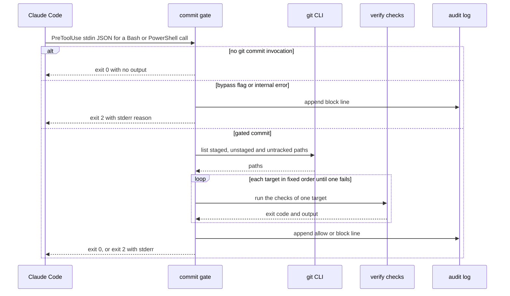
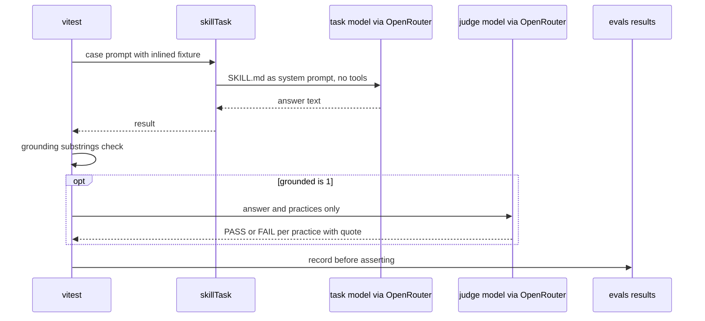

# Spec: Harness quality gates — a regression eval for `frontend-ui-architecture`, a PreToolUse commit test gate, and mutation testing of eval scoring
Spec ID: SPEC-06
Status: approved
Supersedes: none

## Problem and user

Three checks are missing from the DevDigest harness, and each one covers a different kind of
rule. This is the L06 extra homework. Its items are traced in this spec as **HW-A**, **HW-B**
and **HW-C**:

- **HW-A — the L02 skill has no regression protection.**
  - `.claude/skills/frontend-ui-architecture/SKILL.md` was authored in L02 (commit `8d0cfe94`)
    and has no eval. `evals/skills/` holds only `dependency-checker`.
  - An edit to the skill's description or rules can silently weaken it. Examples of rules that
    could go: no `utils.ts` (`SKILL.md:159-164`), narrow barrels only (`SKILL.md:93-103`),
    no splitting on line count (`SKILL.md:107-110`).
  - The weakness is found a week later, in a strange review.
- **HW-B — "never commit without green tests" is a rule nobody enforces.**
  - `CLAUDE.md` asks for `node scripts/verify.mjs <pkg>` before every commit. Today an agent
    can skip that and commit anyway.
  - An eval is a probabilistic check with a threshold. A rule that must always hold needs a
    deterministic gate: a hook.
  - `.claude/settings.json:7-31` has only the UserPromptSubmit and Stop insights hooks. It has
    no PreToolUse hook.
- **HW-C — green tests say nothing about the tests themselves.**
  - `server/test/eval-scoring.test.ts` has 21 tests over
    `server/src/modules/eval/helpers/scoring.ts`, which is pure: type-only imports,
    `scoring.ts:1-8`.
  - Nobody knows whether those tests would catch a logic substitution, such as `<=` → `<` in
    `findingMatches` (`scoring.ts:64`).

The users:

- **The harness maintainer (the course student).** Edits skills, hooks and tests, and needs a
  red signal when an edit breaks behaviour.
- **The agent.** This is the main Claude session and every subagent, because hooks fire for
  subagent tool calls too. Its commits are gated. It needs a denial reason it can act on.
- **The grader / a fresh checkout.** Needs the commands, the documented evidence (a sensitivity
  run, a caught commit, a mutation report), and every existing check still green.

## Goals / Non-goals

**Goals**

- **HW-A: a 4-case skill eval for `frontend-ui-architecture`.**
  - The four cases are placement, anatomy/barrels, logic/state, and one negative case.
  - It is calibrated on the CI models and stable across 3 runs.
  - Its sensitivity is proven by break → red → revert → green.
  - It is documented in a README next to the cases.
- **HW-B: one PreToolUse command hook that gates every agent `git commit`.**
  - Before the commit proceeds, the checks of every touched package must be green.
  - It is deterministic, fail-closed and audit-logged.
  - It is documented, with at least one real caught case.
- **HW-C: mutation testing of `scoring.ts` with Stryker.**
  - Record a baseline, kill every non-equivalent survivor with one focused test, and document
    the equivalent ones.
  - Document the before/after scores.

**Non-goals** (each is a decision; do not "restore" it)

- **Gating commit-producing commands other than `git commit`.** This covers `git merge`,
  `rebase`, `cherry-pick`, `revert`, `am`, `commit-tree` and `stash`. It also covers git
  aliases such as `git ci`, commits made inside a script file the agent runs, and a shell fed a
  heredoc (`bash <<EOF`). The gate covers the literal `git commit` subcommand only. These
  limits are listed in the gate doc (decided by orchestrator, DR-7).
- **Closing Claude Code's own fail-open paths.** Claude Code treats a hook exit code other
  than 2 as non-blocking, and a hook timeout does not block either. So if `node` is missing
  from PATH, or the hook process dies before its own error handling runs, the call proceeds.
  These limits are documented, not engineered around (DR-8).
- **Retrying flaky tests inside the gate.** A known load flake (`server/INSIGHTS.md:36`) can
  block a commit. The agent sees the output and commits again (DR-9).
- **Serialising concurrent commits from parallel subagents.** There is no lock (DR-10).
- **The DB-backed `--it` lane in the gate.** It needs Docker and takes too long for a pre-commit
  gate (brief decision 11).
- **Running checks for `evals/`, `docs/`, `.claude/` outside `hooks/`, or root files** from
  the gate (brief decision 11).
- **An agent-usable escape hatch.** The human bypass is to commit from one's own terminal, or to
  run Claude with hooks disabled (brief decision 14).
- **Proving the skill's lift with `eval:benchmark -n 5`.** `evals/docs/writing-cases.md:48,198`
  recommends it. The sensitivity check (AC-11) stands in for it as the proof of
  discrimination, and the benchmark stays optional (decided by orchestrator, DR-14).
- **A CI change for the evals workflow.** `ci-detect` already selects a new skill eval folder
  (brief decision 6).
- **Mutation testing beyond `scoring.ts`, a mutation-score threshold, or Stryker in
  `verify` or CI** (brief decisions 16, 21).
- **Changing `scoring.ts` production code to kill mutants** (brief decision 19).

## User stories

- **US-1** As the harness maintainer, I want a regression eval for `frontend-ui-architecture`,
  so that an edit that weakens one of its rules fails a test before it reaches a review.
- **US-2** As the harness maintainer, I want documented proof that the eval goes red when the
  skill is broken and green when it is restored, so that I can trust a green run.
- **US-3** As the harness maintainer, I want every `git commit` an agent attempts to be blocked
  unless the checks of the touched packages pass, so that "never commit without green tests"
  always holds.
- **US-4** As the agent, I want the denial to name the failing target and step with the tail
  of its output, so that I can fix the failure and commit again.
- **US-5** As the harness maintainer, I want an audit log and a documented caught case, so that
  I can show what the gate actually stopped.
- **US-6** As the harness maintainer, I want mutation testing on `scoring.ts` with every
  non-equivalent survivor killed, so that I know its tests would catch a logic substitution.
- **US-7** As the grader, I want the commands and the evidence documented and every existing
  check green, so that I can reproduce all three items from a checkout.

## Acceptance criteria (EARS)

### A. Skill eval — `frontend-ui-architecture` (HW-A)

**AC-1 [evals]** The `frontend-ui-architecture` skill eval shall consist of exactly four
`SkillCase` entries, executed through `skillTask` by `pnpm vitest run
skills/frontend-ui-architecture` from `evals/`:

- placement;
- anatomy/barrels;
- logic/state;
- one negative case.

Verify: manual — command output lists exactly four tests under the `frontend-ui-architecture`
describe block.

**AC-2 [evals]** The fixture of the placement case gives raw facts about three things:

- (a) a component imported by exactly one route;
- (b) a component imported by three routes;
- (c) a needed UI element for which `src/vendor/ui` already ships a primitive (`SKILL.md:51-53`).

WHEN given this fixture, the placement case shall pass only if the output does all three of
these:

- places (a) under that route's `_components/`, gated by the grounding substring
  `_components/`;
- places (b) under `src/components/`;
- reuses the named primitive for (c) instead of creating a component (`SKILL.md:35-39`).

Verify: manual — the grounding gate and the judge verdicts in the run output and
`evals/results/` record.

**AC-3 [evals]** The fixture of the anatomy/barrels case contains three traps:

- a `src/components/index.ts` that re-exports 12 components;
- a `utils.ts`;
- a component that imports its own folder's `./index`.

WHEN given this fixture, the anatomy/barrels case shall pass only if the output does all three
of these:

- rejects the wide barrel and says to import by real path (`SKILL.md:93-101`);
- rejects `utils.ts` in favour of a concept-named module or a `helpers.ts` beside its caller
  (`SKILL.md:159-164`);
- names the same-folder `./index` import as a cycle (`SKILL.md:102-103`).

Verify: manual — judge verdicts with evidence quotes in the run record.

**AC-4 [evals]** The fixture of the logic/state case contains four traps:

- a `useState` initialised from query data;
- a `renderRow()` helper that returns JSX;
- a derived total stored in state;
- a pure formatter named `useFormatCost`.

WHEN given this fixture, the logic/state case shall pass only if the output does all four of
these:

- reads the query data directly instead of copying it (`SKILL.md:186-188`);
- turns `renderRow` into a PascalCase component (`SKILL.md:130-131`);
- computes the total during render (`SKILL.md:212-213`);
- renames the formatter to a non-`use` name (`SKILL.md:179-181`).

Verify: manual — judge verdicts with evidence quotes in the run record.

**AC-5 [evals]** The fixture of the negative case is a small change that follows every
convention:

- a route-local `_components/<Name>/` folder;
- a long but single-purpose component;
- `constants.ts` with an `as const` map;
- `helpers.ts`;
- `styles.ts` exporting `s`;
- a one-component `index.ts`;
- a colocated test.

WHEN given this fixture, the negative case shall pass only if the output does both of these:

- states that no structural change is needed;
- states that the component's length alone is not a reason to split it (`SKILL.md:107-110`).

Verify: manual — judge verdicts with evidence quotes in the run record.

**AC-6 [evals]** No case prompt or fixture shall state the rule under test or the expected
verdict. For example, a fixture gives "imported by `app/pulls/page.tsx` only", never "so it
belongs in `_components/`" (`evals/docs/writing-cases.md:57-59`).
Verify: manual — review of the cases file and fixtures against each practice, noted in the
eval README.

**AC-7 [evals]** Each case shall declare 3–5 practices, each one a single, self-contained,
quotable condition, with a threshold that admits at most one failed practice (3 → 0.6,
4 → 0.75, 5 → 0.8; `evals/docs/writing-cases.md:51,70-77,96-98`).
Verify: manual — inspection of the cases file.

**AC-8 [evals]** WHEN the calibrated eval is run with `EVAL_BACKEND=openrouter`,
`EVAL_MODEL=anthropic/claude-haiku-5.5` and `EVAL_JUDGE_MODEL=deepseek/deepseek-v4.1-flash`
(the CI defaults, `.github/workflows/evals.yml:47-49`), it shall pass all four cases in one run.
Verify: manual — command output shows `4 passed`; recorded in the eval README.

**AC-9 [evals]** WHEN the calibrated eval is then run three times in a row with the same
models, each run shall pass at least three of the four cases.
Verify: manual — three command outputs, summarised in the eval README.

**AC-10 [evals]** IF a run shows an infrastructure failure, THEN that run shall be discarded and
repeated, and it does not count toward AC-8, AC-9, AC-11 or AC-13. An infrastructure failure is
a record under 1 s with 0 tokens and no score, or an OpenRouter error
(`evals/docs/writing-cases.md:180-181`).
Verify: manual — the eval README lists every discarded run with its reason.

**AC-11 [evals]** WHEN `SKILL.md` is deliberately broken, at least one case shall fail with a
judge FAIL verdict whose verbatim evidence quote is recorded in the eval README. The break
either removes the barrel, `utils.ts` and anatomy rules, or inverts one rule.
Verify: manual — command output shows the red case; the README quotes the FAIL evidence.

**AC-12 [harness]** WHEN the break is reverted, `git diff --exit-code --
.claude/skills/frontend-ui-architecture` shall exit 0.
Verify: manual — command exit code 0, recorded in the eval README.

**AC-13 [evals]** WHEN the eval is run after the revert, all four cases shall pass. At most one
re-run is allowed, and both runs are recorded.
Verify: manual — command output shows `4 passed`; recorded in the eval README.

**AC-14 [harness]** No commit on the homework branch shall contain the broken `SKILL.md`.
Verify: manual — `git log --oneline main..HEAD -- .claude/skills/frontend-ui-architecture`
prints nothing.

**AC-15 [evals]** `evals/skills/frontend-ui-architecture/README.md` shall document five things:

- what each case protects, by `SKILL.md` section;
- the calibration notes: each practice rewording and why;
- the sensitivity run: what was broken, which case went red, the evidence quotes, the revert
  check and the green re-run;
- the stability runs;
- the run commands, naming environment variables but never their values.

Verify: manual — inspection of the README.

**AC-16 [evals]** WHEN `CHANGED_FILES` names a file under
`evals/skills/frontend-ui-architecture/` or `.claude/skills/frontend-ui-architecture/`,
`evals/scripts/ci-detect.mjs` shall output a `skills` list containing
`frontend-ui-architecture`. The mapping is `ci-detect.mjs:47`; the eval-existence check is
`ci-detect.mjs:133-137`.
Verify: manual — command output of `CHANGED_FILES=evals/skills/frontend-ui-architecture/frontend-ui-architecture.cases.ts node evals/scripts/ci-detect.mjs`
shows `skills=["frontend-ui-architecture"]`.

### B. PreToolUse commit test gate (HW-B)

**AC-17 [harness]** `.claude/settings.json` shall register exactly one new `PreToolUse` entry,
and leave the existing `UserPromptSubmit` and `Stop` entries byte-identical. The entry has:

- matcher `Bash|PowerShell`;
- one `command` hook in exec form: command `node`, args
  `["${CLAUDE_PROJECT_DIR}/.claude/hooks/commit-test-gate.mjs"]`;
- `timeout` 600;
- `statusMessage` `Commit gate: running tests…`.

Verify: manual — `git diff main -- .claude/settings.json` shows only the added `PreToolUse`
block.

**AC-18 [harness]** WHEN the shell command contains no `git commit` invocation, the gate shall
exit 0 with empty stdout and stderr. In that case it runs no git query, runs no check and
writes no audit-log line.
Verify: unit — the spawned gate, given `ls`, `git status`, `git log` and `pnpm test`, exits 0
with no output; the log file is untouched.

**AC-19 [harness]** WHEN `git commit` (with any options, including `--amend` and `--dry-run`)
appears as a command in any segment of a compound command, the gate shall evaluate the whole
tool call exactly once as one gated commit. A segment is split on `&&`, `||`, `;`, `|`, `&` or
a newline.
Verify: unit — a table of compound commands, including two commits in one call, each yields
one gated decision.

**AC-20 [harness]** WHEN `git commit` appears inside any of the following, the gate shall treat
it as a commit invocation:

- `( … )`;
- `$( … )`;
- backticks;
- the script string of `bash -c`, `sh -c`, `pwsh -c` / `-Command`, `powershell -Command` or
  `cmd /c`.

Verify: unit — each form is classified as a commit.

**AC-21 [harness]** WHEN the git invocation carries any of the following, the gate shall still
recognise `commit` as its subcommand:

- leading `VAR=value` assignments;
- a wrapper: `env` with its options, `command`, `builtin`, `exec`, `time`, `nohup`, `sudo`, or
  the PowerShell `&` call operator;
- git global options: `-C <path>`, `-c <k=v>`, `--git-dir=…`, `--work-tree=…`, `--no-pager`;
- the spelling `git.exe`, or a path ending in `git` or `git.exe`.

Verify: unit — each prefix form is classified as a commit.

**AC-22 [harness]** IF the text `git commit` occurs only in one of these places, THEN the gate
shall not treat the call as a commit:

- inside a single-quoted string;
- inside a double-quoted string, outside a substitution;
- inside a heredoc body or a PowerShell here-string body;
- inside a `#` comment;
- as an argument of another command, such as `echo git commit` or `grep -r "git commit" .`.

Verify: unit — each form exits 0 with no check run, including `git log --grep "git commit"`
and a commit-message heredoc passed to a non-git command.

**AC-23 [harness]** WHERE the call comes from the PowerShell tool, the gate shall apply AC-18 to
AC-22 using PowerShell's syntax:

- quoting: `'…'`, `"…"`, `@'…'@`, `@"…"@` and the backtick escape;
- separators: `;`, `&&`, `||`, `|` and newline.

The command is read from `tool_input.command`, which the PowerShell tool fills the same way the
Bash tool does (researcher: code.claude.com/docs/en/tools-reference#powershell-tool).
Verify: unit — PowerShell-tool payloads with commit and non-commit commands are classified as
for Bash.

**AC-24 [harness]** IF a gated commit carries `--no-verify` or `-n`, THEN the gate shall exit 2
without running any check, with a stderr reason that says the commit test gate cannot be
bypassed from the agent.

- `-n` is also caught inside a clustered short-option group such as `-anm`.
- Option values (`-m <msg>`, `-F <file>`) and arguments after `--` are not scanned.

Verify: unit — `git commit --no-verify`, `git commit -n`, `git commit -anm x` are blocked;
`git commit -m "-n"` is not blocked for that reason.

**AC-25 [harness]** WHEN a commit is gated, the gate shall compute the touched paths as the
union of three sets in the target work tree:

- staged files;
- unstaged changes to tracked files;
- untracked, non-ignored files.

Renames contribute both paths. The target work tree is resolved in this order:

1. stdin `cwd`;
2. any `cd <dir>` segment earlier in the same command;
3. `-C <path>`.

Verify: unit — in a temporary git repository, each set and each resolution step changes the
computed path set as expected.

**AC-26 [harness]** The gate shall map the touched paths to check targets by prefix:

| Path prefix | Target |
|---|---|
| `server/` | `server` |
| `client/` | `client` |
| `reviewer-core/` | `reviewer-core` |
| `mcp/` | `mcp` |
| `specs/` | `specs` |
| `.claude/hooks/` | `hooks` |
| any other path | no target |

Verify: unit — a path-to-target table.

**AC-27 [harness]** WHEN the target set is empty, the gate shall allow the commit with exit 0
and log it with `targets: []` and reason `no_targets`.
Verify: unit — a commit touching only `docs/` and `evals/` is allowed and logged.

**AC-28 [harness]** The gate shall run the checks one target at a time, in the fixed order
`hooks`, `specs`, `reviewer-core`, `mcp`, `server`, `client`:

- for a package target: `node scripts/verify.mjs <target>` with no file arguments and never
  `--it`;
- for `hooks`: the `.claude/hooks/` `node --test` suite.

Verify: unit — with the check runner injected, the recorded invocations match the order and
the arguments.

**AC-29 [harness]** WHEN every check of a gated commit exits 0, the gate shall exit 0 with no
output.
Verify: unit — all-green fake checks yield exit 0 and empty stdout and stderr.

**AC-30 [harness]** IF a check exits non-zero, THEN the gate shall exit 2 with a stderr that has
three parts:

- the failing target and step;
- the last ≤ 40 lines of that check's output;
- the closing line `commit blocked by commit-test-gate: fix the failing checks, then commit
  again`.

Verify: unit — a failing fake check yields exit 2 and that stderr shape.

**AC-31 [harness]** IF a check fails, THEN the gate shall start none of the remaining targets.
Verify: unit — after a red `specs` check, the injected runner records no `server` or `client`
invocation.

**AC-32 [harness]** IF the gate meets an internal error, THEN it shall exit 2 with a stderr
reason naming the error. Internal errors are:

- stdin that is not JSON;
- a missing `tool_input.command`;
- git not runnable;
- a failing git query;
- a check that cannot be spawned.

Verify: unit — each injected error yields exit 2 and a named reason.

**AC-33 [harness]** IF the checks of one gated commit run longer than 540 s, THEN the gate
shall terminate the running check's process tree and exit 2 with a reason naming the deadline.
Verify: unit — with the deadline injected at 1 s and a sleeping fake check, the gate exits 2
and no check process survives.

**AC-34 [harness]** WHERE the target work tree has no `scripts/verify.mjs` at its top level, so
it is not a DevDigest checkout, the gate shall allow the commit and log reason
`out_of_scope`.
Verify: unit — a commit in a temporary non-DevDigest repository is allowed and logged.

**AC-35 [harness]** WHEN the gate reaches an allow or block decision on a gated commit, it shall
append one JSON line to `.devdigest/cache/commit-gate.jsonl` under the project directory. The
line follows the audit-log contract in *Module interactions*; the directory is gitignored
(`.gitignore:19`).
Verify: unit — after allow and after block runs, the log holds one valid line each, with the
contract's fields.

**AC-36 [harness]** IF appending to the audit log fails, THEN the gate shall keep its allow or
block decision unchanged.
Verify: unit — with an unwritable log path, a green commit still exits 0 and a red commit still
exits 2.

**AC-37 [harness]** `docs/harness/commit-test-gate.md` shall document:

- why a hook and not an eval (deterministic versus probabilistic);
- the two template examples it is modelled on, and the three differences: command not prompt,
  fail-closed not fail-open, commit not push;
- the detection rules and their non-goals (EC-10);
- what runs, and the audit log;
- the bypass policy: commit from one's own terminal, or start Claude with
  `--settings '{"disableAllHooks": true}'`
  (researcher: code.claude.com/docs/en/hooks);
- Claude Code's own fail-open limits (EC-11).

Verify: manual — inspection of the doc.

**AC-38 [harness]** The "Caught cases" section of that doc shall hold at least one blocked
attempt whose timestamp matches a `"result":"block"` line of the audit log. The entry gives:

- the command the agent tried;
- the failing target and step;
- an output excerpt;
- what was fixed afterwards;
- the label "controlled demonstration" when the failure was staged on purpose.

Verify: manual — the documented timestamp and command match a line in
`.devdigest/cache/commit-gate.jsonl`.

### C. Mutation testing of `scoring.ts` (HW-C)

**AC-39 [server]** `pnpm mutation:scoring` run from `server/` shall run Stryker with these
settings:

- it mutates only `src/modules/eval/helpers/scoring.ts`;
- it runs against `test/eval-scoring.test.ts`, with per-test coverage analysis and the server's
  path aliases;
- it prints a clear-text report;
- it writes an HTML report under `reports/mutation/`.

Verify: manual — command output lists mutants of `scoring.ts` only, and the HTML report exists.

**AC-40 [server]** The Stryker packages shall be `server/` devDependencies added with `pnpm add
-D`, and `server/pnpm-lock.yaml` changes only through pnpm. The packages are
`@stryker-mutator/core` and `@stryker-mutator/vitest-runner`, compatible with vitest 2.1.x and
Node 22.
Verify: manual — `pnpm install --frozen-lockfile` in `server/` exits 0.

**AC-41 [server]** WHEN a mutation run finishes or aborts, its temporary directory and reports
shall leave `git status --porcelain` unchanged.
Verify: manual — `git status --porcelain` before and after a run is identical.

**AC-42 [server]** For each surviving or no-coverage mutant that is not equivalent,
`server/test/eval-scoring.test.ts` shall gain one focused test whose name references that
mutant's mutator and line.
Verify: unit — the new tests pass on unmutated code
(`node scripts/verify.mjs server test/eval-scoring.test.ts`); manual — the re-run reports that
mutant `Killed`.

**AC-43 [server]** IF a surviving mutant is equivalent, so that no observable behaviour
changes, THEN the mutation doc shall record it with that reason. No test is written for it.
Verify: manual — inspection of the survivor table.

**AC-44 [server]** WHEN Stryker is re-run after the new tests, the report shall show zero
survived or no-coverage mutants that are not equivalent, with timeouts counted as detected.
Its mutation score is higher than the baseline, or equal when the baseline had no such
mutants.
Verify: manual — command output totals compared with the documented baseline.

**AC-45 [server]** The production code of `server/src/modules/eval/helpers/scoring.ts` shall
stay unchanged by this work. The one exception is a survivor that reveals a real defect: then
the fix is a separate, documented item with its own test.
Verify: manual — `git diff main -- server/src/modules/eval/helpers/scoring.ts` is empty, or
every hunk is referenced by a defect item in the mutation doc.

**AC-46 [server]** `server/docs/mutation-testing.md` shall document:

- the command;
- the baseline totals: killed, survived, no-coverage, timeout and score;
- every baseline survivor and no-coverage mutant: mutator, line, original → mutated;
- the killing test's name, or the equivalence reason, for each of them;
- the after totals;
- the "check the checker" rationale.

Verify: manual — inspection of the doc against both command outputs.

## Edge cases

- **EC-1** A commit message passed through a heredoc contains the words `git commit`.
  → AC-22
- **EC-2** `echo "git commit"`, `grep -r "git commit" .`, or `git log --grep "git commit"`.
  → AC-22
- **EC-3** The agent commits through the PowerShell tool, which is the primary shell on this
  Windows machine. → AC-17, AC-23
- **EC-4** `git -C ../elsewhere commit` into a repository that is not DevDigest. → AC-34
- **EC-5** A subagent with worktree isolation commits inside a git worktree of this repo. That
  worktree has its own `scripts/verify.mjs`, so the checks run there. → AC-25
- **EC-6** `git commit --no-verify`, `-n`, or a clustered `-anm`. → AC-24
- **EC-7** `git commit -m "-n"`: `-n` is a message value, not a flag. → AC-24
- **EC-8** Two commits in one command (`git commit -m a && git commit -m b`). → AC-19
- **EC-9** `git commit --amend --no-edit`, or `--allow-empty`, with nothing changed and no
  untracked files. → AC-27
- **EC-10** Commits made by other means:
  - `git merge`, `rebase`, `cherry-pick`, `revert`, `am`, `commit-tree`, `stash`;
  - git aliases;
  - a script file the agent runs;
  - `bash <<EOF … EOF`.

  → Non-goal
- **EC-11** Claude Code's own fail-open behaviour: `node` is not on PATH, the hook process
  crashes before its handler, or the 600 s hook timeout is hit. → Non-goal (documented by
  AC-37)
- **EC-12** A load flake in a server unit test blocks a valid commit
  (`server/INSIGHTS.md:36`). → Non-goal
- **EC-13** Two parallel subagents commit at the same moment, and their checks compete for CPU.
  → Non-goal
- **EC-14** The checks of several touched packages together exceed 540 s. → AC-33
- **EC-15** Stdin is empty or not JSON. → AC-32
- **EC-16** A secret in a leading assignment (`OPENROUTER_API_KEY=… git commit`). → NFR-5
- **EC-17** A command substitution with side effects inside the commit command. → NFR-3
- **EC-18** An unrelated untracked file under `client/` adds the `client` target. This is
  accepted as conservative. → AC-25
- **EC-19** `.devdigest/cache/` is missing or not writable. → AC-36
- **EC-20** The deliberate break turns no case red. Pick a stronger break (remove more rules, or
  invert a rule a case grades) and repeat; the weaker attempt is recorded too. → AC-11
- **EC-21** A judge flake on an unrelated practice right after the revert. → AC-13
- **EC-22** An OpenRouter outage or an empty record during calibration. → AC-10
- **EC-23** Changing `.claude/settings.json` or `.claude/hooks/` re-runs the workflow eval tier
  in CI (`evals/scripts/ci-detect.mjs:38-45`). That tier loads the project settings, but it
  runs with read-only tools and no Bash (`evals/src/tasks.ts:47-55`), so the gate never fires
  inside an eval. → NFR-9
- **EC-24** An equivalent mutant. → AC-43
- **EC-25** A survivor reveals a real defect in `scoring.ts`. → AC-45
- **EC-26** The baseline has no non-equivalent survivors. → AC-44
- **EC-27** An aborted Stryker run leaves its temporary directory behind. → AC-41
- **EC-28** A mutant times out. → AC-44

## Non-functional requirements

**NFR-1 [harness]** WHEN given a non-commit command, the gate shall exit within 1 s from process
start, measured as the median of 10 runs on the development machine.
Verify: manual — command output of a 10-run timing loop that pipes an `ls` payload into the
gate.

**NFR-2 [harness]** The gate and its tests shall use only Node ≥ 22 built-ins and the git CLI,
and pass `node --test .claude/hooks/` on Windows and on Linux.
Verify: unit — the suite passes on the Windows development machine; manual — the gate's imports
are all `node:` modules.

**NFR-3 [harness]** The gate shall never execute any part of the tool-call command text: it
parses the text only.
Verify: unit — given `git commit -m x $(node -e "require('fs').writeFileSync('PWNED','')")`, no
`PWNED` file is created.

**NFR-4 [harness]** The gate shall read no environment variable, flag or command-text token that
changes its decision, apart from `CLAUDE_PROJECT_DIR` for locating the project.
Verify: unit — a red fixture prefixed with `SKIP_COMMIT_GATE=1 COMMIT_GATE=off` is still
blocked.

**NFR-5 [harness]** The audit log shall record the command truncated to 500 characters, with the
value of every leading `VAR=value` assignment replaced by `***`.
Verify: unit — `OPENROUTER_API_KEY=sk-or-x git commit -m y` is logged as
`OPENROUTER_API_KEY=*** git commit -m y`; a 2,000-character command is logged at 500
characters.

**NFR-6 [evals]** Each case's prompt, including its inlined fixture text, shall be at most 6 KB.
Verify: manual — the byte size of each assembled prompt, noted in the eval README.

**NFR-7 [evals, harness, server]** No committed file shall contain an API key or token value. The
OpenRouter key is read from the environment only, exported for the process from
`~/.devdigest/secrets.json`.
Verify: manual — `git grep -nE "sk-or-v1-|sk-ant-"` on the branch returns nothing.

**NFR-8 [server]** Stryker shall run only on demand. It is absent from `scripts/verify.mjs`,
from `pnpm verify:l06` (`server/package.json:17`) and from every `.github/workflows/*.yml`.
Verify: manual — `git grep -n "stryker\|mutation:scoring" -- scripts .github server/package.json`
shows only the `mutation:scoring` script.

**NFR-9 [server, harness, evals]** On the final commit, all of these checks shall exit 0:

- `node scripts/verify.mjs server`;
- `node scripts/verify.mjs specs`;
- `pnpm verify:l06` in `server/`;
- `node --test .claude/hooks/`;
- `node --test evals/scripts/ci-detect.test.mjs`.

Verify: manual — the command outputs, with a load flake re-run in isolation per
`server/INSIGHTS.md:36`.

## Module interactions

### B — commit gate

- **Claude Code → gate.** The call is synchronous, before the tool runs. It fires for the main
  session and for subagents. When the gate exits 2, Claude Code blocks the call and shows
  stderr to the model. Any other non-zero exit, or a timeout, is non-blocking in Claude Code
  (EC-11). The gate turns its own failures into exit 2 (AC-32, AC-33).
- **Gate → git.** Synchronous. A failure leads to exit 2 (AC-32).
- **Gate → checks.** Synchronous, one target at a time. A red check leads to exit 2 (AC-30).
  The deadline leads to exit 2 (AC-33).
- **Gate → audit log.** An append. A failed append does not change the decision (AC-36).

**Contract: hook input (consumed, existing — Claude Code).** These stdin JSON fields are read:

| Field | Required | Notes |
|---|---|---|
| `tool_name` | yes | `Bash` or `PowerShell` |
| `tool_input.command` | yes | its absence is an internal error (AC-32) |
| `cwd` | yes | the start of target resolution (AC-25) |
| `session_id` | no | logged |
| `agent_type` | no | present inside a subagent; logged |

**Contract: hook outcome (existing — Claude Code).**

- Exit 0 means allow.
- Exit 2 means deny, and the stderr text is the reason the model sees.

**Contract: audit-log line (proposed).** One JSON object per line in
`.devdigest/cache/commit-gate.jsonl`:

| Field | Type | Required | Notes |
|---|---|---|---|
| `ts` | string, ISO-8601 UTC | yes | |
| `session_id` | string or null | yes | |
| `agent_type` | string | no | present only inside a subagent |
| `tool` | `Bash` \| `PowerShell` | yes | |
| `command` | string | yes | ≤ 500 chars, assignment values redacted (NFR-5) |
| `targets` | string[] | yes | from `hooks`, `specs`, `reviewer-core`, `mcp`, `server`, `client` |
| `result` | `allow` \| `block` | yes | |
| `reason` | string | no | one of `no_targets`, `out_of_scope`, `bypass_flag`, `internal_error`, `deadline`; absent for a plain check outcome |
| `failing` | object | no | `{target, step}`, present on a check failure |
| `duration_ms` | number | yes | |

### A — skill eval

- **Content.** `skillTask` injects `SKILL.md` plus `references/*.md` (`evals/src/tasks.ts:21-24`,
  `evals/src/artifacts/load.ts:18-31`). This skill has no `references/` folder, so only
  `SKILL.md` is injected.
- **Order.** The judge runs only when grounding is 1 (`evals/src/dsl/case.ts:100-105`), and the
  record is written before the asserts (`case.ts:106-108`).
- **Failure.** A model or OpenRouter failure fails the case; the run is then handled by AC-10.
- **CI.** The existing `evals.yml` picks the eval up through `ci-detect` (AC-16).

### C — mutation testing

There is no service boundary: Stryker runs the server's vitest locally against one file.
A crash or abort of the run is covered by AC-41.

## Inputs and provenance

| Input | Source | Producer | Freshness | Trusted |
|---|---|---|---|---|
| Shell command text (`tool_input.command`) | Claude Code hook stdin | the agent (main or subagent), possibly steered by content it read | per call | **no** |
| `cwd`, `session_id`, `agent_type` | Claude Code hook stdin | Claude Code | per call | yes |
| Touched paths | `git` in the target work tree | the agent's edits | at gate time | **no** (names only; never put on a command line, AC-28) |
| Check output | `scripts/verify.mjs`, `node --test` | repo tests and tools | at gate time | partly (quotes repo content); truncated to 40 lines (AC-30) |
| `SKILL.md` | `.claude/skills/frontend-ui-architecture/` | the maintainer | at run time | yes |
| Case prompts and fixtures | `evals/skills/frontend-ui-architecture/` | the maintainer, synthetic | committed | **no**: handled as data, see below |
| Task-model output | OpenRouter (`EVAL_MODEL`) | LLM | per run | **no** |
| Judge verdicts and quotes | OpenRouter (`EVAL_JUDGE_MODEL`) | LLM | per run | **no** |
| `OPENROUTER_API_KEY` | process environment, exported from `~/.devdigest/secrets.json` | the user | per session | secret |
| Mutation results | Stryker over `server/test/eval-scoring.test.ts` | local tool | per run | yes |

## Untrusted inputs

- **Shell command text.** It may contain injected text from PR bodies, diffs or repo files the
  agent read.
  - It is parsed, never executed (NFR-3).
  - Text inside quotes, heredocs or comments never triggers the gate (AC-22).
  - No token in it can turn the gate off (NFR-4).
  - Malformed input fails closed (AC-32).
  - It is redacted and truncated before logging (NFR-5).
- **Touched paths.** They only select targets by prefix (AC-26). Checks run with no path
  arguments (AC-28), so a crafted file name never reaches a command line.
- **Check output.** It is shown to the model as the denial reason, capped at the last 40 lines
  (AC-30).
- **Eval fixtures and prompts.**
  - They are synthetic and hold no real secret (NFR-7).
  - They are capped at 6 KB (NFR-6).
  - The task model runs with no tools (`evals/docs/writing-cases.md:15`), so instruction-like
    fixture text cannot act on the repo.
- **Model and judge output.** It is graded only: grounding substrings, then the blind judge
  (AC-2 to AC-5). It is never executed. Records go to the gitignored `evals/results/`.

## Design review

There is no UI and no design mock. `docs/design/extracted/` has no artboard for harness tooling.

The items below come from analysing the brief, the code and the docs. "Brief" means the
orchestrator's final decisions. "Decided by orchestrator" means a gap this spec closed with the
recommended default, under the user's delegation.

| # | Finding | Evidence | Decision → destination |
|---|---|---|---|
| DR-1 | On Windows the agent also commits through the **PowerShell** tool. A matcher of `Bash` alone never sees those commits, and the docs recommend `Bash\|PowerShell` for hooks that inspect shell commands. | researcher: code.claude.com/docs/en/hooks (matcher table), /tools-reference#powershell-tool; this session's environment ("Shell: PowerShell (primary)") | decided by orchestrator: the matcher is `Bash\|PowerShell`, extending brief decision 8 → AC-17, AC-23 |
| DR-2 | `bash -c "git commit …"` really commits, but brief decision 9 says quoted text must not trigger. | brief 9 | decided by orchestrator: the script strings of nested shells are parsed as commands; other quoted text is not → AC-20, AC-22 |
| DR-3 | Which repository a commit targets: the stdin `cwd`, a `cd` earlier in the command, or `-C`. | brief 9, 11 | decided by orchestrator: resolution order cwd → `cd` → `-C` → AC-25 |
| DR-4 | A commit into a repository that is not DevDigest has no `verify.mjs`. Fail-closed would block it for good. | `scripts/verify.mjs` | decided by orchestrator: allow and log `out_of_scope` → AC-34 |
| DR-5 | Whether to run every target after a failure, and in which order. | brief 11 ("each target in turn") | decided by orchestrator: stop at the first red target; fixed order, cheapest first → AC-28, AC-31 |
| DR-6 | Audit-log details: secrets in leading assignments, the tool name, why a commit was allowed with no checks, and a failed append. | brief 13 | decided by orchestrator: redaction, plus `tool` and `reason` fields; a failed append keeps the decision → NFR-5, AC-35, AC-36 |
| DR-7 | Commit-producing commands other than `git commit`, git aliases, scripts. | brief 9 (`git commit` only) | decided by orchestrator: out of scope, listed in the doc → Non-goal, EC-10, AC-37 |
| DR-8 | Claude Code treats a non-2 exit and a hook timeout as non-blocking, so a missing `node` fails open. | researcher / brief "Hooks" facts | decided by orchestrator: documented, not engineered → Non-goal, EC-11, AC-37 |
| DR-9 | Load flakes in the server unit suite can block a valid commit. | `server/INSIGHTS.md:36` | decided by orchestrator: no retry in the gate → Non-goal, EC-12 |
| DR-10 | Parallel subagent commits run their checks concurrently. | `server/INSIGHTS.md:36` (parallel lanes) | decided by orchestrator: no lock → Non-goal, EC-13 |
| DR-11 | A change to settings or hooks re-runs the workflow eval tier in CI. That tier loads the project hooks with read-only tools. | `evals/scripts/ci-detect.mjs:38-45`, `evals/src/tasks.ts:47-55` | accepted as CI cost; the gate never fires there → EC-23, NFR-9 |
| DR-12 | The brief's citation lines differ from the tree. `skillContent` is at `evals/src/artifacts/load.ts:18-31`, not 93-105. `QualityCase` is at `evals/src/dsl/case.ts:23-34`. | the files | corrected citations used throughout; no behaviour change |
| DR-13 | Stryker's no-coverage and timeout statuses, and a baseline with no survivors. | brief 17, 18 | decided by orchestrator: no-coverage is treated as a survivor; a timeout counts as detected; equal score is allowed when the baseline is clean → AC-42, AC-44 |
| DR-14 | `writing-cases.md` recommends `eval:benchmark -n 5` before committing cases. | `evals/docs/writing-cases.md:48,198` | decided by orchestrator: optional; the sensitivity check is the required proof → Non-goal |
| DR-15 | Infrastructure-failed eval runs, and a judge flake right after the revert. | `evals/docs/writing-cases.md:180-181` | decided by orchestrator: discard and repeat; one re-run after the revert → AC-10, AC-13 |
| DR-16 | Fixture size is unbounded, which affects cost and noise. | `evals/docs/writing-cases.md:66-67` | decided by orchestrator: ≤ 6 KB per case → NFR-6 |
| DR-17 | `verify.mjs server` typecheck does not cover `server/test/**`. | `server/INSIGHTS.md:110` | the new mutation-killing tests are verified by running them → AC-42 |
| DR-18 | The human bypass mechanism. | researcher: code.claude.com/docs/en/hooks (`disableAllHooks`) | brief 14, mechanism named → AC-37 |
| DR-19 | The unit lane of `verify.mjs server` already excludes `*.it.test.ts`. | `scripts/verify.mjs:52` | brief 11 → AC-28 |
| DR-20 | Untracked files unrelated to the commit can add targets. | brief 11 (union includes untracked) | accepted, conservative → AC-25, EC-18 |
| DR-21 | Sensitivity: a break might turn no case red. | brief 4 | decided by orchestrator: escalate to a stronger break and record both → AC-11, EC-20 |

## Traceability

| AC / NFR | From (US / EC / design review) | Packages | Verify |
|---|---|---|---|
| AC-1 | US-1, HW-A, brief 1-2 | evals | manual |
| AC-2 | US-1, HW-A, brief 2a | evals | manual |
| AC-3 | US-1, HW-A, brief 2b | evals | manual |
| AC-4 | US-1, HW-A, brief 2c | evals | manual |
| AC-5 | US-1, HW-A, brief 2d | evals | manual |
| AC-6 | US-1, HW-A, brief 2 | evals | manual |
| AC-7 | US-1, HW-A, brief 2 | evals | manual |
| AC-8 | US-1, HW-A, brief 3 | evals | manual |
| AC-9 | US-1, HW-A, brief 3 | evals | manual |
| AC-10 | US-1, EC-22, DR-15 | evals | manual |
| AC-11 | US-2, HW-A, brief 4, EC-20, DR-21 | evals | manual |
| AC-12 | US-2, HW-A, brief 4 | harness | manual |
| AC-13 | US-2, HW-A, brief 4, EC-21, DR-15 | evals | manual |
| AC-14 | US-2, HW-A, brief 4 | harness | manual |
| AC-15 | US-2, US-7, HW-A, brief 5 | evals | manual |
| AC-16 | US-1, HW-A, brief 6 | evals | manual |
| AC-17 | US-3, HW-B, brief 8, EC-3, DR-1 | harness | manual |
| AC-18 | US-3, HW-B, brief 9 | harness | unit |
| AC-19 | US-3, HW-B, brief 9, EC-8 | harness | unit |
| AC-20 | US-3, HW-B, brief 9, DR-2 | harness | unit |
| AC-21 | US-3, HW-B, brief 9 | harness | unit |
| AC-22 | US-3, HW-B, brief 9, EC-1, EC-2, DR-2 | harness | unit |
| AC-23 | US-3, HW-B, EC-3, DR-1 | harness | unit |
| AC-24 | US-3, HW-B, brief 10, EC-6, EC-7 | harness | unit |
| AC-25 | US-3, HW-B, brief 11, EC-5, EC-18, DR-3, DR-20 | harness | unit |
| AC-26 | US-3, HW-B, brief 11 | harness | unit |
| AC-27 | US-3, HW-B, brief 11, EC-9 | harness | unit |
| AC-28 | US-3, HW-B, brief 11, DR-5, DR-19 | harness | unit |
| AC-29 | US-3, HW-B, brief 12 | harness | unit |
| AC-30 | US-4, HW-B, brief 12 | harness | unit |
| AC-31 | US-4, HW-B, DR-5 | harness | unit |
| AC-32 | US-3, HW-B, brief 12, EC-15 | harness | unit |
| AC-33 | US-3, HW-B, brief 12, EC-14 | harness | unit |
| AC-34 | US-3, HW-B, EC-4, DR-4 | harness | unit |
| AC-35 | US-5, HW-B, brief 13, DR-6 | harness | unit |
| AC-36 | US-5, HW-B, EC-19, DR-6 | harness | unit |
| AC-37 | US-5, US-7, HW-B, brief 14-15, EC-10, EC-11, DR-7, DR-8, DR-18 | harness | manual |
| AC-38 | US-5, HW-B, brief 15 | harness | manual |
| AC-39 | US-6, HW-C, brief 16 | server | manual |
| AC-40 | US-6, HW-C, brief 16 | server | manual |
| AC-41 | US-6, HW-C, brief 16, EC-27 | server | manual |
| AC-42 | US-6, HW-C, brief 18, DR-13, DR-17 | server | unit, manual |
| AC-43 | US-6, HW-C, brief 18, EC-24 | server | manual |
| AC-44 | US-6, HW-C, brief 18, EC-26, EC-28, DR-13 | server | manual |
| AC-45 | US-6, HW-C, brief 19, EC-25 | server | manual |
| AC-46 | US-6, US-7, HW-C, brief 17, 20 | server | manual |
| NFR-1 | US-3, HW-B, brief 9 | harness | manual |
| NFR-2 | US-3, US-7, HW-B, brief 7 | harness | unit, manual |
| NFR-3 | US-3, HW-B, EC-17 | harness | unit |
| NFR-4 | US-3, HW-B, brief 14 | harness | unit |
| NFR-5 | US-5, HW-B, EC-16, DR-6 | harness | unit |
| NFR-6 | US-1, HW-A, DR-16 | evals | manual |
| NFR-7 | US-7, brief 22 | evals, harness, server | manual |
| NFR-8 | US-6, HW-C, brief 21 | server | manual |
| NFR-9 | US-7, brief 21, 23, EC-23, DR-11 | server, harness, evals | manual |

## Open questions

No blocking questions: every point was decided by the user's delegate, the orchestrator (see
*Design review*).

The one deferred, non-blocking item: genuine caught cases observed in later sessions are
appended to the "Caught cases" section of `docs/harness/commit-test-gate.md` as they happen.
AC-38 needs only one, which may be a labelled controlled demonstration.
