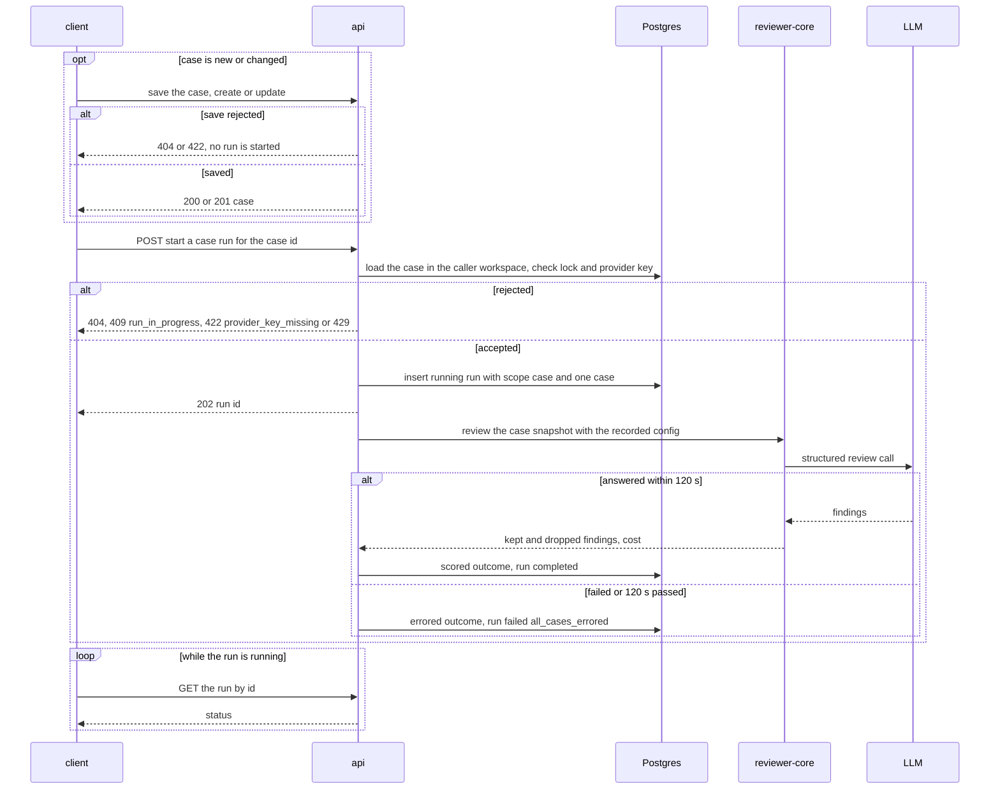
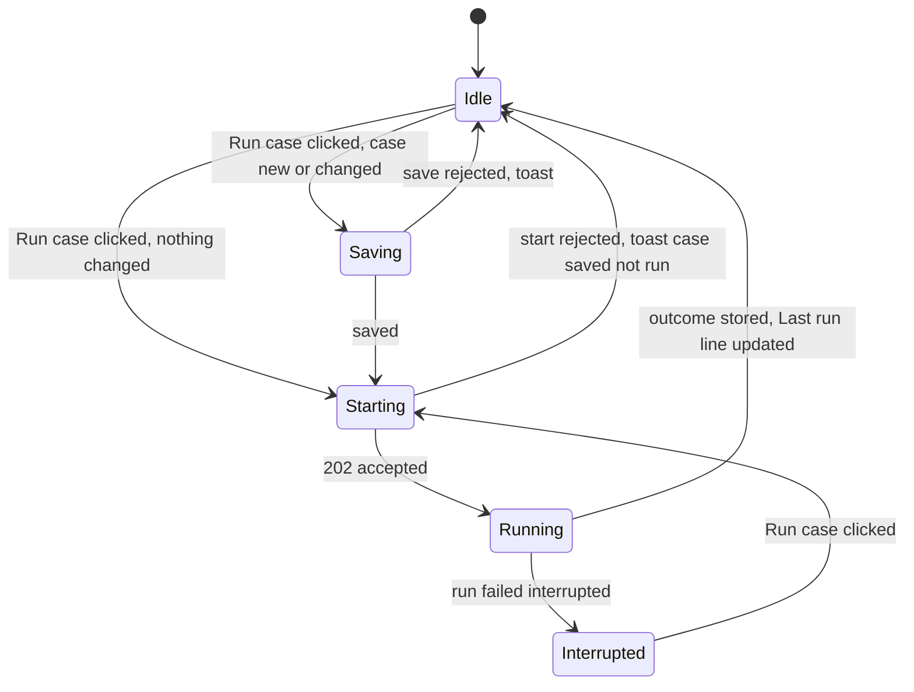

# Spec: Eval "Run case" — save and run one eval case from the case editor and the case row
Spec ID: SPEC-07
Status: approved
Supersedes: SPEC-04 (partially) — the Non-goal "Per-case runs" (`SPEC-04-eval-pipeline.md` L99-101), DR-19 (Run case / Run on save part) and DR-20, AC-29 ("no Run icon" in rows) and the AC-36 Verify clause "there is no … Run case or Run on save". SPEC-05 (partially) — the Non-goal "Run case, Run on save, and per-case runs" (`SPEC-05-eval-case-editor-and-trend.md` L66-67, decision 8) and the AC-3 clause "Run case button" (create mode). It also narrows "run" to "suite run" in the aggregate criteria SPEC-04 AC-27, AC-31, AC-33, AC-79, AC-82…AC-89, AC-90…AC-97 and SPEC-05 AC-50…AC-56, AC-59, without changing what they assert about suite runs. "Run on save" stays out (Non-goals). Every other SPEC-04 and SPEC-05 decision stands.

## Problem and user

An agent author who edits an eval case cannot see whether the agent passes it. The case modal
offers only Cancel and Save (`EvalCaseModal.tsx:139-148`). To check one case, the author must:

1. save and close the modal;
2. run the whole suite, which makes one paid engine review per case, at up to 120 s each
   (SPEC-04 AC-50, AC-55);
3. wait for every case;
4. reopen the case.

With 8+ seeded cases (SPEC-04 AC-107), one check of one edited expectation costs eight model calls
and several minutes. A mentor review of PR #11 asked for a **Run case** button that saves the case
and runs that one case immediately, to shorten the edit → check loop. The design draws it
(`screen_cizruns.jsx:64`) together with a per-row ▶ Run (`components2.jsx:55`).

SPEC-04 declined per-case runs because a one-case run "is not comparable with suite runs and would
pollute history" (`SPEC-04-eval-pipeline.md:99-101`). This spec keeps that concern and answers it:
a single-case run is a run of a distinct **scope**. It is stored and shown on the case itself, and
it never enters any suite aggregate.

The users:

- **The agent author.** They want to edit a case, or write a new one, and see within one model
  call whether the agent finds it (or leaves it alone).
- **The person paying for model calls.** A case run must cost exactly one engine review, and it
  must share the "one running run per agent" bound.
- **The workspace owner.** Case text stays data, and case runs never cross workspaces.

## Goals / Non-goals

**Goals**

- **"Run case" in the case modal**, in create mode and in edit mode for both case origins. It saves
  the case when it is new or changed, then starts a run of that one case. The modal stays open and
  shows the result.
- **A per-row ▶ Run icon** in the Evals-tab case list. It starts the same single-case run without
  opening the modal.
- **A case-scope run.** It is a stored run with `scope: "case"` and the target `case_id`, holding
  exactly one outcome. It is started in the background (202) and pinned to the agent's saved config
  like a suite run. It is reviewed and scored by the suite run's rules, and it is bounded by the
  same 120 s deadline, stale reaper and one-running-run lock.
- **The case shows its newest result of either scope.** The row status, the row's result line and
  the modal's "Last run" line all follow it.
- **Case runs stay out of every suite aggregate**: metrics, the "k / N passing" badge, both trends,
  the sparklines, the regression alert, the run history, the dashboard runs table, the overview's
  latest run and compare. The filtering is server-side, applied before the 20-run window.

**Non-goals** (each is a decision; do not "restore" it)

- **The "Run on save" toggle** (`screen_cizruns.jsx:62`). "Run case" already is save + run. A
  toggle duplicates it and would need a persisted per-user preference that has no storage
  (proposal P2, declined).
- **An "edited since this run" hint** on the Last run line (P3, declined). Run case always saves
  first, and outcomes carry no diff snapshot to compare against.
- **The agent version on the Last run line** (P4, declined). It is not in the mock.
- **A keyboard shortcut for Run case** (P5, declined). Tab and Enter reach the button (NFR-2).
- **Case runs in any history or comparison view**: the run history, the dashboard runs table,
  compare and the overview (Q1). A finished case run is visible only through its case and through
  `GET /eval/runs/:id`.
- **Cost or token aggregation of case runs.** A case run's cost appears only on the Last run line
  and on `GET /eval/runs/:id`. Token counts are not recorded, as for suite runs. A timed-out call's
  unreported cost stays unaccounted (`run-executor.ts:183-187, 227`; gap 11).
- **A toast when a case run finishes** (Q8). The row and, if open, the modal update in place.
- **A per-route rate limit on case runs** (Q7). The one-running-run lock bounds concurrency to one
  ≤ 120 s call per agent; only the global limit applies (`server/src/app.ts:95-97`).
- **New eligibility codes for running a case** (gap 10). A case is runnable whenever its agent's
  provider has a key. A finding-born case whose source is gone stays runnable (SPEC-04 AC-105).
- **Running a chosen subset of cases.** A run is either the whole suite or exactly one case.
- **Cancelling a running case run.** SPEC-04 P5 is kept; the deadline and the reapers bound it.
- **A new e2e browser flow.** SPEC-04 P7 is kept: a real run needs an LLM.

## User stories

- **US-1** As an agent author editing a case, I want to save it and run just that case in one
  click, so that I see whether the agent passes it without running the whole suite.
- **US-2** As an agent author writing a new case, I want to create and run it in one click, so
  that its first result shows before I leave the editor.
- **US-3** As an agent author looking at the case list, I want to run one case from its row, so
  that I can re-check it without opening it.
- **US-4** As an agent author tracking regressions, I want single-case runs kept out of suite
  metrics, trends, the alert, compare and history, so that a one-case result never reads as a
  suite score.
- **US-5** As the person paying for model calls, I want a case run to cost one engine review and to
  share the one-running-run lock, so that spend stays bounded.
- **US-6** As a workspace owner, I want case runs confined to my workspace and case text treated as
  data exactly as in a suite run, so that nothing leaks or steers the model.

## Acceptance criteria (EARS)

### A. Run case in the case modal

**AC-1 [client]** The case modal footer shall show, in this order: Cancel, a secondary "Run case"
button with the `Play` icon, and the primary Save. This holds in create mode and in edit mode for
manual and finding-born cases (`screen_cizruns.jsx:63-65`).
Verify: unit — in each of the three modes the three buttons render in that order, and no "Run on
save" toggle renders.

**AC-2 [client]** WHILE any condition of SPEC-05 AC-13 that disables Save holds, the case modal
shall disable "Run case".
Verify: unit — an empty name, an invalid diff (editable modes), invalid expectation JSON, a
failing range check and a pending save each disable "Run case"; with none of them it is enabled.

**AC-3 [client]** WHILE a run of the agent of either scope is `running`, the case modal shall
disable "Run case".
Verify: unit — a mocked running suite run, and a running case run of another case, each disable
the button.

**AC-4 [client]** WHEN the user clicks "Run case" on an existing case whose fields differ from the
stored case, the client shall send the run-start request only after the update request has
succeeded.
Verify: unit — the requests are `PATCH /eval/cases/:id` then `POST /eval/cases/:id/runs`; with a
mocked failing PATCH no POST is sent.

**AC-5 [client]** WHEN the user clicks "Run case" on an existing case with no changed field, the
client shall send the run-start request without an update request.
Verify: unit — exactly one request, `POST /eval/cases/:id/runs`.

**AC-6 [client]** WHEN the user clicks "Run case" in create mode, the client shall send the create
request and then the run-start request for the created case's id.
Verify: unit — `POST /agents/:id/eval/cases`, then `POST /eval/cases/<new id>/runs` with the id
from the 201 body.

**AC-7 [client]** WHEN the create request of a "Run case" succeeds, the client shall replace the
create modal with the edit modal of the new case at `?case=<id>`, with the new case already in
the agent's case list, without a page reload.
Verify: unit — after the mocked 201 the URL carries `case=<new id>`, the dialog title is "Eval case
· `<stored name>`", and the case list holds the new case before any refetch resolves.

**AC-8 [client]** WHEN the user double-clicks "Run case", the client shall send at most one save
request and one run-start request.
Verify: unit — two rapid clicks issue one PATCH (or POST create) and one run-start POST.

**AC-9 [client]** IF the save part of "Run case" fails, THEN the client shall send no run-start
request. The modal then behaves as SPEC-05 AC-17: it stays open, every field is kept as typed, and
one mapped toast shows.
Verify: unit — a mocked 422 on the PATCH and on the create each yield no run-start request, one
toast, and unchanged fields.

**AC-10 [client]** IF the save succeeds and the run start is rejected with 409, 422 or 429, THEN
the client shall show exactly one toast reading "Case saved; not run: `<mapped reason>`". The toast
never shows a raw code or i18n key.
Verify: unit — `run_in_progress`, `provider_key_missing` and a 429 each yield one toast with the
mapped text.

**AC-11 [client]** IF the run start that follows a successful create is rejected, THEN the client
shall show the created case in the edit modal, so that a second "Run case" sends no second create
request.
Verify: unit — after a mocked 201 then 409, the dialog is in edit mode for the new id; clicking
"Run case" again sends only `POST /eval/cases/<id>/runs`.

**AC-12 [client]** WHEN the run start is accepted (202), the case modal shall stay open.
Verify: unit — after the mocked 202 the dialog is still rendered.

**AC-13 [client]** WHILE the open case's own case run is `running`, the case modal shall show
"Running…" in place of the Last run line.
Verify: unit — a mocked running case run for this case renders "Running…" and no "Last run …"
text.

**AC-14 [client]** WHILE the open case's own case run is `running`, the case modal shall render
"Run case" in the button's loading state.
Verify: unit — the button carries the loading state and is disabled.

**AC-15 [client]** WHILE the open case's own case run is `running`, the case modal shall keep Save
enabled under the SPEC-05 AC-13 conditions.
Verify: unit — with a running case run and a valid changed field, Save is enabled and sends the
PATCH.

**AC-16 [client]** WHEN the open case's case run reaches a final status with a stored outcome, the
case modal shall render the Last run line from that outcome (SPEC-04 AC-44 variants) at the first
poll after the final status is written, without a page reload.
Verify: unit — with fake timers, the mocked run changes to `completed` and the case response
carries the new outcome. After advancing one poll interval (3 s) the line reads "Last run passed ·
…"; an errored outcome reads "Last run errored · timeout".

**AC-17 [client]** IF the open case's case run ends `failed` with reason `interrupted`, THEN the
case modal shall show the inline message "Run interrupted — try again" in place of the "Running…"
line.
Verify: unit — a mocked run turning `failed: interrupted` renders the message, and "Run case" is
enabled again.

**AC-18 [client]** WHEN the user closes the case modal while its case run is `running`, the Evals
tab shall update that case's row from the run's outcome when the run settles, without a page
reload.
Verify: unit — close the dialog, let the mocked run settle: the row's status icon and result line
change, and no toast appears (Q8).

### B. Run from the case row

**AC-19 [client]** The Evals tab shall render in each case row a "Run" icon button with the `Play`
icon, placed before Edit and Delete (`components2.jsx:55`).
Verify: unit — every row has a button labelled "Run" preceding "Edit" and "Delete".

**AC-20 [client]** WHILE a run of the agent of either scope is `running`, the Evals tab shall
disable the "Run" button of every row.
Verify: unit — with a mocked running suite run, and with a running case run of one case, every
row's Run button is disabled.

**AC-21 [client]** WHEN the user clicks a row's "Run" button, the client shall send exactly one
run-start request for that case, without opening the case modal.
Verify: unit — one click and a double click each issue one `POST /eval/cases/<id>/runs`; the URL
gains no `case` parameter.

**AC-22 [client]** WHILE a case run of a row's case is `running`, the Evals tab shall render a
spinner with the accessible label "Running" in place of that row's status icon.
Verify: unit — the row of the running case shows the spinner; other rows keep their status icons.

**AC-23 [client]** IF a row's run start is rejected with 409, 422 or 429, THEN the client shall
show exactly one toast with the human-readable message for that response.
Verify: unit — each status yields one toast with the mapped text and no raw code.

### C. Suite surfaces during and after a case run

**AC-24 [client]** WHILE a case run of the agent is `running`, the suite run button on the Evals tab
and on the dashboard detail shall read "Running case…" and be disabled.
Verify: unit — a mocked running case run (`cases_total` 1) renders "Running case…", not "Running
0 / 1 cases", and the button is disabled.

**AC-25 [client]** The Evals tab and the dashboard detail shall exclude every run with `scope:
"case"` from the metric cards, the "k / N passing" badge, the trend, the run history and the runs
table.
Verify: unit — a response holding a running case run next to suite runs renders no extra history
or table row, no trend point and unchanged cards.

### D. Starting and executing a case run (server)

**AC-26 [server]** WHEN `POST /eval/cases/:id/runs` names a case of the caller's workspace and no
run of its agent is `running`, the system shall record a run with status `running`, `scope:
"case"`, `case_id` equal to the case id and `cases_total` 1. It answers 202 with `{ run_id,
status: "running", cases_total: 1 }` before the model call completes.
Verify: integration — with a never-settling stub LLM, the request returns 202 and the run row has
those values.

**AC-27 [server]** The system shall record on a case run the agent version and the effective
config as of the run's start, by the same rule as a suite run (SPEC-04 AC-47).
Verify: integration — editing the agent after the start leaves the case run's recorded version and
config unchanged.

**AC-28 [server]** The system shall review a case run's case with the diff, PR meta and expectation
the case had when the run started.
Verify: unit — with a gated stub LLM, edit the case's diff and expectation after the start. The
captured prompt holds the old diff, and the outcome's expectation snapshot is the old one.

**AC-29 [server]** The system shall build a case run's engine input by the same rules as a suite
run of that case, as fixed by SPEC-04 AC-48, AC-49 and NFR-5 and by SPEC-05 AC-45…AC-47 and NFR-4.
Verify: unit — for one case and one config, the spy-captured prompt of a case run equals that of a
suite run. A sentinel placed in the case's name, notes, labels and expectation is absent from it.

**AC-30 [server]** The system shall make at most one engine review per case run and no other model
call.
Verify: unit — a counting stub sees the engine calls of exactly one review, and no intent or
scoring call.

**AC-31 [server]** The system shall score a case run's outcome by the code-only rules of a suite
run (SPEC-04 AC-65…AC-68, AC-74).
Verify: unit — a stub returning a finding on the expectation's range scores `must_find` passed and
`must_not_flag` failed, with an LLM provider that throws on any scoring call.

**AC-32 [server]** WHEN the case run's case is scored, the system shall set the case run's status
to `completed`.
Verify: integration — a stubbed scored case ends the run `completed` with `finished_at` set and one
outcome.

**AC-33 [server]** IF the case run's model call fails or does not finish within 120 s, THEN the
system shall finish the run `failed: all_cases_errored`, holding one `errored` outcome with the
reason `llm_error`, `invalid_output` or `timeout`.
Verify: unit — a failing stub and a never-settling stub under fake timers each end the run so, with
the matching outcome reason.

**AC-34 [server]** IF a run of the case's agent, of either scope, is `running`, THEN the system
shall reject a case-run start with 409 `run_in_progress` and record no run.
Verify: integration — with a running suite run, and with a running case run of another case, the
start is 409 and the run count is unchanged.

**AC-35 [server]** IF a case run of an agent is `running`, THEN the system shall reject a suite-run
start for that agent with 409 `run_in_progress`.
Verify: integration — the suite start is 409 and no suite run row exists.

**AC-36 [server]** IF the agent's provider has no API key configured, THEN the system shall reject a
case-run start with 422 `provider_key_missing` and record no run.
Verify: integration — status and reason; no run row.

**AC-37 [server]** IF the case id of a case-run start is not a case of the caller's workspace, THEN
the system shall answer 404, record no run and make no model call.
Verify: integration — a second workspace's case id and a random uuid each yield 404. Neither
workspace gains a run row, and the stub LLM records zero calls.

**AC-38 [server]** IF a case run is still `running` 15 minutes after its start, or the server
restarts while it runs, THEN the system shall set it `failed` with reason `interrupted` (SPEC-04
AC-58).
Verify: integration — a case run row older than 15 min, and one present at boot, both become
`failed: interrupted`.

**AC-39 [server]** WHEN the client that started a case run disconnects, the system shall continue
the run to its final status.
Verify: integration — start a case run, never poll it, and the row reaches `completed`.

**AC-40 [server]** WHEN a case is deleted while its case run is `running`, the system shall finish
the run and keep its stored outcome.
Verify: integration — delete the case after the start; the run reaches a final status and its
outcome row exists.

**AC-41 [server]** The system shall report a case run's `cost_usd` as its outcome's cost, and its
`duration_ms` as the time from its start to its final status.
Verify: unit — an outcome costing 0.02 yields a run `cost_usd` of 0.02; an errored outcome yields
null; integration — `duration_ms` equals `finished_at − started_at`.

**AC-42 [server]** The system shall report as a case's `last_outcome` its newest stored outcome,
whether that outcome came from a suite run or a case run.
Verify: integration — after a suite run and then a case run, `GET /agents/:id/eval/cases` and
`GET /eval/cases/:id` carry the case run's outcome. After a further suite run, they carry the suite
run's outcome.

**AC-43 [server]** WHEN `GET /eval/runs/:id` names a case run of the caller's workspace, the system
shall return it with `scope: "case"`, its `case_id` and its one outcome.
Verify: integration — the response carries those fields and `outcomes` of length 1.

**AC-44 [server]** The system shall report `scope: "suite"` and `case_id: null` for every suite
run, including runs recorded before this feature.
Verify: integration — after migrating, seeded and pre-existing suite runs, and a new suite run,
all carry those values.

### E. Case runs stay out of suite aggregates (server)

**AC-45 [server]** The system shall answer `GET /agents/:id/eval/runs` with the agent's newest
suite runs, at most 20, counted without case runs, followed by the agent's running case run when
one exists.
Verify: integration — 20 suite runs, 5 finished case runs newer than all of them and 1 running case
run yield 21 items: the 20 suite runs and the running case run. No finished case run is listed.

**AC-46 [server]** The system shall return in the dashboard response's `runs` the same runs as
AC-45.
Verify: integration — the same fixture yields the same 21 items.

**AC-47 [server]** The system shall compute the dashboard `trend` and the regression `alert` from
completed suite runs only.
Verify: integration — a completed case run newer than two suite runs, with a failing outcome,
changes neither the trend's points nor the alert.

**AC-48 [server]** The system shall report as each agent's overview `latest_run` its newest suite
run.
Verify: integration — an agent whose newest run is a case run shows its newest suite run, or null
when it has none.

**AC-49 [server]** IF either id of `GET /eval/compare` names a case run of the caller's workspace,
THEN the system shall reject the compare with 422 `not_suite_run`.
Verify: integration — a completed case run compared with a completed suite run of the same agent
yields 422 `not_suite_run`.

## Edge cases

- **EC-1** "Run case" while a suite run is running → AC-3, AC-34
- **EC-2** A suite run is started while a case run is running → AC-24, AC-35
- **EC-3** The save succeeds and the run start is rejected (409 race, missing key, 429) → AC-10,
  AC-11
- **EC-4** The form is invalid or a save is pending → AC-2
- **EC-5** "Run case" on a valid case with no change → AC-5
- **EC-6** "Run case" or a row's Run is double-clicked → AC-8, AC-21
- **EC-7** The case is deleted while its case run is running → AC-40
- **EC-8** The case is edited and saved while its case run is running → AC-15, AC-28
- **EC-9** The case run is reaped (15 min or restart) → AC-38, AC-17
- **EC-10** The case's model call fails or times out → AC-33, AC-16
- **EC-11** The modal is closed, or the user navigates away, mid-run → AC-18, AC-39
- **EC-12** The agent's Config tab holds unsaved edits when "Run case" is clicked; the run uses the
  saved config and version → AC-27
- **EC-13** A finding-born case whose source finding was deleted → AC-26 (runnable; SPEC-04 AC-105)
- **EC-14** No API key for the agent's provider → AC-36, AC-10, AC-23
- **EC-15** A case id or a case-run id from another workspace → AC-37, NFR-4
- **EC-16** Many case runs in an edit loop would push suite runs out of the 20-run window → AC-45,
  AC-46
- **EC-17** An agent with exactly one case: a suite run and a case run cover the same case set
  and must stay distinguishable → AC-26, AC-44
- **EC-18** After a case run, a row turns green or red while the suite-based "k / N passing" badge
  is unchanged. This inconsistency is accepted (Q2) → AC-42, AC-25
- **EC-19** A hand-made compare URL names a case run → AC-49
- **EC-20** A timed-out call keeps running and its cost is never reported → Non-goal (cost
  aggregation)
- **EC-21** The case diff or PR text carries instructions or a literal `</untrusted>` → AC-29
- **EC-22** A case run settles while the modal is closed → AC-18 (no toast)
- **EC-23** A row's Run is clicked while another case's run is running → AC-20, AC-34
- **EC-24** "Run case" in create mode with a name already taken in the suite; the stored name gets
  a suffix (SPEC-05 AC-24) → AC-7 (the edit modal shows the stored name)
- **EC-25** Another case's run is running while this case's modal is open → AC-3 (disabled), AC-13
  (no "Running…" line for this case)

## Non-functional requirements

**NFR-1 [client]** Every new UI string of this feature shall come from a key under
`client/messages/en/eval.json`. The strings are "Run case", "Run", "Running…", "Running case…",
"Run interrupted — try again", "Case saved; not run: …" and the spinner label.
Verify: unit — component tests assert the English text, which a missing key would replace with the
raw key.

**NFR-2 [client]** "Run case" and every row's "Run" button shall be reachable by Tab and operable by
Enter and Space (WCAG 2.2 AA, 2.1.1 Keyboard). A row's Run button does not trigger the row's
open-modal handler.
Verify: unit — tabbing reaches each button. Enter on a row's Run issues the start and opens no
modal.

**NFR-3 [server]** IF the model never answers, THEN the system shall bring a case run to a final
status within 125 s of its start.
Verify: unit — with fake timers and a never-settling stub, the run is final after 125 s of
simulated time.

**NFR-4 [server]** The system shall answer 404 to `GET /eval/runs/:id` and `GET /eval/compare` when
an id names a case run of another workspace, reading nothing of it.
Verify: integration — a second workspace's request for the owner's case run id yields 404.

**NFR-5 [client]** The new controls shall be composed from `@devdigest/ui` primitives (`Button`,
`IconBtn`) and the mock's CSS tokens, with no hard-coded colour values.
Verify: manual — compare the footer and rows with `screen_cizruns.jsx:61-65` and
`components2.jsx:54-57`, and grep the changed client files for hex and `rgb(` literals. No
automated visual check exists.

## Module interactions

### Boundaries

| Boundary | Who calls whom | Data | Sync / async | Failure behaviour |
|---|---|---|---|---|
| client → api: save | case modal → `PATCH /eval/cases/:id` or `POST /agents/:id/eval/cases` (existing) | changed fields or the new case | sync | 404 / 422 → no start, toast (AC-9) |
| client → api: start a case run | case modal, case row → `POST /eval/cases/:id/runs` (proposed) | case id | sync; 202 before the model call | 404 / 409 / 422 / 429 → mapped toast (AC-10, AC-23, AC-34…AC-37) |
| client → api: watch | case modal → `GET /eval/runs/:id`; Evals tab and dashboard → runs list and dashboard (existing, polled while a run is `running`, `client/src/lib/hooks/eval.ts:78-123`) | run status; the running case run in lists | polled every 3 s | interrupted → AC-17 |
| api → reviewer-core | case run → engine | case snapshot, recorded config | in-process, one case | engine error or 120 s → errored outcome (AC-33) |
| reviewer-core → LLM | engine → provider | assembled prompt | network | failure → AC-33; hang → AC-33, NFR-3 |
| api → DB | API → Postgres | run row, one outcome | sync | restart mid-run → AC-38 |

### Run case from the modal



### The modal's Run case states



### Contracts

All names are snake_case on the wire. Both vendor copies change in lock-step
(`server/src/vendor/shared/contracts/eval-ci.ts`, `client/src/vendor/shared/contracts/eval-ci.ts`).

```text
EvalSuiteRun (changed, proposed; today eval-ci.ts:199-221)
  scope        "suite" | "case"     required   new
  case_id      string | null        required   new; the run's one case when scope = "case",
                                               null exactly when scope = "suite"
  (every other field unchanged; a case run has cases_total = 1)

EvalCompareErrorCode (changed, proposed; today eval-ci.ts:357-361)
  + "not_suite_run"
```

```text
Endpoints
  POST /eval/cases/:id/runs   (proposed)  no body  -> 202 EvalRunStartResponse
                                                       { run_id, status: "running", cases_total: 1 }
                                                       (eval-ci.ts:224-229, unchanged shape)
       errors 404                      (case not in the caller workspace; no run, no model call)
              409 run_in_progress      (a run of the case's agent, of either scope, is running)
              422 provider_key_missing
              429                      (global limit only)
  POST /agents/:id/eval/runs  (changed)   409 run_in_progress also while a case run is running
  GET  /agents/:id/eval/runs  (changed)   <= 20 newest suite runs + the running case run, if any
  GET  /agents/:id/eval/dashboard (changed) runs as above; trend and alert from suite runs only
  GET  /eval/overview         (changed)   latest_run = newest suite run
  GET  /eval/compare          (changed)   + 422 not_suite_run
  GET  /eval/runs/:id         (changed)   returns case runs too, with scope, case_id, one outcome
  GET  /agents/:id/eval/cases, GET /eval/cases/:id   last_outcome = newest outcome of either scope
```

How the scope and the target case are stored is the planner's decision. A stored discriminator is
required, because a suite run of a one-case suite has the same case set as a case run (EC-17).

## Inputs and provenance

| Input | Comes from | Produced by | Freshness | Trusted |
|---|---|---|---|---|
| Case id | modal / row → URL path | the app | per request | resolved through the caller's workspace (AC-37) |
| Case diff, PR title and body | `eval_cases` row | GitHub (finding-born) or the author's paste (manual) | snapshot at run start (AC-28) | no — wrapped as in a suite run (AC-29) |
| Expectation, name, notes, labels | `eval_cases` row | user / LLM labels | snapshot at run start | never prompted (AC-29); scored in code (AC-31) |
| Agent config and version | `agents`, linked skills | the agent author | recorded at run start (AC-27) | prompt, model, provider, strategy: yes; imported or community skills: no, wrapped (AC-29) |
| Model findings | LLM via reviewer-core | LLM | per case run | no — grounded, scored in code (AC-31), rendered as text (SPEC-04 NFR-4) |
| Outcome cost and duration | engine `costUsd`, clock | provider usage, server | per case run | yes; cost may be null (AC-41) |
| Run status for the modal and buttons | `GET /eval/runs/:id`, runs list, dashboard | server | polled every 3 s while running | yes |
| Provider API key | local secrets | user settings | read at start | secret, never sent to the client (AC-36) |

## Untrusted inputs

- **Case diff and PR title/body.**
  - They reach the model only inside the engine's untrusted delimiters, and never in the trusted
    task line, exactly as in a suite run → AC-29.
  - They are size-checked when saved; that is unchanged (SPEC-04 AC-23, SPEC-05 AC-25, AC-28).
- **Case name, notes, labels and expectation.** They are absent from every prompt → AC-29. The
  expectation is used only by code scoring → AC-31.
- **Imported or community skills.** They are wrapped as in a review → AC-29.
- **Model findings of a case run.** Only grounded findings are scored → AC-31. They are rendered as
  text where shown; that is unchanged (SPEC-04 NFR-4).
- **Ids in requests** (case, run). They are confined to the caller's workspace → AC-37, NFR-4.
  - `eval_cases` and the run table carry `workspace_id` (`server/src/db/schema/eval.ts:35, 67`).
  - Outcomes carry none, and are read only through a scoped case or run (`repository.ts:17-23`).
- **Spend.** A case run makes one engine review → AC-30. It is bounded by the one-running-run lock
  → AC-34, AC-35, and by the deadline → AC-33, NFR-3.

## Design review

Decision sources: **"orchestrator (Qn / gap n / Pn)"** means the orchestrator's answer to the
Pass 1 question, gap or proposal of that number, given under the user's delegation.

| # | Finding or proposal | Evidence | Decision |
|---|---|---|---|
| DR-1 | The mock draws "Run case" (secondary, Play) between Cancel and Save; the shipped footer has Cancel and Save | `screen_cizruns.jsx:63-65`; `EvalCaseModal.tsx:139-148` | accepted (mentor request; reverses SPEC-04 P1 / SPEC-05 decision 8) → AC-1 |
| DR-2 | A single-case run must not read as a suite score or crowd the 20-run window; every aggregate reads the unfiltered list today | `EvalsTab/helpers.ts:35-57`; `RunHistory.tsx:23`; `service.ts:536-563`; `repository.ts:375-382`; `constants.ts:37` | accepted, orchestrator (Q1): stored `scope: "case"`, filtered server-side before the window → AC-25, AC-45…AC-49 |
| DR-3 | A one-case suite run is indistinguishable from a case run without a stored discriminator | `schema/eval.ts:79-82` | accepted: `scope` + `case_id` on the wire, storage → planner → AC-26, AC-44 |
| DR-4 | The lock is the partial unique index on running rows; the service pre-check reads a list that would be filtered | `schema/eval.ts:96-98`; `service.ts:351-352` | accepted: the lock spans both scopes → AC-34, AC-35 |
| DR-5 | Case rows already show the newest outcome across runs | `repository.ts:281-289` | accepted, orchestrator (Q2), with the badge/row inconsistency → AC-42, EC-18 |
| DR-6 | The "something is running" signal, polling and the post-run refresh depend on a running row in the list | `EvalsTab.tsx:43`; `EvalAgentDetail.tsx:75`; `hooks/eval.ts:45-65` | accepted, orchestrator (Q3): lists append the running case run → AC-45, AC-46, AC-20, AC-24 |
| DR-7 | The suite button would read "Running 0 / 1 cases" during a case run | `EvalRunButton.tsx:31-33` | accepted, orchestrator (Q4): "Running case…" → AC-24 |
| DR-8 | Create mode is local state, while edit mode is URL-driven from the case list | `EvalsTab.tsx:38, 45-46, 105-121` | accepted, orchestrator (Q5): hand-off to the edit modal with the case in the cache → AC-6, AC-7 |
| DR-9 | The running state of the Last run line is not drawn; the modal closes on Save | `screen_cizruns.jsx:93-95`; `EvalCaseModal.tsx:85, 99` | accepted, orchestrator (Q6) → AC-12…AC-16 |
| DR-10 | Save succeeds but the run start is rejected; a create retry would duplicate | `service.ts:343-403` | accepted, orchestrator (gap 1) → AC-10, AC-11 |
| DR-11 | Run case while any run is running | `EvalRunButton.tsx:41` | accepted, orchestrator (gap 2) → AC-3, AC-20 |
| DR-12 | Run case on an invalid form; unchanged case | `EvalCaseModal.tsx:74-75, 92-98` | accepted, orchestrator (gap 3) → AC-2, AC-5 |
| DR-13 | Double click | `EvalRunButton.tsx:26-46` | accepted, orchestrator (gap 4) → AC-8, AC-21 |
| DR-14 | A case deleted mid-run leaves an orphan outcome; outcomes have no FK | `schema/eval.ts:102-111` | accepted, orchestrator (gap 5) → AC-40 |
| DR-15 | A case edited mid-run; the run uses its snapshot | `service.ts:405-414` | accepted, orchestrator (gap 6) → AC-28 |
| DR-16 | An interrupted run stores no outcome, so the old Last run line would silently stay | `run-executor.ts:119, 242`; `repository.ts:388-414` | accepted, orchestrator (gap 7) → AC-17, AC-38 |
| DR-17 | Modal closed mid-run | SPEC-04 AC-60 | accepted, orchestrator (gap 8) → AC-18, AC-39 |
| DR-18 | Unsaved agent Config edits | `service.ts:385-393` | accepted, orchestrator (gap 9): saved config only → AC-27, EC-12 |
| DR-19 | Eligibility to run a case | SPEC-04 AC-105 | no new codes, orchestrator (gap 10) → Non-goal; AC-36, AC-37 |
| DR-20 | Cost and token accounting of case runs | `run-executor.ts:183-187, 227` | orchestrator (gap 11): cost on the Last run line and `GET /eval/runs/:id` only → AC-41; aggregation → Non-goal |
| DR-21 | Sync vs async start | server/INSIGHTS.md:86 (OpenRouter ignores the per-request timeout; SPEC-04 EC-19) | async 202 with the `EvalRunStartResponse` shape, orchestrator → AC-26 |
| DR-22 | Prompt parity with suite runs | SPEC-04 AC-48, AC-49, NFR-5; SPEC-05 AC-45…AC-47; server/INSIGHTS.md:74 | accepted, orchestrator → AC-29 |
| DR-23 | A case id from another workspace | `schema/eval.ts:35` | accepted, orchestrator: 404, no run, no model call → AC-37, NFR-4 |
| DR-24 | Compare could be handed a case run id | `service.ts:460-485` | accepted, orchestrator: 422 `not_suite_run` → AC-49 |
| DR-25 | Per-row ▶ Run | `components2.jsx:55`; SPEC-04 AC-29, DR-20; `EvalCaseRow.tsx:1-3` | accepted, orchestrator (P1), reversing SPEC-04 AC-29 → AC-19…AC-23 |
| DR-26 | "Run on save" toggle | `screen_cizruns.jsx:62` | declined, orchestrator (P2) → Non-goal |
| DR-27 | "Edited since this run" hint | `eval-ci.ts:108-112` | declined, orchestrator (P3) → Non-goal |
| DR-28 | Agent version on the Last run line | `screen_cizruns.jsx:95` | declined, orchestrator (P4) → Non-goal |
| DR-29 | Keyboard shortcut for Run case | — | declined, orchestrator (P5) → Non-goal; NFR-2 |
| DR-30 | Per-route rate limit (security skill suggests 3/min for AI generation) | `.claude/skills/security/SKILL.md:118`; `server/src/app.ts:95-97` | declined, orchestrator (Q7) → Non-goal |
| DR-31 | Toast on completion | — | declined, orchestrator (Q8) → Non-goal; AC-18 |

## Traceability

| AC / NFR | From (US / EC / design review) | Packages | Verify |
|---|---|---|---|
| AC-1 | US-1, US-2, DR-1, DR-26 | client | unit |
| AC-2 | US-1, EC-4, DR-12 | client | unit |
| AC-3 | US-5, EC-1, EC-25, DR-11 | client | unit |
| AC-4 | US-1, DR-12 | client | unit |
| AC-5 | US-1, EC-5, DR-12 | client | unit |
| AC-6 | US-2, DR-8 | client | unit |
| AC-7 | US-2, EC-24, DR-8 | client | unit |
| AC-8 | US-5, EC-6, DR-13 | client | unit |
| AC-9 | US-1, US-2, DR-10 | client | unit |
| AC-10 | US-1, EC-3, EC-14, DR-10 | client | unit |
| AC-11 | US-2, EC-3, DR-10 | client | unit |
| AC-12 | US-1, DR-9 | client | unit |
| AC-13 | US-1, EC-25, DR-9 | client | unit |
| AC-14 | US-1, DR-9 | client | unit |
| AC-15 | US-1, EC-8, DR-9 | client | unit |
| AC-16 | US-1, EC-10, DR-9 | client | unit |
| AC-17 | US-1, EC-9, DR-16 | client | unit |
| AC-18 | US-1, EC-11, EC-22, DR-17, DR-31 | client | unit |
| AC-19 | US-3, DR-25 | client | unit |
| AC-20 | US-3, US-5, EC-23, DR-11, DR-25 | client | unit |
| AC-21 | US-3, EC-6, DR-25 | client | unit |
| AC-22 | US-3, DR-25 | client | unit |
| AC-23 | US-3, EC-14, DR-25 | client | unit |
| AC-24 | US-5, EC-2, DR-7 | client | unit |
| AC-25 | US-4, EC-18, DR-2 | client | unit |
| AC-26 | US-1, US-3, EC-13, EC-17, DR-3, DR-21 | server | integration |
| AC-27 | US-4, EC-12, DR-18 | server | integration |
| AC-28 | US-1, EC-8, DR-15 | server | unit |
| AC-29 | US-6, EC-21, DR-22 | server | unit |
| AC-30 | US-5, DR-22 | server | unit |
| AC-31 | US-1, DR-22 | server | unit |
| AC-32 | US-1 | server | integration |
| AC-33 | US-5, EC-10 | server | unit |
| AC-34 | US-5, EC-1, EC-23, DR-4 | server | integration |
| AC-35 | US-5, EC-2, DR-4 | server | integration |
| AC-36 | US-5, EC-14, DR-19 | server | integration |
| AC-37 | US-6, EC-15, DR-23 | server | integration |
| AC-38 | US-5, EC-9, DR-16 | server | integration |
| AC-39 | US-1, EC-11, DR-17 | server | integration |
| AC-40 | US-1, EC-7, DR-14 | server | integration |
| AC-41 | US-5, DR-20 | server | unit, integration |
| AC-42 | US-1, US-3, EC-18, DR-5 | server | integration |
| AC-43 | US-1, DR-6, DR-16 | server | integration |
| AC-44 | US-4, EC-17, DR-3 | server | integration |
| AC-45 | US-4, EC-16, DR-2, DR-6 | server | integration |
| AC-46 | US-4, EC-16, DR-2, DR-6 | server | integration |
| AC-47 | US-4, DR-2 | server | integration |
| AC-48 | US-4, DR-2 | server | integration |
| AC-49 | US-4, EC-19, DR-24 | server | integration |
| NFR-1 | US-1, US-3 | client | unit |
| NFR-2 | US-1, US-3, DR-29 | client | unit |
| NFR-3 | US-5, EC-10 | server | unit |
| NFR-4 | US-6, EC-15, DR-23 | server | integration |
| NFR-5 | US-1, US-3, DR-1, DR-25 | client | manual |

## Open questions

None. The orchestrator answered every Pass 1 question, gap and proposal under the user's
delegation; each answer is recorded under Design review. No question was deferred.
